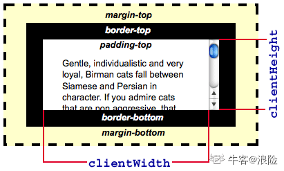
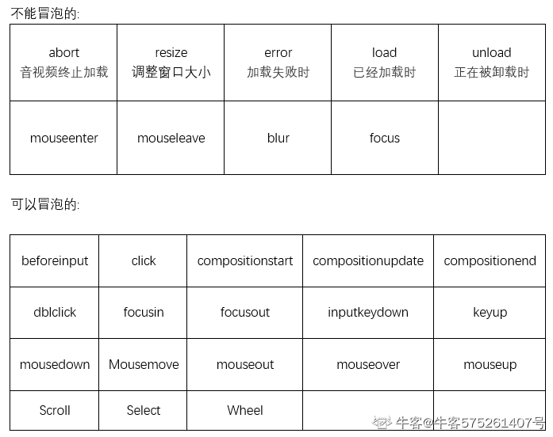
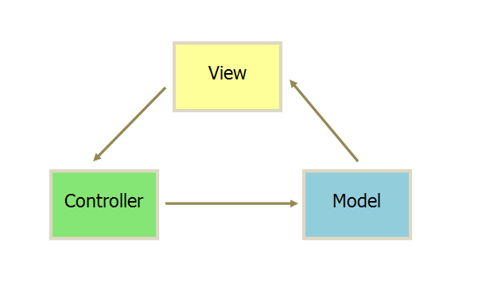
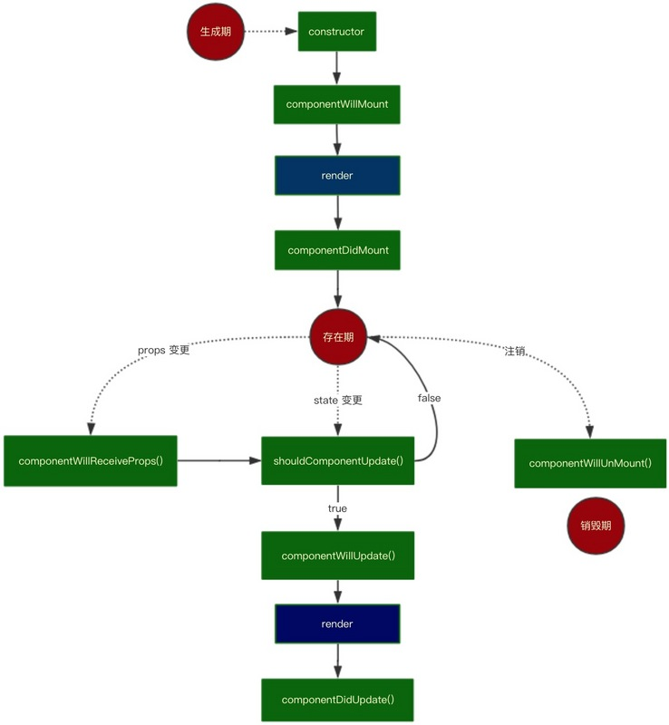
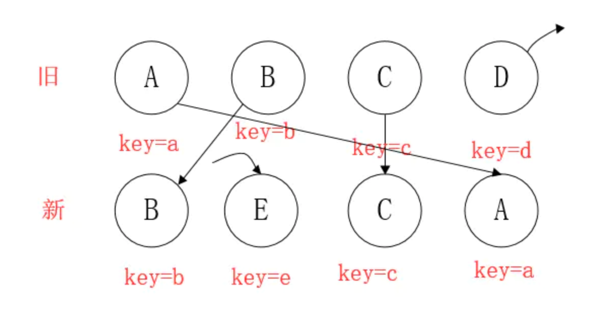

# wweebb

## 使用无分号风格

- 当一行代码是以 ： 

  - (
  - [
  - `  //是EcmaScript 6 中新增的一种字符串包裹方式，叫做：模板字符串他支持换行和非常方便的拼接变量

- 开头的时候，则在前面补上一个分号，用以避免一些语法解析错误，这也是有些第三方代码中看到的一上来就打分号，即第一个字符是分号的原因，有些人喜欢玩一些花哨的东西，例如补的不是分号是！~ 等。

- ```javascript
  function say() {
      console.log('hello world!')
  }
  
  say()
  
  ;(function () {
      console.log('hello!')
  })()
  
  say()
  
  ;['a','b'].forEach(function (item) {
      console.log(item)
  })
  
  var foo = `
  bar
  `
  console.log(foo)
  
  ;`hello`.toString()
  ```

## window.onlaod 和 DOMContentloaded 的异同

window.onlaod 和 DOMContentloaded 都是为了解决DOM加载后才绑定事件的问题的

- window.onlaod 
  - 当 `onload`事件触发时，页面上所有的DOM，样式表，脚本，图片，flash都已经加载完成了。
- DOMContentloaded
  - 当 `DOMContentLoaded` 事件触发时，仅当DOM加载完成，不包括样式表，图片，flash。

如果只是为了解决绑定事件的问题，DOMContentLoaded机制更加合理，因为我们可以容忍图片，flash延迟加载，却不可以容忍看见内容后页面不可交互。也就是说，即使用户网速再慢，好歹也给用户看一点东西。

## npx

npx 是 npm 5.0以后才有的命令他又一些有用的地方

- 避免全局安装

  ```shell
  # 比如一些脚手架工具，除了新建工程就么什么用了，但是还有全局安装有点浪费资源
  $ npx create-react-app my-react-project
  ```

- 方便调用项目内部安装模块

  ```shell
  # 比如
  node_modules/.bin/nodemon --version
  # 有了npx后可以直接调用，不用在给package.json的script了
  npx nodemon --version
  ```

## HTML

### 置换元素

⼀个内容不受CSS视觉格式化模型控制，CSS渲染模型并不考虑对此内容的渲染，且元素本⾝⼀般拥有固有尺⼨（宽度，⾼度，宽⾼⽐）的元素，被称之为置换元素。例如：浏览器会根据标签的src属性的 值来读取图片信息并显示出来，而如果查看(x)html代码，则看不到图片的实际内容；<input>标签的type属性来决定是显示输入 框，还是单选按钮等。

\、\<input\>、\<textarea\>、\<select\>、\<object\> 这些都是置换元素

1.常见的块级元素(**自动换行，** **可设置高宽** )有：

​    div,h1-h6,p,pre,ul,ol,li,**form**,table,**label**等

2。常见的行内元素（**无法自动换行，无法设置宽高**）有：

​    a,img,span，i（斜体）,em（强调）,sub(下标)，sup（上标）等。

3.常见的行块级元素(拥有内在尺寸，**可设置高宽，不会自动换行** )有：

### HTML中的图像格式

网页html文档支持的图片格式有jpg   ,   gif  ,   png  和  bmp  这四种，jpg ， gif  和  png 格式的图片特点是体积很小，因为在网上很常见，然而 bmp就不常见了，因为这种格式虽然很清晰色彩丰富，但是所占内存很大，所以很少见，但是也是支持的。一共这4种。还有谷歌退出的webp。

### H5新增表单元素

autocomplete、autofocus、form、formaction、formenctype、formmethod、formnovalidate、formtarget、height、list、max、min、**multiple**、**pattern**、**placeholder**、**required**、step、width。

**input**


### 行内元素有

\<a>标签可定义锚、\<abbr>表示一个缩写形式、\<acronym>   定义只取首字母缩写、\<b> 字体加粗、\<big>大号字体加粗、\<br>换行、\<cite>引用进行定义、\<em>    定义为强调的内容、\<i> 斜体文本效果、\ 向网页中嵌入一幅图像、\<input> 输入框、\<label>   标签为 input 元素定义标注

\<select>创建单选或多选菜单、\<small>呈现小号字体效果、\<span>组合文档中的行内元素、\<strong>语气更强的强调的内容、\<textarea>多行的文本输入控件

### 块级元素有

\<address>定义地址

\<caption>定义表格标题

\<dd> 定义列表中定义条目

\<div> 定义文档中的分区或节

\<dl> 定义列表

\<dt> 定义列表中的项目

\<fieldset>定义一个框架集

\<form> 创建 HTML 表单

\<h1>定义最大的标题

\<h2>定义副标题

\<h3>定义标题

\<h4>定义标题

\<h5>定义标题

\<h6>定义最小的标题

\<hr>创建一条水平线

\<legend>元素为 fieldset 元素定义标题

\<li>标签定义列表项目

\<noframes>为那些不支持框架的浏览器显示文本，于 frameset 元素内部

\<noscript>定义在脚本未被执行时的替代内容

\<ol>定义有序列表

\<ul>定义无序列表

\<p>标签定义段落

\<pre>定义预格式化的文本

\<table>标签定义 HTML 表格

\<tbody>标签表格主体（正文）

\<td>表格中的标准单元格

\<tfoot>定义表格的页脚（脚注或表注）

\<th>定义表头单元格

\<thead>标签定义表格的表头

\<tr>定义表格中的行

### 可变元素有

\<button>  按钮

\<del> 定义文档中已被删除的文本

\<iframe>   创建包含另外一个文档的内联框架（即行内框架）

\<ins> 标签定义已经被插入文档中的文本

\<map> 客户端图像映射（即热区）

\<object>  object对象

\<script>   客户端脚本

## CSS3

- vh单位，视窗高度的百分比
- vw单位，视窗宽度的百分比
- rem 相对于根字体大小（html）的单位，比如可以设置 1rem=50px
-  em 相对于父级的font-size，比如font-size：16px（浏览器默认），则2em=32px

### Width/Height

ele.clientWidth = 宽度 + padding

ele.offsetWidth = 宽度 + padding + border

 ele.scrollTop = 被卷去的上侧距离

 ele.scrollHeight = 自身实际的高度（不包括边框）



### BFC

> https://blog.csdn.net/sinat_36422236/article/details/88763187

BFC(Block formatting context)直译为"块级格式化上下文"。它是一个独立的渲染区域，只有Block-level box参与， 它规定了内部的Block-level Box如何布局，并且与这个区域外部毫不相干。

BFC是一个独立的布局环境，其中的元素布局是不受外界的影响，并且在一个BFC中，块盒与行盒（行盒由一行中所有的内联元素所组成）都会垂直的沿着其父元素的边框排列。

**BFC的布局规则**

- 内部的Box会在垂直方向，一个接一个地放置。

- Box垂直方向的距离由margin决定。属于同一个BFC的两个相邻Box的margin会发生重叠。

- 每个盒子（块盒与行盒）的margin box的左边，与包含块border box的左边相接触(对于从左往右的格式化，否则相反)。即使存在浮动也是如此。

- BFC的区域不会与float box重叠。

- BFC就是页面上的一个隔离的独立容器，容器里面的子元素不会影响到外面的元素。反之也如此。

- 计算BFC的高度时，浮动元素也参与计算。

**如何创建BFC**

1. float的值不是none。
2. position的值不是static或者relative。
3. display的值是inline-block、table-cell、flex、table-caption或者inline-flex
4. overflow的值不是visible（这个方法常用，直接加overflow：hidden）

**BFC的作用**

1. 利用BFC避免margin重叠。（第二个元素创建BCF就可以了）
2. 自适应两栏布局
   - 一个元素左浮动一个元素无浮动的话，无浮动的元素就会包含浮动元素，无浮动元素中创建BCF就好了
3. 清除浮动
   - 如果父元素无高度的话，子元素设置为浮动，父元素高度会塌陷，父元素创建BCF就可以防止塌陷

## 三栏布局

### 圣杯布局

经典圣杯布局

- 子div设置为float
- 左边margin-left:-100%
- 右边margin-left:-自身宽度
-  中间width：100%（前几步设置好后是会挡住中间部分的，解决办法如下两部）
- 容器设置padding，左右为左组件和右组件的宽度
- 子div加上position：relative，然后左右组件分别往左右一自身的宽度

```html
<!DOCTYPE html>
<html>
	<head>
		<meta charset="utf-8" />
		<title>css</title>
	</head>
	 <style type="text/css">
	 	*{
	 		margin:0;
	 		padding: 0;
	 	}
	 	.main>div{
            float: left;
            height: 100px;
            position: relative;
	 	}
	 	.left {
	 		width: 200px;
	 		background: red;
	 		margin-left: -100%;
			left:-200px;
	 	}
	 	.right{
	 		width: 200px;
	 		background: blue;
	 		margin-left: -200px;
			right:-200px;
	 	}
	 	.middle{
	 		width: 100%;
	 		background: yellow;
	 	}
		.main{
			padding:0 200px 0 200px;
		}
	 </style>
	<body>
	<div class="main">
		<div class="middle">中间
		 </div>
		<div class="left">
			左边
		</div>
		<div class="right">
			右边
		</div>
	</div>
	</body>
</html>
```

flex版圣杯布局 父容器设置为flex，order排序，flex-grow设置每一项的比例

```css
.main{
    display:flex;
    flex-direction:row;
}
.left {
    order:-1;
    flex-grow:1;
}
.middle {
    order:0;
    flex-grow:2;
}
.right {
    order:1;
    flex-grow:1;
}
```

### 双飞翼

双飞翼布局

- 子div设置为float

- 左边margin-left:-100%

- 右边margin-left:-自身宽度

- 中间width：100% （同圣杯布局，中间是会被挡住的）
- 因为中间组件又有一个子容器，所以设置子容器margin左右控件的宽度就好了

```css
<style type="text/css">
    .main>div{
        float: left;
        height: 100px;
    }
    .left {
        width: 200px;
        background: red;
        margin-left: -100%;
    }
    .right{
        width: 200px;
        background: blue;
        margin-left: -200px;
    }
    .middle{
        width: 100%;
        background: yellow;

    }
    .content{ /* 中间把内容顶到中间部分，防止左右遮住 */ 
        margin-left: 200px;
        margin-right: 200px;
    }
</style>
<body>
    <div class="main">
        <div class="middle">
            <div class="content">
                中间
            </div>
        </div>
        <div class="left">
            左边
        </div>
        <div class="right">
            右边
        </div>
    </div>
</body>
```

## flex

阮一峰老师的教程，写的十分详尽http://www.ruanyifeng.com/blog/2015/07/flex-grammar.html

### @import/link

@import写着css文件中、link先在html中

```css
@import url(http://fonts.googleapis.com/css?family=Open+Sans:400,300,800,700);
@import url("normalize.css");
@import url("grid.css");
@import url("modal.css");
```

```html
<link rel=stylesheet href="css/main.css">
```

@import 进来的样式在页面内容载入完毕后再加载, 如果网速慢, 页面可能闪烁, 故不推荐使用. 相对于这种方式, 如果要加载许多独立的CSS文件, 建议直接用 link[rel=stylesheet] 加载.

如果CSS内容不是很多, 还是(按需)合并到一个文件里比较好, 减少请求.

使用import要注意几点

1. @import url（）机制是不同于link的，link是在加载页面前把css加载完毕，而@import url（）则是读取完文件后在加载，所以会出现一开始没有css样式，闪烁一下出现样式后的页面(网速慢的情况下)
2. @import 是css2里面的，所以古老的ie5不支持。 
3. 当使用javascript控制dom去改变样式的时候，只能使用link标签，因为@import不是dom可以控制的。
4. link除了能加载css外还能定义RSS，定义rel连接属性，@import只能加载css 

## js

注意：'use strict' 严格模式下进制使用this关键字，在此模式下的this为undefined

### new

1. 创建一个空对象
2. 连接原型链
3. 绑定this
4. 返回新对象

```js
function create(){
    // 1. 创建空对象
    let obj = new Object();
    // 2. 链接原型
    let con = [].shift.call(arguments) 
    obj.__proto__ = con.prototype
    // 3. 绑定this
    let res = con.apply(obj,arguments)
    // 4. 返回新对象
    return typeof res === 'object'?res:obj;
}
```

2. 然后构造函数里面的this会指向这个空对象

3. 构造函数内的 this.x=1 就相当于将 1 赋值给了这个空对象

4. 其实还默认做了一个事 即 return this

5. 所以最后 x 得到了 return 回来的 this。

6. 所以 x 有了 构造函数的属性

```js
var name = 'global';
var obj = {
    name: 'local',
    foo: function(){
        this.name = 'foo';
    }.bind(window)
};
var bar = new obj.foo();// 1.foo 因为new 改变了bind的绑定，所以this指向的是新对象
setTimeout(function() {
    console.log(window.name);// 3.global 异步所以最后又因为obj并没有改到window的属性所以window还是global
}, 0);
console.log(bar.name);
  
var bar3 = bar2 = bar;
bar2.name = 'foo2';// 2.foo2 因为js是引用赋值（浅拷贝），所以修改bar2就等于修改bar3
console.log(bar3.name);
// foo, foo2, global
```

bind返回一个函数，该函数体中的this绑定到window上，然后new对该函数进行构造调用，返回一个新对象，函数体中的this指向该对象。bind是硬绑定，new绑定的优先级高于硬绑定。所以this还是绑定在bar这个新对象上。this.name='foo'就是bar.name='foo'

### Object.assign

此方法用于对象的合并，将源对象（source）的所有可枚举属性，复制到目标对象（target）。

```js
const target = { a: 1 };

const source1 = { b: 2 };
const source2 = { c: 3 };

Object.assign(target, source1, source2);
target // {a:1, b:2, c:3}
```

**事件是否支持冒泡**



关于上述的onchange事件，onchange是在被改动的对象(如textbox)的值发生改变，**并失去焦点**的时候触发事件。如果想实现输入框值改变就触发事件可以用keyup事件

### 变量提升

js中用var修饰、函数都会进行变量提升，而函数的变量提升优先级比变量高，即函数在变量前面

### 顶级的对象

Navagator：提供有关浏览器的信息

Window：Window对象处于对象层次的最顶层，它提供了处理Navagator窗口的方法和属性

Location：提供了与当前打开的URL一起工作的方法和属性，是一个静态的对象

History：提供了与历史清单有关的信息

Document：包含与文档元素一起工作的对象，它将这些元素封装起来供编程人员使用


**readystatechange**
document有readyState属性来描述document的loading状态，readyState的改变会触发readystatechange事件.

- loading
  文档仍然在加载
- interactive
  文档结束加载并且被解析，但是像图片，样式，frame之类的子资源仍在加载
- complete
  文档和子资源已经结束加载，该状态表明将要触发load事件。

## ES6

原生具备 Iterator 接口的数据结构如下。

- Array
- Map
- Set
- String
- TypedArray
- 函数的 arguments 对象
- NodeList 对象

## 数组

Array.prototype.sort()

```js

var a = [1,2,5,3]
a.sort((forward,next) => {
    // 如果返回值小于零则为first second 不改变位置，如果大于零则改变位置
    //return forward-next // 升序
    return next-forward// 降序
})
```

## 短路运算符

1、只要“||”前面为false，无论“||”后面是true还是false，结果都返回“||”后面的值。

2、只要“||”前面为true，无论“||”后面是true还是false，结果都返回“||”前面的值。

3、只要“&&”前面是false，无论“&&”后面是true还是false，结果都将返“&&”前面的值;

4、只要“&&”前面是true，无论“&&”后面是true还是false，结果都将返“&&”后面的值;

A: 1&&3&&1 = >1

B:1&&2&&3  =>3

C:1||0||3  =>1

D:0||1||2  =>1

## 回流和重绘

整个在浏览器的渲染过程中（页面初始化，用户行为改变界面样式，动画改变界面样式等）reflow(回流)和repaint(重绘) 会大大影响web性能，尤其是手机页面。因此我们在页面设计的时候要尽量减少reflow和repaint。

**什么是reflow和repaint（原文链接：http://www.cnblogs.com/Peng2014/p/4687218.html）**

reflow：例如某个子元素样式发生改变，直接影响到了其父元素以及往上追溯很多祖先元素（包括兄弟元素），这个时候浏览器要重新去渲染这个子元素相关联的所有元素的过程称为回流。

reflow：几乎是无法避免的。现在界面上流行的一些效果，比如树状目录的折叠、展开（实质上是元素的显 示与隐藏）等，都将引起浏览器的 reflow。鼠标滑过、点击……只要这些行为引起了页面上某些元素的占位面积、定位方式、边距等属性的变化，都会引起它内部、周围甚至整个页面的重新渲 染。通常我们都无法预估浏览器到底会 reflow 哪一部分的代码，它们都彼此相互影响着。

repaint：如果只是改变某个元素的背景色、文 字颜色、边框颜色等等不影响它周围或内部布局的属性，将只会引起浏览器 repaint（重绘）。repaint 的速度明显快于 reflow

下面情况会导致reflow发生

**1：改变窗口大小**

**2：改变文字大小**

**3：内容的改变，如用户在输入框中敲字**

**4：激活伪类，如:hover**

**5：一些class属性的改变**

**6：脚本操作DOM**

**7：计算offsetWidth和offsetHeight**

**8：设置style属性**

那么为了减少回流要注意哪些方式呢？

**1：不要通过父级来改变子元素样式，最好直接改变子元素样式，改变子元素样式尽可能不要影响父元素和兄弟元素的大小和尺寸**

**2：尽量通过class来设计元素样式，切忌用style**

```js
var bstyle = document.body.style; // cache
```

```js
bstyle.padding = "20px"; // reflow, repaint
bstyle.border = "10px solid red"// 再一次的 reflow 和 repaint
```

```js
bstyle.color = "blue"// repaint
bstyle.backgroundColor = "#fad"// repaint
```

```js
bstyle.fontSize = "2em"// reflow, repaint
```

```js
// new DOM element - reflow, repaint
document.body.appendChild(document.createTextNode('dude!'));
```

对上面代码优化：

.b-class{

　　padding:20px;

　　color:blue;

　　border:10px solid red;

　　background-color:#fad;

　　font-size:2em;

}

```
$div.addClass("b-class");
```

**3：实现元素的动画，对于经常要进行回流的组件，要抽离出来，它的position属性应当设为fixed或absolute**

**4：权衡速度的平滑。比如实现一个动画，以1个像素为单位移动这样最平滑，但reflow就会过于频繁，CPU很快就会被完全占用。如果以3个像素为单位移动就会好很多。**

**5：不要用tables布局的另一个原因就是tables中某个元素一旦触发reflow就会导致table里所有的其它元素reflow。在适合用table的场合，可以设置table-layout为auto或fixed，**

**6：这样可以让table一行一行的渲染，这种做法也是为了限制reflow的影响范围。**

**7：css里不要有表达式expression**

**8：减少不必要的 DOM 层级（DOM depth）。改变 DOM 树中的一级会导致所有层级的改变，上至根部，下至被改变节点的子节点。这导致大量时间耗费在执行 reflow 上面。**

**9：避免不必要的复杂的 CSS 选择器，尤其是后代选择器（descendant selectors），因为为了匹配选择器将耗费更多的 CPU。**

**10: 尽量不要过多的频繁的去增加，修改，删除元素，因为这可能会频繁的导致页面reflow，可以先把该dom节点抽离到内存中进行复杂的操作然后再display到页面上。**

在div.first里面加入div.second,在div.second里面加入div.third:

$divS = $("<div class='second'></div>");

$(div.first).append($divS));//reflow

$divT = $("<div class='third'></div>");

$divS.append($divT);//reflow

优化代码：

$divS = $("<div class='second'></div>");

$divT = $("<div class='third'></div>");

$divS.append($divT);

$(div.first).append($divS));//reflow

或者：

var $divF = $(div.first);

$divS = $("<div class='second'></div>");

$divS.hide();

$(div.first).append($divS));

$divT = $("<div class='third'></div>");

$divS.append($divT);

$divS.show();//reflow

**11：请求如下值offsetTop, offsetLeft, offsetWidth, offsetHeight，scrollTop/Left/Width/Height，clientTop/Left/Width/Height，浏览器会发生reflow，建议将他们合并到一起操作，可以减少回流的次数。**

如果我们要经常去获取和操作这些值，则可以先将这些值缓存起来例如：

var windowHeight = window.innerHeight;//reflow

for(i=0;i<10;i++){

　　$body.height(windowHeight++);

　　一系列关于windowHeight的操作.......

}


## Event loop

https://segmentfault.com/a/1190000016278115

### 宏任务与微任务

宏任务一般是：包括整体代码script，setTimeout，setInterval。

微任务：Promise，process.nextTick。

setTimeout 和 setInterval 这连个宏异步任务，指向后是放到任务队列的最后，要比微任务后，因此当指向异步任务的时候无论位置如何，先执行Promise这一类异步任务在执行宏的异步任务。注意，如果有new Promise(()=>{})的话，这个回调函数内部出了reslove() reject()之外的所有代码执行的顺序都是在主线程队列的，即和外部代码是在同一个队列中的。

```js
// 定时器任务属于宏任务，并且需要先在任务队列等待，等到同步任务执行完，执行栈清空，才会在任务队列中按顺序选任务进去
setTimeout(() => console.log('a'));//4. 打印a
 
//Promise 属于异步微任务，在本轮同步任务结束之前执行
Promise.resolve().then(
    // 1. 打印 b
   () => console.log('b')  //
 ).then(
    // 箭头函数的resolve传递的参数作为下一个then的参数
   () => Promise.resolve('c').then(
     // 执行箭头函数
     (data) => {
        // 把定时器任务也放入任务队列中等待，在第一个定时器之后
       setTimeout(() => console.log('d')); //5. 打印d
       // 2.打印 f
       console.log('f');
       // 此时返回的 数据作为下一个then的参数
       return data;
     }
   )
 ).then(data => console.log(data)); // 3.打印 c
// 打印顺序 bfcad 
```

```js
new Promise((resolve) => {
console.log('1')
    resolve()
console.log('2')
     }).then(() => {
    console.log('3')
     })
     setTimeout(() => {
    console.log('4')
     })
     console.log('5')
// 12534  这里就是因为是 new Promise()里的回调函数是在主队列中的，因此按顺序执行125
```


## MVC和MVVM

### MVC

MVC: M(Model)、V(View)、C(Controller)，换句话说，一个事件的发生是这样的过程

1. 用户和应用交互
2. 控制器的事件处理器被触发
3. 控制器从模型中请求数据，并将其交给视图
4. 视图将数据呈现给用户

模型：用来存放应用的所有数据对象。模型不必知晓视图和控制器的细节，模型只需包含数据及直接和这些数据相关的逻辑。任何事件处理代码、视图模版，以及那些和模型无关的逻辑都应当隔离在模型之外。
视图：视图层是呈现给用户的，用户与之产生交互。在javaScript应用中，视图大都是由html、css和JavaScript模版组成的。除了模版中简单的条件语句之外，视图不应当包含任何其他逻辑。事实上和模型类似，视图也应该从应用的其他部分中解耦出来
控制器：控制器是模型和视图的纽带。控制器从视图获得事件和输入，对它们进行处理，并相应地更新视图。当页面加载时，控制器会给视图添加事件监听，比如监听表单提交和按钮单击。然后当用户和应用产生交互时，控制器中的事件触发器就开始工作。
例如JavaScript框架早期框架backbone就是采用的MVC模式。

上面的例子似乎太过空洞，下面讲一个生活中的例子进行讲解：

1. 用户提交一个新的聊天信息
2. 控制器的事件处理器被触发
3. 控制器创建了一个新的聊天模型
4. 然后控制器更新视图
5. 用户在聊天窗口看到新的聊天信息

在原生JS中我们可以定义一个构造方法，这个构造方法你们属性就是数据，还可以定义一些模型的方法，例如一些模型是专门又来获取网络数据的，一些是赋值做算法处理的

```js
// es5
function ModelA(x,y) {
    this.x = x || '1'
    this.y = y || 'b'
    this.func = function (){
    	console.log(this.y)
	}
}
// es6
class ModelA {
    constructor(x,y) {
        this.x = x || '1'
        this.y = y || 'b'
    }
    func() {
        console.log(this.x)
    }
}
```

Controller 就可已解锁平常做逻辑处理的js，这里的js通过Model的数据动态修改HTML页面



### MVVM

MVVM:M(Model)、V(View)、VM(ViewModel)，因为用MVC的设计时会时Controller中大量的DOM操作，这样会消耗大量的性能，如果出现卡顿就会降低用户体验，VM是把MVC里的controller的数据加载，加工功能分离出来，把一些消耗性能的功能交给服务器。**我们只用处理业务逻辑**，因为MVVM是数据双向绑定的所以也不用关心DOM的操作。

**View**：View是作为视图模板，用于定义结构、布局。它自己不处理数据，只是将ViewModel中的数据展现出来。此外为了和ViewModel产生关联，那么还需要做的就是数据绑定的声明，指令的声明，事件绑定的声明。这在当今流行的MVVM开发框架中体现的淋淋尽致。在示例图中，我们可以看到ViewModel和View之间是双向绑定，意思就是说ViewModel的变化能够反映到View中，View的变化也能够改变ViewModel的数据值。那如何实现双向绑定呢，例如有这个input元素：

```html
<input type='text' yg-model='message'>
```

随着用户在Input中输入值的变化，在ViewModel中的message也会发生改变，这样就实现了View到ViewModel的单向数据绑定。下面是一些思路：

1. 扫描看哪些节点有yg-xxx属性
2. 自动给这些节点加上onchange这种事件
3. 更新ViewModel中的数据，例如ViewModel.message = xx.innerText

那么ViewModel到View的绑定可以是下面例子：

```html
<p yg-text='message'></p>
```

渲染后p中显示的值就是ViewModel中的message变量值。下面是一些思路：

1. 首先注册ViewModel
2. 扫描整个DOM Tree 看哪些节点有yg-xxx这中属性
3. 记录这些被单向绑定的DOM节点和ViewModel之间的隐射关系
4. 使用innerText,innerHTML = ViewModel.message进行赋值

**ViewModel**：ViewModel起着连接View和Model的作用，同时用于处理View中的逻辑。在MVC框架中，视图模型通过调用模型中的方法与模型进行交互，然而在MVVM中View和Model并没有直接的关系，在MVVM中，ViewModel从Model获取数据，然后应用到View中。相对MVC的众多的控制器，很明显这种模式更能够轻松管理数据，不至于这么混乱。还有的就是处理View中的事件，例如用户在点击某个按钮的时候，这个行动就会触发ViewModel的行为，进行相应的操作。行为就可能包括更改Model,重新渲染View。

**Model**：Model 层，对应数据层的域模型，它主要做域模型的同步。通过 Ajax/fetch 等 API 完成客户端和服务端业务 Model 的同步。在层间关系里，它主要用于抽象出 ViewModel 中视图的 Model。


**MVVM设计模式的优点**

1. 双向绑定技术，当Model变化时，View-Model会自动更新，View也会自动变化。很好的做到数据的一致性

2. 由于控制器的功能大都移动到View上处理，大大的对控制器进行了瘦身

3. View的功能进一步强化，具有控制的部分功能，

   若想无限增强它的功能，甚至控制器的全部功能几乎都可以迁移到各个View上

　（不过这样不可取，那样View干不了属于它职责范围内的事情）。

　  View可以像控制器一样具有自己都View-Model 

4. 可以对View或ViewController的数据处理部分抽象出来一个函数处理model。 

   这样它们专职页面布局和页面跳转，它们必然更一步的简化。

**MVVM设计模式的缺点**

1. 数据绑定也使得bug很难被调试。比如你看到页面异常了，有可能是你的View的代码有bug，也可能是你的model的代码有问题。数据绑定使得一个位置的Bug被快速传递到别的位置，要定位原始出问题的地方就变得不那么容易了。

2. 数据双向绑定不利于代码重用。客户端开发最常用的是View，但是数据双向绑定技术，让你在一个View都绑定了一个model，不同的模块model都不同。那就不能简单重用view了

3. 一个大的模块中model也会很大，虽然使用方便了也很容易保证数据的一致性，但是长期持有，不释放内存就造成话费更多的内存。

## storage

sessionStorage用于本地存储一个会话（session）中的数据，这些数据只有在同一个会话中的页面才能访问并且当会话结束后数据也随之销毁。因此    sessionStorage不是一种持久化的本地存储，仅仅是会话级别的存储。而localStorage用于持久化的本地存储，除非主动删除数据，否则数据是永远不会过期的。

web storage和cookie的区别

Web Storage的概念和cookie相似，区别是它是为了更大容量存储设计的。Cookie的大小是受限的，并且每次你请求一个新的页面的时候Cookie都会被发送过去，这样无形中浪费了带宽，另外cookie还需要指定作用域，不可以跨域调用。

除此之外，Web Storage拥有setItem,getItem,removeItem,clear等方法，不像cookie需要前端开发者自己封装setCookie，getCookie。但是Cookie也是不可以或缺的：Cookie的作用是与服务器进行交互，作为HTTP规范的一部分而存在 ，而Web Storage仅仅是为了在本地“存储”数据而生。

## React

### pureComponent 与 Component 

在讲这两个组件的差别前我们先来看看Component的声明周期。




我们观察这个生命周期后发现，如果想减少组价不必要的render来提高性能，如果我们使用Component的话，就需要自己重写shouldComponentUpdate方法。不然只要props或者state改变了，那又要重新render。

#### shouldComponentUpdate

```js
shouldComponentUpdate(nextProps, nextState)
```

使用shouldComponentUpdate()以让React知道当前状态或属性的改变是否不影响组件的输出，默认返回ture，返回false时不会重写render，而且该方法并不会在初始化渲染或当使用forceUpdate()时被调用，我们要做的只是这样：

```js
shouldComponentUpdate(nextProps, nextState) {
  return nextState.someData !== this.state.someData
}
```

但是，state里的数据这么多，还有对象，还有复杂类型数据，react的理念就是拆分拆分再拆分，这么多子组件，我要每个组件都去自己一个一个对比吗，这样工作量会不会太大了点，因此react就推出了PureComponent这个组件，这个组组件的优势就是内部帮我们重写了shouldComponentUpdate这个方法。

**两者异同**

React.PureComponent 与 React.Component 几乎完全相同，但 React.PureComponent 通过props和state的浅对比来实现 shouldComponentUpate()。

在PureComponent中，如果包含比较复杂的数据结构，可能会因深层的数据不一致而产生错误的否定判断，导致界面得不到更新。

如果定义了 shouldComponentUpdate()，无论组件是否是 PureComponent，它都会执行shouldComponentUpdate结果来判断是否 update。如果组件未实现 shouldComponentUpdate() ，则会判断该组件是否是 PureComponent，如果是的话，会对新旧 props、state 进行 shallowEqual 比较，一旦新旧不一致，会触发 update。

浅对比： 当所有键的值严格相等，且键对应值得类型相等时返回true，当对象键数量不相等、键不相等、键对应的值不相等时返回false。这个浅对比的方法也就是源码中shallowEqual这个方法

**区别点**：
PureComponent自带通过props和state的浅对比来实现 shouldComponentUpate()，而Component没有。
PureComponent缺点
可能会因深层的数据不一致而产生错误的否定判断，从而shouldComponentUpdate结果返回false，界面得不到更新。
PureComponent优势
不需要开发者自己实现shouldComponentUpdate，就可以进行简单的判断来提升性能。
为什么PureComponent比较复杂的数据结构，可能会因深层的数据不一致而产生错误的否定判断？
JavaScript 中的对象一般是可变的（Mutable），因为使用了引用赋值，新的对象简单的引用了原始对象，改变新的对象将影响到原始对象。如 foo={a: 1}; bar=foo; bar.a=2 你会发现此时 foo.a 也被改成了 2。

为了解决这个问题，一般的做法是使用 shallowCopy（浅拷贝）或 deepCopy（深拷贝）来避免被修改，但这样做造成了 CPU 和内存的浪费。

```js
let foo = {a: {b: 1}};
let bar = foo;
bar.a.b = 2;
console.log(foo.a.b);  // 打印 2
console.log(foo === bar); // 打印 true
```

可以在fb的shallowEqual方法源码中看到，如下，浅对比只是用Object.is()对Object的value做了一个基本数据类型的比较。

```js
function is(x: mixed, y: mixed): boolean {
  // SameValue algorithm
  if (x === y) { // Steps 1-5, 7-10
    // Steps 6.b-6.e: +0 != -0
    // Added the nonzero y check to make Flow happy, but it is redundant
    return x !== 0 || y !== 0 || 1 / x === 1 / y;
  } else {
    // Step 6.a: NaN == NaN
    return x !== x && y !== y;
  }
}

function shallowEqual(objA: mixed, objB: mixed): boolean {
  if (is(objA, objB)) {
    return true;
  }

  if (typeof objA !== 'object' || objA === null ||
      typeof objB !== 'object' || objB === null) {
    return false;
  }

  const keysA = Object.keys(objA);
  const keysB = Object.keys(objB);

  if (keysA.length !== keysB.length) {
    return false;
  }

  // Test for A's keys different from B.
  for (let i = 0; i < keysA.length; i++) {
    if (
      !hasOwnProperty.call(objB, keysA[i]) ||
      !is(objA[keysA[i]], objB[keysA[i]])
    ) {
      return false;
    }
  }

  return true;
}
```

我们先来对is()函数进行分析：

在js中 ‘===’ 可以判断数据类型是否相等，但其实这样方式也并不十分严谨，例如

+0 === -0; // js 打印true
NaN === NaN; // js 打印false
我们希望上述的判断结果，+0和-0为false，NaN与NaN为true，这时候可以用这种方式

1/+0 // 结果为Infinity
1/-0 // 结果为-Infinity
Infinity === -Infinity; // false

解决 NaN === NaN为false，可以通过NaN和自身不相等的特性来解决
x !== x && y !== y

所以is()函数首先是通过 ‘===’ 来对数据类型进行比较，然后解决+0/-0和NaN的比较问题。

接下来分析shallowEqual()函数


```js
function shallowEqual(objA: mixed, objB: mixed): boolean {
  // 首先对两个基本数据类型进行比较
  if (is(objA, objB)) {
    return true;
  }

  // 判断两个数据都为object的情况
  if (typeof objA !== 'object' || objA === null ||
      typeof objB !== 'object' || objB === null) {
    return false;
  }

  // 获得所有的key
  const keysA = Object.keys(objA);
  const keysB = Object.keys(objB);

  // 判断两者key的数量是否一致
  if (keysA.length !== keysB.length) {
    return false;
  }

  // 如果key数量相同，使用一层for循环去比较
  for (let i = 0; i < keysA.length; i++) {
    if (
      // 判断对象B中是否包含对象A的key，即两者的keys是否一致
      !hasOwnProperty.call(objB, keysA[i]) ||
      // 通过is()函数对比A和B的key对应的数据
      !is(objA[keysA[i]], objB[keysA[i]])
    ) {
      return false;
    }
  }
```

下面以组件的使用来举例：

例如：

```jsx
class ChildComponent extends React.PureComponent {
  render() {
    return(
      <div>
        {this.props.numbers}
      </div>
    )
  }
}
class MainComponent extends React.Component {
  constructor(props) {
   super(props);
    this.handleClick = this.handleClick.bind(this);
    this.state = {
      numbers: [0]
    }
  }
  handleClick() {
    const arr = this.state.numbers;
    arr.push(1);
    this.setState({
      numbers: arr
    })
    console.log(this.state.numbers)
  }
  render() {
    <div>
      <button onClick={this.handleClick} />
      <ChildComponent numbers={this.state.numbers}/>
    </div>
  }
}
```

然而在MainComponent中去修改numbers时，ChildComponent并没有得到刷新。原因在于js使用的是引用赋值，新的对象简单引用了原始对象，改变新对象虽然影响了原始对象，但对象的地址还是一样，使用===比较的方式相等。而在PureComponent中，会被判定prop相等而不触发render()。

避免此类问题最简单的方式是，避免使用值可能会突变的属性或状态，而是使用副本来返回新的变量。

```js
handleClick() {
  this.setState(prevState => ({
    words: [...prevState.words, 'marklar'],
  }));
};
```

另外一种方式是使用Immutable.js

### Function Component

function Component：写纯函数组件非常简洁优雅，官方也推荐这种写法。但是，这并不代表纯函数组件是性能最好的组件写法。
在内部被包装成了一个只有render方法的StatelessComponent组件，在所有情况下都会更新。后来出了Hook来管理组件是否更新。我也在electron的note中的项目中专门讲了React Hook的用法，其实就是使用Effect来判断需要更新组件，把那些改变的的state或者prop放入effect的第二个参数的数组中就可以了。数组中任何一个变量的改变都会更新Fnction Component组件

### 虚拟DOM

其实就是dom树的一个映射，一个dom封装成一个类，标签属性就是类的属性，这个类里也有属性指向子类。根据dom tree 一层套一层，最终形成虚拟dom

```js
function createElement(type, props, children) {
    return new Element(type, props, children)
}
class Element{
    constructor(type, props, children){
        this.type = type;// 标签的 tag
        this.props = props;// 标签的属性
        this.children = children // 子标签
    }
}

let virtualDom1 = createElement('ul', {class: 'list'}, [
    createElement('li', {class: 'item'}, ['a']),
    createElement('li', {class: 'item'}, ['b']),
    createElement('li', {class: 'item'}, ['c']),
])
let virtualDom2 = createElement('ul', {class: 'list'}, [
    createElement('li', {class: 'item'}, ['1']),
    createElement('li', {class: 'item'}, ['2']),
    createElement('li', {class: 'item'}, ['3']),
])
let el = render(virtualDom);
renderDom(el, window.root);
let patchs = diff(virtualDom1, virtualDom2);
```

### diff 算法

三种策略 tree diff、component diff、element diff


**tree diff** 

- 就是对比，对虚拟dom进行深度便利，一个一个节点对比可如果没有了就直接把该节点以及其所有子孙节点全部删除。如果某节点改变了，那么是先删掉就的节点，在把新的节点及其子节点一个一个加上。

**component diff** 

- 如果是同一类组件那么先根据shouldComponentUpdate函数判断是否更新组件，如果是则，直接那么按照virtual DOM 的 tree diff的原策略继续遍历，否则直接返回
- 如果是不同类的逐渐，直接整个节点及其子孙节点替换为新逐渐

**Element diff**

- 如果是同一层级（有同一个父节点，即兄弟节点），那么如果改变了，那么根据变动会对element进行插入 移动 和 删除这三个方法的操作。
- 如果按照tree diff策略那么会进行大量的dom操作，因为只要是改变位置都会删掉旧的节点创建新的节点，因此在element diff 中给每一个element都加了key，就是为了方便重用dom减少回流的性能损耗
- 因此对element diff 的操作过程是先对列表组件加key，然后遍历确定要删除和新增的，然后把删除的直接删掉，然后创建新的节点，最后根据新的位置移动到相应的位置。加了key就是为了重用dom，减少对dom操作，从而提升性能。



## 网络

### 缓存

http协议中与资源缓存相关的协议头有哪些

- 通用首部

  - Cache-Control: HTTP/1.1+控制缓存的协议头
  - pragma：HTTP/1.1版本之前控制缓存的协议头
- 实体首部
- expires: 实体主题过期的时间

通过响应来控制缓存，在响应头中主要有cache-control、pragma、expires三个响应头，其中expires是HTTP1.0中的响应头，后面直接跟一个缓存失效日期，但是服务器和客户端之间的时钟往往不同，因此通过该响应头来控制缓存失效时间不准确，一般不用，如果要设置客户端不缓存，则设置响应头“expires: -1”即可；pragema是HTTP1.1协议为了兼容HTTP1.0+协议，用来控制不缓存，“pragma: no-cache"；cache-control是HTTP1.1中的响应头，其参数为相对的秒值，即过多少秒缓存失效，因此建议使用该响应头来控制缓存失效时间，其后可以跟的内容有no-cache、no-store、max-age、must-revalidate
为了兼容各个协议版本，要想客户端不缓存资源，一般都添加三个响应头：cache-control: no-cache、pragma: no-cache、expires: -1
注意：cache-control: no-cache控制缓存，客户端是会缓存资源的，只是在于原始服务器进行再验证之前不会想客户端提供资源，也就是资源新鲜度永远过期，这样比直接访问服务器节省了资源在网络中的传输成本，相比开启缓存增加了再验证的成本，性能失效介于两者之间；要想客户端缓存不从响应中拷贝资源副本，则应该使用cache-control: no-store，使用该响应头内容也可以让缓存立即删除已经拷贝的副本；而must-revalidate是服务器希望缓存能严格遵守过期信息，一般情况下类似no-cache，但在缓存与原始服务器进行新鲜度验证的时候，原始服务器不可用，这将会导致这一段时间中访问该资源会504 gateway timeout，因此建议使用no-cache

### Session/cookie

http是无状态的网络协议,请求响应后，断开了TCP连接，下一次连接与上一次无关。为了识别不同的请求是否来自同一客户，引用HTTP会话机制,而维持这个会话则主要靠session和cookie。简单来说，cookie机制采用的是在客户端保持状态的方案，而session机制采用的是在服务器端保持状态的方案。

### CORS

跨域资源共享(CORS) 是一种机制，它使用额外的 HTTP 头来告诉浏览器 让运行在一个 origin (domain) 上的Web应用被准许访问来自不同源服务器上的指定的资源。当一个资源从与该资源本身所在的服务器不同的域、协议或端口请求一个资源时，资源会发起一个跨域 HTTP 请求。

而CORS 允许浏览器向跨源服务器，发出跨域请求，从而克服了AJAX只能同源使用的限制。

CORS是一个W3C标准，它同时需要浏览器和服务端的支持，浏览器基本都支持，因此，想要实现CORS通信，只要服务器实现了CORS接口即可

## 工具

### concurrently

可以用这个插件在一个命令行同时运行两个命令

安装

```shell
$ npm i -D  concurrently
```

使用

```js
// 如果是全局安装的 concurrently 
concurrently "命令1" "命令2"
// 如果是在项目中安装，则在script中加上
"key": "concurrently \"命令1\" \"命令2\""
```

### wait-on

wait-on是跨平台的命令行实用程序，它将等待文件，端口，套接字和http（s）资源变得可用之后再执行另一条指令

安装

```shell
$ npm i -D wait-on
```

使用

```js
wait-on xxx && 命令
// 如 wait-on http://localhost:3000 && electron .
```

### cross-env

运行跨平台设置和使用环境变量的脚本，因为不同平台的脚本运行的时对环境变量的语法是不一样的，而cross-env就解决了这个跨平台的问题

```json
"scripts": {
    "dev": "concurrently \"wait-on http://localhost:3000 && electron .\" \"cross-env BROWSER=none npm start\""
},
```

上面的代码就是为了解决 BROWSER=none 这个环境变量问题的

### classnames

一个帮我们拼接className的插件

```shell
$ npm i classnames
```

使用

```jsx
const fClassName = classNames({
    'nav-link': true,
    'active': file.id === activeId
})
// 这样fClassName 就是拼接好的class字符串，file.id===activeId 则class加上active，为false就不添加
```

### uuid

用 uuid 插件生成 uuid

```shell
$ npm i uuid
```

使用

```jsx
// *为uuid的版本（不是module是版本，就是识别的版本）
import uuidv* from 'uuid/v*'
const newID = uuidv4()
```


