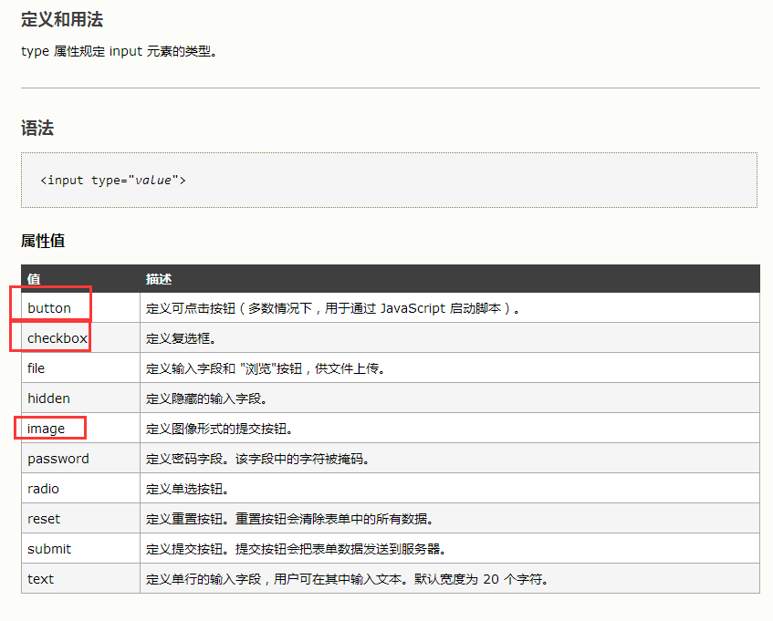

# wweebb

## 使用无分号风格

- 当一行代码是以 ： 

  - (
  - [
  - `  //是EcmaScript 6 中新增的一种字符串包裹方式，叫做：模板字符串他支持换行和非常方便的拼接变量

- 开头的时候，则在前面补上一个分号，用以避免一些语法解析错误，这也是有些第三方代码中看到的一上来就打分号，即第一个字符是分号的原因，有些人喜欢玩一些花哨的东西，例如补的不是分号是！~ 等。

- ```javascript
  function say() {
      console.log('hello world!')
  }
  
  say()
  
  ;(function () {
      console.log('hello!')
  })()
  
  say()
  
  ;['a','b'].forEach(function (item) {
      console.log(item)
  })
  
  var foo = `
  bar
  `
  console.log(foo)
  
  ;`hello`.toString()
  ```

## window.onlaod 和 DOMContentloaded 的异同

window.onlaod 和 DOMContentloaded 都是为了解决DOM加载后才绑定事件的问题的

- window.onlaod 
  - 当 `onload`事件触发时，页面上所有的DOM，样式表，脚本，图片，flash都已经加载完成了。
- DOMContentloaded
  - 当 `DOMContentLoaded` 事件触发时，仅当DOM加载完成，不包括样式表，图片，flash。

如果只是为了解决绑定事件的问题，DOMContentLoaded机制更加合理，因为我们可以容忍图片，flash延迟加载，却不可以容忍看见内容后页面不可交互。也就是说，即使用户网速再慢，好歹也给用户看一点东西。

## npx

npx 是 npm 5.0以后才有的命令他又一些有用的地方

- 避免全局安装

  ```shell
  # 比如一些脚手架工具，除了新建工程就么什么用了，但是还有全局安装有点浪费资源
  $ npx create-react-app my-react-project
  ```

- 方便调用项目内部安装模块

  ```shell
  # 比如
  node_modules/.bin/nodemon --version
  # 有了npx后可以直接调用，不用在给package.json的script了
  npx nodemon --version
  ```

## HTML

Head 标签必须要有的子标签是title。

textare标签内的所有东西会当成文本框的内容直接以文字的方式显示出来，也就是说放dom标签也是不会正常解析的，比如

```html
<textarea rows="20" cols="50"></textarea>
```

效果：


### DOM树

> https://www.jianshu.com/p/4f3cf54db0c8

一个标签是一个节点，注释也是一个节点，文本也是一个节点甚至换行符都是一个节点。然后根据位置变成N叉树。这就是DOM树，具体解释可以看看这个链接。

### 置换元素

⼀个内容不受CSS视觉格式化模型控制，CSS渲染模型并不考虑对此内容的渲染，且元素本⾝⼀般拥有固有尺⼨（宽度，⾼度，宽⾼⽐）的元素，被称之为置换元素。例如：浏览器会根据标签的src属性的 值来读取图片信息并显示出来，而如果查看(x)html代码，则看不到图片的实际内容；<input>标签的type属性来决定是显示输入 框，还是单选按钮等。

\、\<input\>、\<textarea\>、\<select\>、\<object\> 这些都是置换元素

1.常见的块级元素(**自动换行，** **可设置高宽** )有：

​    div,h1-h6,p,pre,ul,ol,li,**form**,table,**label**等

2。常见的行内元素（**无法自动换行，无法设置宽高**）有：

​    a,img,span，i（斜体）,em（强调）,sub(下标)，sup（上标）等。

3.常见的行块级元素(拥有内在尺寸，**可设置高宽，不会自动换行** )有：

### HTML中的图像格式

网页html文档支持的图片格式有jpg   ,   gif  ,   png  和  bmp  这四种，jpg ， gif  和  png 格式的图片特点是体积很小，因为在网上很常见，然而 bmp就不常见了，因为这种格式虽然很清晰色彩丰富，但是所占内存很大，所以很少见，但是也是支持的。一共这4种。还有谷歌退出的webp。

### H5新增表单元素

autocomplete、autofocus、form、formaction、formenctype、formmethod、formnovalidate、formtarget、height、list、max、min、**multiple**、**pattern**、**placeholder**、**required**、step、width。

**input**



### 行内元素有

\<a>标签可定义锚、\<abbr>表示一个缩写形式、\<acronym>   定义只取首字母缩写、\<b> 字体加粗、\<big>大号字体加粗、\<br>换行、\<cite>引用进行定义、\<em>    定义为强调的内容、\<i> 斜体文本效果、\ 向网页中嵌入一幅图像、\<input> 输入框、\<label>   标签为 input 元素定义标注

\<select>创建单选或多选菜单、\<small>呈现小号字体效果、\<span>组合文档中的行内元素、\<strong>语气更强的强调的内容、\<textarea>多行的文本输入控件

### 块级元素有

\<address>定义地址

\<caption>定义表格标题

\<dd> 定义列表中定义条目

\<div> 定义文档中的分区或节

\<dl> 定义列表

\<dt> 定义列表中的项目

\<fieldset>定义一个框架集

\<form> 创建 HTML 表单

\<h1>定义最大的标题

\<h2>定义副标题

\<h3>定义标题

\<h4>定义标题

\<h5>定义标题

\<h6>定义最小的标题

\<hr>创建一条水平线

\<legend>元素为 fieldset 元素定义标题

\<li>标签定义列表项目

\<noframes>为那些不支持框架的浏览器显示文本，于 frameset 元素内部

\<noscript>定义在脚本未被执行时的替代内容

\<ol>定义有序列表

\<ul>定义无序列表

\<p>标签定义段落

\<pre>定义预格式化的文本

\<table>标签定义 HTML 表格

\<tbody>标签表格主体（正文）

\<td>表格中的标准单元格

\<tfoot>定义表格的页脚（脚注或表注）

\<th>定义表头单元格

\<thead>标签定义表格的表头

\<tr>定义表格中的行

### 可变元素有

\<button>  按钮

\<del> 定义文档中已被删除的文本

\<iframe>   创建包含另外一个文档的内联框架（即行内框架）

\<ins> 标签定义已经被插入文档中的文本

\<map> 客户端图像映射（即热区）

\<object>  object对象

\<script>   客户端脚本

### canvas

HTML5 \<canvas> 标签用于绘制图像（通过脚本，通常是 JavaScript）。

不过，\<canvas> 元素本身并没有绘制能力（它仅仅是图形的容器） - 您必须使用js来完成实际的绘图任务。getContext() 方法可返回一个对象，该对象提供了用于在画布上绘图的方法和属性。

### script标签中的async、defer问题

defer 会按照顺序在 DOMContentLoaded 前按照页面出现顺序依次执行。

async 则是下载完立即执行。

#### 普通 script

先来看一个普通的 script 标签。

```xml
<script src="a.js"></script>
```

浏览器会做如下处理

- 停止解析 document.
- 请求 a.js
- 执行 a.js 中的脚本
- 继续解析 document

#### defer

```xml
<script src="d.js" defer></script>
<script src="e.js" defer></script>
```

- 不阻止解析 document， 并行下载 d.js, e.js
- 即使下载完 d.js, e.js 仍继续解析 document
- 按照页面中出现的顺序，在其他同步脚本执行后，`DOMContentLoaded` 事件前 依次执行 d.js, e.js。

#### async

```xml
<script src="b.js" async></script>
<script src="c.js" async></script>
```

- 不阻止解析 document, 并行下载 b.js, c.js
- 当脚本下载完后立即执行。（两者执行顺序不确定，执行阶段不确定，可能在 `DOMContentLoaded` 事件前或者后 ）

#### 其他

- 如果 script 无 src 属性，则 defer, async 会被忽略
- 动态添加的 script 标签隐含 async 属性。

#### 结论

- 两者都不会阻止 document 的解析
- defer 会在 DOMContentLoaded 前依次执行 （可以利用这两点哦！）
- async 则是下载完立即执行，不一定是在 DOMContentLoaded 前
- async 因为顺序无关，所以很适合像 Google Analytics 这样的无依赖脚本


## CSS3

- vh单位，视窗高度的百分比
- vw单位，视窗宽度的百分比
- rem 相对于根字体大小（html）的单位，比如可以设置 1rem=50px
-  em 相对于父级的font-size，比如font-size：16px（浏览器默认），则2em=32px

### 新增属性

1、box-shadow（阴影效果）

2、border-color（为边框设置多种颜色）

3、border-image（图片边框）

4、text-shadow（文本阴影）

5、text-overflow（文本截断）

6、word-wrap（自动换行）

7、border-radius（圆角边框）

8、opacity（透明度）

9、box-sizing（控制盒模型的组成模式）

10、resize（元素缩放）

11、outline（外边框）

12、background-size（指定背景图片尺寸）

13、background-origin（指定背景图片从哪里开始显示）

14、background-clip（指定背景图片从什么位置开始裁剪）

15、background（为一个元素指定多个背景）

16、hsl（通过色调、饱和度、亮度来指定颜色颜色值）

17、hsla（在hsl的基础上增加透明度设置）

18、rgba（基于rgb设置颜色，a设置透明度）

### Font-Face

其实就是让浏览器的字体变成自己服务器上存的字体，不用再局限于浏览其中的字体。注意这里只是引入了一种字体，在使用的时候还要在元素的css样式中设置。

@font-face规则，网页设计师再也不必使用的"web-safe"的字体之一。

字体的名称，font - face规则：

- font-family: myFirstFont;

字体文件包含在您的服务器上的某个地方，参考CSS：

- src: url('Sansation_Light.ttf')

如果字体文件是在不同的位置，请使用完整的URL：

- src: url('http://www.w3cschool.css/css3/Sansation_Light.ttf')

```css
@font-face
{
font-family: myFirstFont;
src: url('Sansation_Light.ttf'),
     url('Sansation_Light.eot'); /* IE9 */
}
div
{
	font-family:myFirstFont;/*这个名字就是font-face设置的名字*/
}
```

### Width/Height

ele.clientWidth = 宽度 + padding

ele.offsetWidth = 宽度 + padding + border

 ele.scrollTop = 被卷去的上侧距离

 ele.scrollHeight = 自身实际的高度（不包括边框）


### BFC

> https://blog.csdn.net/sinat_36422236/article/details/88763187

BFC(Block formatting context)直译为"块级格式化上下文"。它是一个独立的渲染区域，只有Block-level box参与， 它规定了内部的Block-level Box如何布局，并且与这个区域外部毫不相干。

BFC是一个独立的布局环境，其中的元素布局是不受外界的影响，并且在一个BFC中，块盒与行盒（行盒由一行中所有的内联元素所组成）都会垂直的沿着其父元素的边框排列。

**BFC的布局规则**

- 内部的Box会在垂直方向，一个接一个地放置。

- Box垂直方向的距离由margin决定。属于同一个BFC的两个相邻Box的margin会发生重叠。

- 每个盒子（块盒与行盒）的margin box的左边，与包含块border box的左边相接触(对于从左往右的格式化，否则相反)。即使存在浮动也是如此。

- BFC的区域不会与float box重叠。

- BFC就是页面上的一个隔离的独立容器，容器里面的子元素不会影响到外面的元素。反之也如此。

- 计算BFC的高度时，浮动元素也参与计算。

**如何创建BFC**

1. float的值不是none。
2. position的值不是static或者relative。
3. display的值是inline-block、table-cell、flex、table-caption或者inline-flex
4. overflow的值不是visible（这个方法常用，直接加overflow：hidden）

**BFC的作用**

1. 利用BFC避免margin重叠。（第二个元素创建BCF就可以了）
2. 自适应两栏布局
   - 一个元素左浮动一个元素无浮动的话，无浮动的元素就会包含浮动元素，无浮动元素中创建BCF就好了
3. 清除浮动
   - 如果父元素无高度的话，子元素设置为浮动，父元素高度会塌陷，父元素创建BCF就可以防止塌陷

### IFC

Inline Formatting Context 内敛格式化上下文。

#### ifc是什么

IFC的line box（线框高度由其包含行内元素中最高的实际高度计算而来（不受到竖直方向的padding/margin影响）

IFC的inline box一般左右都贴紧整个IFC，但是因为float元素二扰乱。float元素会位于IFC与line box之间，使得line box宽度缩短。同个IFC下的多个line box高度会不同。IFC中不可能有块级元素，当插入块级元素时（如p中插入div）会产生两个匿名快与div分隔开，即产生两个IFC，每个IFC对外表现为块级元素，与div垂直排列。

#### 作用

水平居中：当一个块要在环境中水平居中时候，设置其为inline-block则会在外层产生IFC，通过text-align:center则可以使其水平居中。

垂直居中：创建一个IFC，用其中一个元素撑开父元素的高度，然后设置其vertical-align:middle,其他行内元素则可以在此父元素下垂直居中。

### icon

关于css图标icon的六种实现方法

- img 法
- background 法
- css sprites 法
- font 法
- SVG 法
- CSS法

1. img 法

顾名思义用img标签插入图片。

缺点：图片过多时，增加服务器请求，当然你可以使用cdn。

2. background 法

把图片放在css背景标签中，background属性能够控制图片居中，平铺，横向或者纵向自适应剪裁，在做复杂的图片处理时用background属性比img标签要好。 

3. css sprites 法

国内一般叫雪碧图或者精灵图，思路就是将多张图片拼成一张背景图，然后选择性展示背景图某一部分来达到展示不同icon的目的。

优点：减少请求。

可以用网上的css sprites生成器生成，然后将每张icon的位置代码复制粘贴即可。

https://spritegen.website-performance.org/

4. font 法

简单的说就是用字体做icon，有些设计师将一些常用的icon集合做成了一套字体，通过字体选择将icon打出来，跟搜狗输入法的特殊符号有点像，不过大小不太好调整，得用font-size。

5. SVG 法

目前比较流行的方法，用svg矢量图做成icon图标。比如阿里巴巴矢量图图标库，比如搜索iphone，会有很多设计师设计的svg图片供你使用，选好图片后创建项目，生成js代码，按照教程将网站上生成的icon图标代码拷贝至你的代码中即可。

优点：无论放多大都不存在图片锯齿。

https://www.iconfont.cn/

6. css 法

很简单、用你学到的css知识写出来

有个哥们在github上弄了一个项目，纯css写icon。目前已经写了几十个icon，有兴趣的可以去了解并尝试，该方法比较考验css技巧。

https://cssicon.space/#/

### 浮动

1、行内元素与浮动元素发生重叠，边框、背景、内容都会显示在浮动元素之上

2、块级元素与浮动元素发生重叠，边框、背景会显示在浮动元素之下，内容会显示在浮动元素之上

### 选择器

伪类选择器和类选择器的优先级是一样的

### 隐藏元素的各方法之间的区别

opacity=0，该元素隐藏起来了，但不会改变页面布局，并且，如果该元素已经绑定一些事件，如click事件，那么点击该区域，也能触发点击事件的
visibility=hidden，该元素隐藏起来了，但不会改变页面布局，但是不会触发该元素已经绑定的事件
display=none，把元素隐藏起来，并且会改变页面布局，可以理解成在页面中把该元素删除掉一样

### 居中

```css
/* flex */
.content {
    display:flex;
    justify-content:center;
}
.content > .item {
    align-self:center;
}
/* css 法一 */
.item {
    display:absolute;
    top:50%;
    left:50%;
    transform:translate(-50%,-50%);
    /* 如果知道宽高也可以直接margin宽高的一半 */
}
/* css 法二 */
.content { dispaly:table; }
.content > .item {
    display: table-cell;
    vertical-align:middle;
}
```


## 三栏布局

### 圣杯布局

经典圣杯布局

- 子div设置为float
- 左边margin-left:-100%
- 右边margin-left:-自身宽度
-  中间width：100%（前几步设置好后是会挡住中间部分的，解决办法如下两部）
- 容器设置padding，左右为左组件和右组件的宽度
- 子div加上position：relative，然后左右组件分别往左右一自身的宽度

```html
<!DOCTYPE html>
<html>
	<head>
		<meta charset="utf-8" />
		<title>css</title>
	</head>
	 <style type="text/css">
	 	*{
	 		margin:0;
	 		padding: 0;
	 	}
	 	.main>div{
            float: left;
            height: 100px;
            position: relative;
	 	}
	 	.left {
	 		width: 200px;
	 		background: red;
	 		margin-left: -100%;
			left:-200px;
	 	}
	 	.right{
	 		width: 200px;
	 		background: blue;
	 		margin-left: -200px;
			right:-200px;
	 	}
	 	.middle{
	 		width: 100%;
	 		background: yellow;
	 	}
		.main{
			padding:0 200px 0 200px;
		}
	 </style>
	<body>
	<div class="main">
		<div class="middle">中间
		 </div>
		<div class="left">
			左边
		</div>
		<div class="right">
			右边
		</div>
	</div>
	</body>
</html>
```

flex版圣杯布局 父容器设置为flex，order排序，flex-grow设置每一项的比例

```css
.main{
    display:flex;
    flex-direction:row;
}
.left {
    order:-1;
    flex-grow:1;
}
.middle {
    order:0;
    flex-grow:2;
}
.right {
    order:1;
    flex-grow:1;
}
```

### 双飞翼

双飞翼布局

- 子div设置为float

- 左边margin-left:-100%

- 右边margin-left:-自身宽度

- 中间width：100% （同圣杯布局，中间是会被挡住的）
- 因为中间组件又有一个子容器，所以设置子容器margin左右控件的宽度就好了

```css
<style type="text/css">
    .main>div{
        float: left;
        height: 100px;
    }
    .left {
        width: 200px;
        background: red;
        margin-left: -100%;
    }
    .right{
        width: 200px;
        background: blue;
        margin-left: -200px;
    }
    .middle{
        width: 100%;
        background: yellow;

    }
    .content{ /* 中间把内容顶到中间部分，防止左右遮住 */ 
        margin-left: 200px;
        margin-right: 200px;
    }
</style>
<body>
    <div class="main">
        <div class="middle">
            <div class="content">
                中间
            </div>
        </div>
        <div class="left">
            左边
        </div>
        <div class="right">
            右边
        </div>
    </div>
</body>
```

## flex

阮一峰老师的教程，写的十分详尽http://www.ruanyifeng.com/blog/2015/07/flex-grammar.html

### @import/link

@import写着css文件中、link先在html中

```css
@import url(http://fonts.googleapis.com/css?family=Open+Sans:400,300,800,700);
@import url("normalize.css");
@import url("grid.css");
@import url("modal.css");
```

```html
<link rel=stylesheet href="css/main.css">
```

@import 进来的样式在页面内容载入完毕后再加载, 如果网速慢, 页面可能闪烁, 故不推荐使用. 相对于这种方式, 如果要加载许多独立的CSS文件, 建议直接用 link[rel=stylesheet] 加载.

如果CSS内容不是很多, 还是(按需)合并到一个文件里比较好, 减少请求.

使用import要注意几点

1. @import url（）机制是不同于link的，link是在加载页面前把css加载完毕，而@import url（）则是读取完文件后在加载，所以会出现一开始没有css样式，闪烁一下出现样式后的页面(网速慢的情况下)
2. @import 是css2里面的，所以古老的ie5不支持。 
3. 当使用javascript控制dom去改变样式的时候，只能使用link标签，因为@import不是dom可以控制的。
4. link除了能加载css外还能定义RSS，定义rel连接属性，@import只能加载css 

## JS

JavaScript是解释性语言，有非独立性、效率低的特点

非独立：JavaScript语言依赖执行环境，对于客户端来说是浏览器，对于服务端来说是node。

效率低：执行前不需要编译，执行时才编译，因此效率低。

注意：'use strict' 严格模式下进制使用this关键字，在此模式下的this为undefined

(()=>{}).length; 获取方法形参个数，形参为0

with、try-catch、eval可以改变作用域链

Number 数据类型为64位浮点数

### Video/Audio

video/Audio 中的事件

```
方法：load() play() pause()
事件：play() playing() pause() seeked() seeking() abort()当音频/视频的加载已放弃时触发
```

### new

1. 创建一个空对象
2. 连接原型链
3. 绑定this
4. 返回新对象

```js
function create(){
    // 1. 创建空对象
    let obj = new Object();
    // 2. 链接原型
    let con = [].shift.call(arguments) 
    obj.__proto__ = con.prototype
    // 3. 绑定this
    let res = con.apply(obj,arguments)
    // 4. 返回新对象
    return typeof res === 'object'?res:obj;
}
```

2. 然后构造函数里面的this会指向这个空对象

3. 构造函数内的 this.x=1 就相当于将 1 赋值给了这个空对象

4. 其实还默认做了一个事 即 return this

5. 所以最后 x 得到了 return 回来的 this。

6. 所以 x 有了 构造函数的属性

```js
var name = 'global';
var obj = {
    name: 'local',
    foo: function(){
        this.name = 'foo';
    }.bind(window)
};
var bar = new obj.foo();// 1.foo 因为new 改变了bind的绑定，所以this指向的是新对象
setTimeout(function() {
    console.log(window.name);// 3.global 异步所以最后又因为obj并没有改到window的属性所以window还是global
}, 0);
console.log(bar.name);
  
var bar3 = bar2 = bar;
bar2.name = 'foo2';// 2.foo2 因为js是引用赋值（浅拷贝），所以修改bar2就等于修改bar3
console.log(bar3.name);
// foo, foo2, global
```

bind返回一个函数，该函数体中的this绑定到window上，然后new对该函数进行构造调用，返回一个新对象，函数体中的this指向该对象。bind是硬绑定，new绑定的优先级高于硬绑定。所以this还是绑定在bar这个新对象上。this.name='foo'就是bar.name='foo'

### Object.assign

此方法用于对象的合并，将源对象（source）的所有可枚举属性，复制到目标对象（target）。

```js
const target = { a: 1 };

const source1 = { b: 2 };
const source2 = { c: 3 };

Object.assign(target, source1, source2);
target // {a:1, b:2, c:3}
```

**事件是否支持冒泡**


关于上述的onchange事件，onchange是在被改动的对象(如textbox)的值发生改变，**并失去焦点**的时候触发事件。如果想实现输入框值改变就触发事件可以用keyup事件

### 变量提升

js中用var修饰、函数都会进行变量提升，而函数的变量提升优先级比变量高，即函数在变量前面

### 顶级的对象

Navagator：提供有关浏览器的信息

Window：Window对象处于对象层次的最顶层，它提供了处理Navagator窗口的方法和属性

Location：提供了与当前打开的URL一起工作的方法和属性，是一个静态的对象

History：提供了与历史清单有关的信息

Document：包含与文档元素一起工作的对象，它将这些元素封装起来供编程人员使用

### readystatechange

document有readyState属性来描述document的loading状态，readyState的改变会触发readystatechange事件.

- loading
  文档仍然在加载
- interactive
  文档结束加载并且被解析，但是像图片，样式，frame之类的子资源仍在加载
- complete
  文档和子资源已经结束加载，该状态表明将要触发load事件。

### 节流、防抖

> 参考 https://www.jianshu.com/p/c8b86b09daf0

在开发过程中，有时候会需要绑定一些持续触发的事件（resize、scroll、mousemove），但是为了性能优化又不希望频繁的触发，因此节流和防抖的概念就出现了。

#### 防抖

防抖就是在一定时间内只触发一次，在这段时间内又触发了那么就会重新刷新定时器，也就是如果持续触发，则方法只会调用一次，等停止触发一段时间后才能再次触发

**非立即执行**

触发事件会等过了定时器的时间才会触发函数，重新触发事件定时器重新计算，也就是停止触发一段时间后才能够重复触发

```js
function debounce(func, wait) {
    let timeout;
    return function () {
        // 记录this和参数列表因为有可能会用到事件对象e
        let context = this;
        let args = arguments;

        if (timeout) clearTimeout(timeout);
        
        timeout = setTimeout(() => {
            func.apply(context, args)
        }, wait);
    }
}
// 调用
document.querySelector('#a').debounce(func,1000)
```

**立即执行**

先触发函数，再等定时器。只有等最后一次触发后停止触发事件n秒才会再执行

```js
function debounce(func,wait) {
    let timeout;
    return function() {
        let context = this
        let args = arguments
        if (timeout) clearTimeout(timeout) // 即使清除了定时器timeout也是有值得
        let callNow = !timeout
        timeout = setTimeout(() => {
            timeout = null // 只有这里请null下次触发才有效，也就是最后一次停止触发
        },wait)
        if (callNow) func.apply(context,args)
    }
}
```

#### 节流

节流就是只要与第一次触发事件时间比大于等于n就可以再触发

**事件戳版本**

```js
function throttle(func,wait) {
    let previous = 0
    return function() {
        let now = Date.now() // 获得当前时间戳
        let context = this
        let args = arguments
        // 因为都已经2020了，时间戳远远大于0，因此可以看出先触发
        if (now - previous >= wait) {
            func.apply(context,args)
            previous = now
        }
    }
}
// 使用方式和防抖一样
```

**定时器版本**

```js
function throttle(func,wait) {
    let timeout;
    return function() {
        let context = this
        let args = arguments
        if (!timeout) {
            timeout = setTimeout(()=>{
                timeout = null
                func.apply(context,args)
            },wait)
        }
    }
}
```

## JS常用设计模式

### **单例模式**

在执行当前 Single 只获得唯一一个对象
单例模式，是一种常用的软件设计模式。在它的核心结构中只包含一个被称为单例的特殊类。通过单例模式可以保证系统中，应用该模式的一个类只有一个实例。即一个类只有一个对象实例。

```js
var Single = (function(){
    var instance;
    function init() {
        // 定义私有方法和属性
        // 操作逻辑
        return {
           // 定义公共方法和属性
        };
    }
    return {
        // 获取实例
        getInstance:function(){
            if(!instance){
                instance = init();
            }
            return instance;
        }
    }
})();

var obj1 = Single.getInstance();
var obj2 = Single.getInstance();
console.log(obj1 === obj2);
```

### **工厂模式**

工厂模式是我们最常用的实例化对象模式了，是用工厂方法代替new操作的一种模式。

因为工厂模式就相当于创建实例对象的new，我们经常要根据类Class生成实例对象，如A a=new A() 工厂模式也是用来创建实例对象的，所以以后new时就要多个心眼，是否可以考虑使用工厂模式，虽然这样做，可能多做一些工作，但会给你系统带来更大的可扩展性和尽量少的修改量。

```js
function Animal(opts){
    var obj = new Object();
    obj.color = opts.color;
    obj.name= opts.name;
    obj.getInfo = function(){
        return '名称：'+ onj.name+'， 颜色：'+ obj.color;
    }
    return obj;
}
var cat = Animal({name: '波斯猫', color: '白色'});
cat.getInfo();
```

### **构造函数模式**

　 ECMAScript中的构造函数可用来创建特定类型的对象，像Array和Object这样的原生构造函数，在运行时会自动出现在执行环境中。此外，也可以创建自定义的构造函数，从而定义自定义对象的属性和方法。使用构造函数的方法，既解决了重复实例化的问题，又解决了对象识别的问题。

```js
function Animal(name, color){
    this.name = name;
    this.color = color;
    this.getName = function(){
        return this.name;
    }
}
// 实例一个对象
var cat = new Animal('猫', '白色');
console.log( cat.getName() );
```

### 代理模式

代理模式（Proxy），为其他对象提供一种代理以控制对这个对象的访问，为了不暴露执行对象的部分代码。也就是ES6提出的Proxy。就是在访问对象前先经过拦截器处理。

### 订阅/发布模式（subscribe & publish）

　　text属性变化了，set方法触发了，但是文本节点的内容没有变化。 如何才能让同样绑定到text的文本节点也同步变化呢？ 这里又有一个知识点： 订阅发布模式。
　　订阅发布模式又称为观察者模式，定义了一种一对多的关系，让多个观察者同时监听某一个主题对象，这个主题对象的状态发生改变时就会通知所有的观察者对象。
**发布者发出通知 =>主题对象收到通知并推送给订阅者 => 订阅者执行相应的操作。**

```js
 // 一个发布者 publisher，功能就是负责发布消息 - publish
var pub = {
    publish: function () {
        dep.notify();
    }
}
// 多个订阅者 subscribers， 在发布者发布消息之后执行函数
var sub1 = { 
    update: function () {
        console.log(1);
    }
}
var sub2 = { 
    update: function () {
        console.log(2);
    }
}
var sub3 = { 
    update: function () {
        console.log(3);
    }
}
// 一个主题对象
function Dep() {
    this.subs = [sub1, sub2, sub3];
}
Dep.prototype.notify = function () {
    this.subs.forEach(function (sub) {
        sub.update();
    });
}

// 发布者发布消息， 主题对象执行notify方法，进而触发订阅者执行Update方法
var dep = new Dep();
pub.publish();
```

**思路： 发布者负责发布消息、 订阅者负责接收接收消息，而最重要的是主题对象，他需要记录所有的订阅这特消息的人，然后负责吧发布的消息通知给哪些订阅了消息的人。**

**所以，当set方法触发后做的第二件事情就是作为发布者发出通知： “我是属性text，我变了”。 文本节点作为订阅者，在接收到消息之后执行相应的更新动作。**

## JS内存泄漏

内存泄漏是每个开发者最终都要面对的问题，它是许多问题的根源：反应迟缓，崩溃，高延迟，以及其他应用问题。

### 什么是内存泄漏？

本质上，内存泄漏可以定义为：应用程序不再需要占用内存的时候，由于某些原因，内存没有被操作系统或可用内存池回收。编程语言管理内存的方式各不相同。只有开发者最清楚哪些内存不需要了，操作系统可以回收。一些编程语言提供了语言特性，可以帮助开发者做此类事情。另一些则寄希望于开发者对内存是否需要清晰明了。

### JavaScript 内存管理

JavaScript 是一种垃圾回收语言。垃圾回收语言通过周期性地检查先前分配的内存是否可达，帮助开发者管理内存。换言之，垃圾回收语言减轻了“内存仍可用”及“内存仍可达”的问题。两者的区别是微妙而重要的：仅有开发者了解哪些内存在将来仍会使用，而不可达内存通过算法确定和标记，适时被操作系统回收。

### JavaScript 内存泄漏

垃圾回收语言的内存泄漏主因是不需要的引用。理解它之前，还需了解垃圾回收语言如何辨别内存的可达与不可达。

### Mark-and-sweep

大部分垃圾回收语言用的算法称之为 Mark-and-sweep 。算法由以下几步组成：

1. 垃圾回收器创建了一个“roots”列表。Roots 通常是代码中全局变量的引用。JavaScript 中，“window” 对象是一个全局变量，被当作 root 。window 对象总是存在，因此垃圾回收器可以检查它和它的所有子对象是否存在（即不是垃圾）；
2. 所有的 roots 被检查和标记为激活（即不是垃圾）。所有的子对象也被递归地检查。从 root 开始的所有对象如果是可达的，它就不被当作垃圾。
3. 所有未被标记的内存会被当做垃圾，收集器现在可以释放内存，归还给操作系统了。

现代的垃圾回收器改良了算法，但是本质是相同的：可达内存被标记，其余的被当作垃圾回收。

不需要的引用是指开发者明知内存引用不再需要，却由于某些原因，它仍被留在激活的 root 树中。在 JavaScript 中，不需要的引用是保留在代码中的变量，它不再需要，却指向一块本该被释放的内存。有些人认为这是开发者的错误。

为了理解 JavaScript 中最常见的内存泄漏，我们需要了解哪种方式的引用容易被遗忘。

### 三种类型的常见 JavaScript 内存泄漏

#### 1：意外的全局变量

JavaScript 处理未定义变量的方式比较宽松：未定义的变量会在全局对象创建一个新变量。在浏览器中，全局对象是 `window` 。

```js
function foo(arg) {
    bar = "this is a hidden global variable";
}
```

真相是：

```js
function foo(arg) {
    window.bar = "this is an explicit global variable";
}
```

函数 `foo` 内部忘记使用 `var` ，意外创建了一个全局变量。此例泄漏了一个简单的字符串，无伤大雅，但是有更糟的情况。

另一种意外的全局变量可能由 `this` 创建：

```js
function foo() {
    this.variable = "potential accidental global";
}

// Foo 调用自己，this 指向了全局对象（window）
// 而不是 undefined
foo();
```

> 在 JavaScript 文件头部加上 `'use strict'`，可以避免此类错误发生。启用严格模式解析 JavaScript ，避免意外的全局变量。

**全局变量注意事项**

尽管我们讨论了一些意外的全局变量，但是仍有一些明确的全局变量产生的垃圾。它们被定义为不可回收（除非定义为空或重新分配）。尤其当全局变量用于临时存储和处理大量信息时，需要多加小心。如果必须使用全局变量存储大量数据时，确保用完以后把它设置为 null 或者重新定义。与全局变量相关的增加内存消耗的一个主因是缓存。缓存数据是为了重用，缓存必须有一个大小上限才有用。高内存消耗导致缓存突破上限，因为缓存内容无法被回收。

#### 2：被遗忘的计时器或回调函数

在 JavaScript 中使用 `setInterval` 非常平常。一段常见的代码：

```js
var someResource = getData();
setInterval(function() {
    var node = document.getElementById('Node');
    if(node) {
        // 处理 node 和 someResource
        node.innerHTML = JSON.stringify(someResource));
    }
}, 1000);
```

此例说明了什么：与节点或数据关联的计时器不再需要，`node` 对象可以删除，整个回调函数也不需要了。可是，计时器回调函数仍然没被回收（计时器停止才会被回收）。同时，`someResource` 如果存储了大量的数据，也是无法被回收的。

对于观察者的例子，一旦它们不再需要（或者关联的对象变成不可达），明确地移除它们非常重要。老的 IE 6 是无法处理循环引用的。如今，即使没有明确移除它们，一旦观察者对象变成不可达，大部分浏览器是可以回收观察者处理函数的。

观察者代码示例：

```js
var element = document.getElementById('button');
function onClick(event) {
    element.innerHTML = 'text';
}

element.addEventListener('click', onClick);
```

**对象观察者和循环引用注意事项**

老版本的 IE 是无法检测 DOM 节点与 JavaScript 代码之间的循环引用，会导致内存泄漏。如今，现代的浏览器（包括 IE 和 Microsoft Edge）使用了更先进的垃圾回收算法，已经可以正确检测和处理循环引用了。换言之，回收节点内存时，不必非要调用 `removeEventListener` 了。

#### 3：脱离 DOM 的引用

有时，保存 DOM 节点内部数据结构很有用。假如你想快速更新表格的几行内容，把每一行 DOM 存成字典（JSON 键值对）或者数组很有意义。此时，同样的 DOM 元素存在两个引用：一个在 DOM 树中，另一个在字典中。将来你决定删除这些行时，需要把两个引用都清除。

```js
var elements = {
    button: document.getElementById('button'),
    image: document.getElementById('image'),
    text: document.getElementById('text')
};

function doStuff() {
    image.src = 'http://some.url/image';
    button.click();
    console.log(text.innerHTML);
    // 更多逻辑
}

function removeButton() {
    // 按钮是 body 的后代元素
    document.body.removeChild(document.getElementById('button'));

    // 此时，仍旧存在一个全局的 #button 的引用
    // elements 字典。button 元素仍旧在内存中，不能被 GC 回收。
}
```

此外还要考虑 DOM 树内部或子节点的引用问题。假如你的 JavaScript 代码中保存了表格某一个 ` 的引用。将来决定删除整个表格的时候，直觉认为 GC 会回收除了已保存的 ` 以外的其它节点。实际情况并非如此：此 ` 是表格的子节点，子元素与父元素是引用关系。由于代码保留了 ` 的引用，导致整个表格仍待在内存中。保存 DOM 元素引用的时候，要小心谨慎。

#### 4：闭包

闭包是 JavaScript 开发的一个关键方面：匿名函数可以访问父级作用域的变量。

代码示例：

```js
var theThing = null;
var replaceThing = function () {
  var originalThing = theThing;
  var unused = function () {
    if (originalThing)
      console.log("hi");
  };

  theThing = {
    longStr: new Array(1000000).join('*'),
    someMethod: function () {
      console.log(someMessage);
    }
  };
};

setInterval(replaceThing, 1000);
```

代码片段做了一件事情：每次调用 `replaceThing` `，theThing` 得到一个包含一个大数组和一个新闭包（`someMethod`）的新对象。同时，变量 `unused` 是一个引用 `originalThing` 的闭包（先前的 `replaceThing` 又调用了 `theThing` ）。思绪混乱了吗？最重要的事情是，闭包的作用域一旦创建，它们有同样的父级作用域，作用域是共享的。`someMethod` 可以通过 `theThing` 使用，`someMethod` 与 `unused` 分享闭包作用域，尽管 `unused` 从未使用，它引用的 `originalThing` 迫使它保留在内存中（防止被回收）。当这段代码反复运行，就会看到内存占用不断上升，垃圾回收器（GC）并无法降低内存占用。本质上，闭包的链表已经创建，每一个闭包作用域携带一个指向大数组的间接的引用，造成严重的内存泄漏。

## ES5继承

> https://www.jianshu.com/p/d8d065185631

这里就写个组合寄生继承

```js
function B() {
    A.apply(this,arguments)
}

function inherit(parent, son) {
    var proto = Object.create(parent.prototype)
    proto.constructor = son
    son.prototype = proto
}

inherit(A,B)
```

## ES6

原生具备 Iterator 接口的数据结构如下。

- Array
- Map
- Set
- String
- TypedArray
- 函数的 arguments 对象
- NodeList 对象

### Proxy

> https://es6.ruanyifeng.com/#docs/proxy

proxy本来是代理的意思，在es6中proxy更像是拦截器，他就是用来在访问或者修改一个对象前，先经过proxy处理后再修改

```js
let target = { age: 18, name: 'Niko Bellic' }
let handlers = {
  get (target, property) {
    return `${property}: ${target[property]}`
  },
  set (target, property, value) {
    target[property] = value
  }
}
let proxy = new Proxy(target, handlers)

proxy.age = 19
console.log(target.age, proxy.age)   // 19,          age : 19
console.log(target.name, proxy.name) // Niko Bellic, name: Niko Bellic
```

## 数组

Array.prototype.sort()

```js

var a = [1,2,5,3]
a.sort((forward,next) => {
    // 如果返回值小于零则为first second 不改变位置，如果大于零则改变位置
    //return forward-next // 升序
    return next-forward// 降序
})
```

+[] 隐式类型转换，因为[]是对象，所以toPrimitive->valueOf->toString为''，结果就是+''===0

**判断数组是否非数组**

- arr instanceof Array 但是 arr instanceof Object 也返回的是true，如果单单是判读一个对象，这个方法是可行的
- arr.constructor == Array 对象的构造函数如果是Array那么对象必定是数组
- Object.prototype.toString.call(arr) == '[object Array]' 用Object原型链上的toString方法来暑促arr的类型，因为如果是不同的对象toString是不同的，所以要用Object的toString
- Array.isArray(arr) 数组对象的方法

**every和some**

[].every(item => 布尔) 只要有一个为false返回值就为false,全部为true才为true

[].some(item => 布尔) 只要有一个为true就为true，全为false才为false

**Array.form()**

`Array.from()` 方法从一个类似数组或可迭代对象创建一个新的，浅拷贝的数组实例。

```js
console.log(Array.from('foo'));
// expected output: Array ["f", "o", "o"]

console.log(Array.from([1, 2, 3], x => x + x));
// expected output: Array [2, 4, 6]
```

## 对象

Object.assigin(obja,objb...) 把所有参数的obj合并。返回值就是合并好的obj，如果出现同名属性，后面的会把前面的覆盖。注意这里第一个参数的obj会被改变，其余的obj不会改变，返回值和第一个obj的引用是一样的

```js
var returnObj =  Object.assign(target,source) // 合并target和source
returnObj == target // true
```

判断对象是否为空对象

```js
const isEmpty = (obj) => {
    for (var key in obj) return false
    return true
}

const isEmpty = (obj) => {
    if (JSON.stringify(obj) === "{}") return true
    return false
}

const isEmpty = (obj) => {
    if (Object.keys(obj).length === 0) return true
    return false
}
```

## 字符串

下面哪些语句可以 在JS里判断一个对象oStringObject是否为String？

因为一直oStringObject是一个对象，也就是 new String('') 出来的，所以用typeof 得出的是object 因此只能够用instanceof来判断

### String.replace()

replace() 方法用于在字符串中用一些字符替换另一些字符，或替换一个与正则表达式匹配的子串。


**语法**


```js
stringObject.replace(regexp/substr,replacement)
```


| 参数          | 描述                                                         |
| :------------ | :----------------------------------------------------------- |
| regexp/substr | 必需。规定子字符串或要替换的模式的 RegExp 对象。请注意，如果该值是一个字符串，则将它作为要检索的直接量文本模式，而不是首先被转换为 RegExp 对象。 |
| replacement   | 必需。一个字符串值。规定了替换文本或生成替换文本的函数。     |

**返回值**

一个新的字符串，是用 *replacement* 替换了 regexp 的第一次匹配或所有匹配之后得到的。

不会改变原字符串的值

## RegExp对象

### 定义 RegExp

RegExp 对象用于存储检索模式。

通过 new 关键词来定义 RegExp 对象。以下代码定义了名为 patt1 的 RegExp 对象，其模式是 "e"：

```js
var patt1=new RegExp("e");
```

当您使用该 RegExp 对象在一个字符串中检索时，将寻找的是字符 "e"。

### RegExp 对象的方法

RegExp 对象有 3 个方法：test()、exec() 以及 compile()。

#### test()

test() 方法检索字符串中的指定值。返回值是 true 或 false。

例子：

```js
var patt1=new RegExp("e");

console.log(patt1.test("The best things in life are free")); 
```

由于该字符串中存在字母 "e"，以上代码的输出将是：

```js
true
```

#### exec()

exec() 方法检索字符串中的指定值。返回值是被找到的值。如果没有发现匹配，则返回 null。

例子 1：

```js
var patt1=new RegExp("e");

console.log(patt1.exec("The best things in life are free")); 
```

由于该字符串中存在字母 "e"，以上代码的输出将是：

```js
e
```

例子 2：

您可以向 RegExp 对象添加第二个参数，以设定检索。例如，如果需要找到所有某个字符的所有存在，则可以使用 "g" 参数 ("global")。

如需关于如何修改搜索模式的完整信息，请访问我们的 [RegExp 对象参考手册](https://www.w3school.com.cn/jsref/jsref_obj_regexp.asp)。

在使用 "g" 参数时，exec() 的工作原理如下：

- 找到第一个 "e"，并存储其位置
- 如果再次运行 exec()，则从存储的位置开始检索，并找到下一个 "e"，并存储其位置

```js
var patt1=new RegExp("e","g");
do
{
result=patt1.exec("The best things in life are free");
console.log(result);
}
while (result!=null) 
```

由于这个字符串中 6 个 "e" 字母，代码的输出将是：

```js
e
e
e
e
e
e
null
```

#### compile()

compile() 方法用于改变 RegExp。

compile() 既可以改变检索模式，也可以添加或删除第二个参数。

**例子：**

```js
var patt1=new RegExp("e");

console.log(patt1.test("The best things in life are free"));

patt1.compile("d");

console.log(patt1.test("The best things in life are free"));
```

由于字符串中存在 "e"，而没有 "d"，以上代码的输出是：

```js
true
false
```

### 支持正则表达式的String对象方法

注意是String对象的方法，不是RegExp的

- search
- match
- replace
- split

## 短路运算符

1、只要“||”前面为false，无论“||”后面是true还是false，结果都返回“||”后面的值。

2、只要“||”前面为true，无论“||”后面是true还是false，结果都返回“||”前面的值。

3、只要“&&”前面是false，无论“&&”后面是true还是false，结果都将返“&&”前面的值;

4、只要“&&”前面是true，无论“&&”后面是true还是false，结果都将返“&&”后面的值;

A: 1&&3&&1 = >1

B:1&&2&&3  =>3

C:1||0||3  =>1

D:0||1||2  =>1

## 回流和重绘

整个在浏览器的渲染过程中（页面初始化，用户行为改变界面样式，动画改变界面样式等）reflow(回流)和repaint(重绘) 会大大影响web性能，尤其是手机页面。因此我们在页面设计的时候要尽量减少reflow和repaint。

**什么是reflow和repaint（原文链接：http://www.cnblogs.com/Peng2014/p/4687218.html）**

reflow：例如某个子元素样式发生改变，直接影响到了其父元素以及往上追溯很多祖先元素（包括兄弟元素），这个时候浏览器要重新去渲染这个子元素相关联的所有元素的过程称为回流。

reflow：几乎是无法避免的。现在界面上流行的一些效果，比如树状目录的折叠、展开（实质上是元素的显 示与隐藏）等，都将引起浏览器的 reflow。鼠标滑过、点击……只要这些行为引起了页面上某些元素的占位面积、定位方式、边距等属性的变化，都会引起它内部、周围甚至整个页面的重新渲 染。通常我们都无法预估浏览器到底会 reflow 哪一部分的代码，它们都彼此相互影响着。

repaint：如果只是改变某个元素的背景色、文 字颜色、边框颜色等等不影响它周围或内部布局的属性，将只会引起浏览器 repaint（重绘）。repaint 的速度明显快于 reflow

下面情况会导致reflow发生

**1：改变窗口大小**

**2：改变文字大小**

**3：内容的改变，如用户在输入框中敲字**

**4：激活伪类，如:hover**

**5：一些class属性的改变**

**6：脚本操作DOM**

**7：计算offsetWidth和offsetHeight**

**8：设置style属性**

那么为了减少回流要注意哪些方式呢？

**1：不要通过父级来改变子元素样式，最好直接改变子元素样式，改变子元素样式尽可能不要影响父元素和兄弟元素的大小和尺寸**

**2：尽量通过class来设计元素样式，切忌用style**

```js
var bstyle = document.body.style; // cache
```

```js
bstyle.padding = "20px"; // reflow, repaint
bstyle.border = "10px solid red"// 再一次的 reflow 和 repaint
```

```js
bstyle.color = "blue"// repaint
bstyle.backgroundColor = "#fad"// repaint
```

```js
bstyle.fontSize = "2em"// reflow, repaint
```

```js
// new DOM element - reflow, repaint
document.body.appendChild(document.createTextNode('dude!'));
```

对上面代码优化：

.b-class{

　　padding:20px;

　　color:blue;

　　border:10px solid red;

　　background-color:#fad;

　　font-size:2em;

}

```
$div.addClass("b-class");
```

**3：实现元素的动画，对于经常要进行回流的组件，要抽离出来，它的position属性应当设为fixed或absolute**

**4：权衡速度的平滑。比如实现一个动画，以1个像素为单位移动这样最平滑，但reflow就会过于频繁，CPU很快就会被完全占用。如果以3个像素为单位移动就会好很多。**

**5：不要用tables布局的另一个原因就是tables中某个元素一旦触发reflow就会导致table里所有的其它元素reflow。在适合用table的场合，可以设置table-layout为auto或fixed，**

**6：这样可以让table一行一行的渲染，这种做法也是为了限制reflow的影响范围。**

**7：css里不要有表达式expression**

**8：减少不必要的 DOM 层级（DOM depth）。改变 DOM 树中的一级会导致所有层级的改变，上至根部，下至被改变节点的子节点。这导致大量时间耗费在执行 reflow 上面。**

**9：避免不必要的复杂的 CSS 选择器，尤其是后代选择器（descendant selectors），因为为了匹配选择器将耗费更多的 CPU。**

**10: 尽量不要过多的频繁的去增加，修改，删除元素，因为这可能会频繁的导致页面reflow，可以先把该dom节点抽离到内存中进行复杂的操作然后再display到页面上。**

在div.first里面加入div.second,在div.second里面加入div.third:

$divS = $("<div class='second'></div>");

$(div.first).append($divS));//reflow

$divT = $("<div class='third'></div>");

$divS.append($divT);//reflow

优化代码：

$divS = $("<div class='second'></div>");

$divT = $("<div class='third'></div>");

$divS.append($divT);

$(div.first).append($divS));//reflow

或者：

var $divF = $(div.first);

$divS = $("<div class='second'></div>");

$divS.hide();

$(div.first).append($divS));

$divT = $("<div class='third'></div>");

$divS.append($divT);

$divS.show();//reflow

**11：请求如下值offsetTop, offsetLeft, offsetWidth, offsetHeight，scrollTop/Left/Width/Height，clientTop/Left/Width/Height，浏览器会发生reflow，建议将他们合并到一起操作，可以减少回流的次数。**

如果我们要经常去获取和操作这些值，则可以先将这些值缓存起来例如：

var windowHeight = window.innerHeight;//reflow

for(i=0;i<10;i++){

　　$body.height(windowHeight++);

　　一系列关于windowHeight的操作.......

}

## Event loop

https://segmentfault.com/a/1190000016278115

### 宏任务与微任务

宏任务一般是：包括整体代码script，setTimeout，setInterval。

微任务：Promise，process.nextTick。

setTimeout 和 setInterval 这连个宏异步任务，指向后是放到任务队列的最后，要比微任务后，因此当指向异步任务的时候无论位置如何，先执行Promise这一类异步任务在执行宏的异步任务。注意，如果有new Promise(()=>{})的话，这个回调函数内部出了reslove() reject()之外的所有代码执行的顺序都是在主线程队列的，即和外部代码是在同一个队列中的。

```js
// 定时器任务属于宏任务，并且需要先在任务队列等待，等到同步任务执行完，执行栈清空，才会在任务队列中按顺序选任务进去
setTimeout(() => console.log('a'));//4. 打印a
 
//Promise 属于异步微任务，在本轮同步任务结束之前执行
Promise.resolve().then(
    // 1. 打印 b
   () => console.log('b')  //
 ).then(
    // 箭头函数的resolve传递的参数作为下一个then的参数
   () => Promise.resolve('c').then(
     // 执行箭头函数
     (data) => {
        // 把定时器任务也放入任务队列中等待，在第一个定时器之后
       setTimeout(() => console.log('d')); //5. 打印d
       // 2.打印 f
       console.log('f');
       // 此时返回的 数据作为下一个then的参数
       return data;
     }
   )
 ).then(data => console.log(data)); // 3.打印 c
// 打印顺序 bfcad 
```

```js
new Promise((resolve) => {
console.log('1')
    resolve()
console.log('2')
     }).then(() => {
    console.log('3')
     })
     setTimeout(() => {
    console.log('4')
     })
     console.log('5')
// 12534  这里就是因为是 new Promise()里的回调函数是在主队列中的，因此按顺序执行125
```


## MVC和MVVM

### MVC

MVC: M(Model)、V(View)、C(Controller)，换句话说，一个事件的发生是这样的过程

1. 用户和应用交互
2. 控制器的事件处理器被触发
3. 控制器从模型中请求数据，并将其交给视图
4. 视图将数据呈现给用户

模型：用来存放应用的所有数据对象。模型不必知晓视图和控制器的细节，模型只需包含数据及直接和这些数据相关的逻辑。任何事件处理代码、视图模版，以及那些和模型无关的逻辑都应当隔离在模型之外。
视图：视图层是呈现给用户的，用户与之产生交互。在javaScript应用中，视图大都是由html、css和JavaScript模版组成的。除了模版中简单的条件语句之外，视图不应当包含任何其他逻辑。事实上和模型类似，视图也应该从应用的其他部分中解耦出来
控制器：控制器是模型和视图的纽带。控制器从视图获得事件和输入，对它们进行处理，并相应地更新视图。当页面加载时，控制器会给视图添加事件监听，比如监听表单提交和按钮单击。然后当用户和应用产生交互时，控制器中的事件触发器就开始工作。
例如JavaScript框架早期框架backbone就是采用的MVC模式。

上面的例子似乎太过空洞，下面讲一个生活中的例子进行讲解：

1. 用户提交一个新的聊天信息
2. 控制器的事件处理器被触发
3. 控制器创建了一个新的聊天模型
4. 然后控制器更新视图
5. 用户在聊天窗口看到新的聊天信息

在原生JS中我们可以定义一个构造方法，这个构造方法你们属性就是数据，还可以定义一些模型的方法，例如一些模型是专门又来获取网络数据的，一些是赋值做算法处理的

```js
// es5
function ModelA(x,y) {
    this.x = x || '1'
    this.y = y || 'b'
    this.func = function (){
    	console.log(this.y)
	}
}
// es6
class ModelA {
    constructor(x,y) {
        this.x = x || '1'
        this.y = y || 'b'
    }
    func() {
        console.log(this.x)
    }
}
```

Controller 就可已解锁平常做逻辑处理的js，这里的js通过Model的数据动态修改HTML页面


### MVVM

MVVM:M(Model)、V(View)、VM(ViewModel)，因为用MVC的设计时会时Controller中大量的DOM操作，这样会消耗大量的性能，如果出现卡顿就会降低用户体验，VM是把MVC里的controller的数据加载，加工功能分离出来，把一些消耗性能的功能交给服务器。**我们只用处理业务逻辑**，因为MVVM是数据双向绑定的所以也不用关心DOM的操作。

**View**：View是作为视图模板，用于定义结构、布局。它自己不处理数据，只是将ViewModel中的数据展现出来。此外为了和ViewModel产生关联，那么还需要做的就是数据绑定的声明，指令的声明，事件绑定的声明。这在当今流行的MVVM开发框架中体现的淋淋尽致。在示例图中，我们可以看到ViewModel和View之间是双向绑定，意思就是说ViewModel的变化能够反映到View中，View的变化也能够改变ViewModel的数据值。那如何实现双向绑定呢，例如有这个input元素：

```html
<input type='text' yg-model='message'>
```

随着用户在Input中输入值的变化，在ViewModel中的message也会发生改变，这样就实现了View到ViewModel的单向数据绑定。下面是一些思路：

1. 扫描看哪些节点有yg-xxx属性
2. 自动给这些节点加上onchange这种事件
3. 更新ViewModel中的数据，例如ViewModel.message = xx.innerText

那么ViewModel到View的绑定可以是下面例子：

```html
<p yg-text='message'></p>
```

渲染后p中显示的值就是ViewModel中的message变量值。下面是一些思路：

1. 首先注册ViewModel
2. 扫描整个DOM Tree 看哪些节点有yg-xxx这中属性
3. 记录这些被单向绑定的DOM节点和ViewModel之间的隐射关系
4. 使用innerText,innerHTML = ViewModel.message进行赋值

**ViewModel**：ViewModel起着连接View和Model的作用，同时用于处理View中的逻辑。在MVC框架中，视图模型通过调用模型中的方法与模型进行交互，然而在MVVM中View和Model并没有直接的关系，在MVVM中，ViewModel从Model获取数据，然后应用到View中。相对MVC的众多的控制器，很明显这种模式更能够轻松管理数据，不至于这么混乱。还有的就是处理View中的事件，例如用户在点击某个按钮的时候，这个行动就会触发ViewModel的行为，进行相应的操作。行为就可能包括更改Model,重新渲染View。

**Model**：Model 层，对应数据层的域模型，它主要做域模型的同步。通过 Ajax/fetch 等 API 完成客户端和服务端业务 Model 的同步。在层间关系里，它主要用于抽象出 ViewModel 中视图的 Model。


**MVVM设计模式的优点**

1. 双向绑定技术，当Model变化时，View-Model会自动更新，View也会自动变化。很好的做到数据的一致性

2. 由于控制器的功能大都移动到View上处理，大大的对控制器进行了瘦身

3. View的功能进一步强化，具有控制的部分功能，

   若想无限增强它的功能，甚至控制器的全部功能几乎都可以迁移到各个View上

　（不过这样不可取，那样View干不了属于它职责范围内的事情）。

　  View可以像控制器一样具有自己都View-Model 

4. 可以对View或ViewController的数据处理部分抽象出来一个函数处理model。 

   这样它们专职页面布局和页面跳转，它们必然更一步的简化。

**MVVM设计模式的缺点**

1. 数据绑定也使得bug很难被调试。比如你看到页面异常了，有可能是你的View的代码有bug，也可能是你的model的代码有问题。数据绑定使得一个位置的Bug被快速传递到别的位置，要定位原始出问题的地方就变得不那么容易了。

2. 数据双向绑定不利于代码重用。客户端开发最常用的是View，但是数据双向绑定技术，让你在一个View都绑定了一个model，不同的模块model都不同。那就不能简单重用view了

3. 一个大的模块中model也会很大，虽然使用方便了也很容易保证数据的一致性，但是长期持有，不释放内存就造成话费更多的内存。

## storage

sessionStorage用于本地存储一个会话（session）中的数据，这些数据只有在同一个会话中的页面才能访问并且当会话结束后数据也随之销毁。因此    sessionStorage不是一种持久化的本地存储，仅仅是会话级别的存储。而localStorage用于持久化的本地存储，除非主动删除数据，否则数据是永远不会过期的。

web storage和cookie的区别

Web Storage的概念和cookie相似，区别是它是为了更大容量存储设计的。Cookie的大小是受限的，并且每次你请求一个新的页面的时候Cookie都会被发送过去，这样无形中浪费了带宽，另外cookie还需要指定作用域，不可以跨域调用。

除此之外，Web Storage拥有setItem,getItem,removeItem,clear等方法，不像cookie需要前端开发者自己封装setCookie，getCookie。但是Cookie也是不可以或缺的：Cookie的作用是与服务器进行交互，作为HTTP规范的一部分而存在 ，而Web Storage仅仅是为了在本地“存储”数据而生。

## React

### pureComponent 与 Component 

在讲这两个组件的差别前我们先来看看Component的声明周期。


我们观察这个生命周期后发现，如果想减少组价不必要的render来提高性能，如果我们使用Component的话，就需要自己重写shouldComponentUpdate方法。不然只要props或者state改变了，那又要重新render。

#### shouldComponentUpdate

```js
shouldComponentUpdate(nextProps, nextState)
```

使用shouldComponentUpdate()以让React知道当前状态或属性的改变是否不影响组件的输出，默认返回ture，返回false时不会重写render，而且该方法并不会在初始化渲染或当使用forceUpdate()时被调用，我们要做的只是这样：

```js
shouldComponentUpdate(nextProps, nextState) {
  return nextState.someData !== this.state.someData
}
```

但是，state里的数据这么多，还有对象，还有复杂类型数据，react的理念就是拆分拆分再拆分，这么多子组件，我要每个组件都去自己一个一个对比吗，这样工作量会不会太大了点，因此react就推出了PureComponent这个组件，这个组组件的优势就是内部帮我们重写了shouldComponentUpdate这个方法。

**两者异同**

React.PureComponent 与 React.Component 几乎完全相同，但 React.PureComponent 通过props和state的浅对比来实现 shouldComponentUpate()。

在PureComponent中，如果包含比较复杂的数据结构，可能会因深层的数据不一致而产生错误的否定判断，导致界面得不到更新。

如果定义了 shouldComponentUpdate()，无论组件是否是 PureComponent，它都会执行shouldComponentUpdate结果来判断是否 update。如果组件未实现 shouldComponentUpdate() ，则会判断该组件是否是 PureComponent，如果是的话，会对新旧 props、state 进行 shallowEqual 比较，一旦新旧不一致，会触发 update。

浅对比： 当所有键的值严格相等，且键对应值得类型相等时返回true，当对象键数量不相等、键不相等、键对应的值不相等时返回false。这个浅对比的方法也就是源码中shallowEqual这个方法

**区别点**：
PureComponent自带通过props和state的浅对比来实现 shouldComponentUpate()，而Component没有。
PureComponent缺点
可能会因深层的数据不一致而产生错误的否定判断，从而shouldComponentUpdate结果返回false，界面得不到更新。
PureComponent优势
不需要开发者自己实现shouldComponentUpdate，就可以进行简单的判断来提升性能。
为什么PureComponent比较复杂的数据结构，可能会因深层的数据不一致而产生错误的否定判断？
JavaScript 中的对象一般是可变的（Mutable），因为使用了引用赋值，新的对象简单的引用了原始对象，改变新的对象将影响到原始对象。如 foo={a: 1}; bar=foo; bar.a=2 你会发现此时 foo.a 也被改成了 2。

为了解决这个问题，一般的做法是使用 shallowCopy（浅拷贝）或 deepCopy（深拷贝）来避免被修改，但这样做造成了 CPU 和内存的浪费。

```js
let foo = {a: {b: 1}};
let bar = foo;
bar.a.b = 2;
console.log(foo.a.b);  // 打印 2
console.log(foo === bar); // 打印 true
```

可以在fb的shallowEqual方法源码中看到，如下，浅对比只是用Object.is()对Object的value做了一个基本数据类型的比较。

```js
function is(x: mixed, y: mixed): boolean {
  // SameValue algorithm
  if (x === y) { // Steps 1-5, 7-10
    // Steps 6.b-6.e: +0 != -0
    // Added the nonzero y check to make Flow happy, but it is redundant
    return x !== 0 || y !== 0 || 1 / x === 1 / y;
  } else {
    // Step 6.a: NaN == NaN
    return x !== x && y !== y;
  }
}

function shallowEqual(objA: mixed, objB: mixed): boolean {
  if (is(objA, objB)) {
    return true;
  }

  if (typeof objA !== 'object' || objA === null ||
      typeof objB !== 'object' || objB === null) {
    return false;
  }

  const keysA = Object.keys(objA);
  const keysB = Object.keys(objB);

  if (keysA.length !== keysB.length) {
    return false;
  }

  // Test for A's keys different from B.
  for (let i = 0; i < keysA.length; i++) {
    if (
      !hasOwnProperty.call(objB, keysA[i]) ||
      !is(objA[keysA[i]], objB[keysA[i]])
    ) {
      return false;
    }
  }

  return true;
}
```

我们先来对is()函数进行分析：

在js中 ‘===’ 可以判断数据类型是否相等，但其实这样方式也并不十分严谨，例如

+0 === -0; // js 打印true
NaN === NaN; // js 打印false
我们希望上述的判断结果，+0和-0为false，NaN与NaN为true，这时候可以用这种方式

1/+0 // 结果为Infinity
1/-0 // 结果为-Infinity
Infinity === -Infinity; // false

解决 NaN === NaN为false，可以通过NaN和自身不相等的特性来解决
x !== x && y !== y

所以is()函数首先是通过 ‘===’ 来对数据类型进行比较，然后解决+0/-0和NaN的比较问题。

接下来分析shallowEqual()函数


```js
function shallowEqual(objA: mixed, objB: mixed): boolean {
  // 首先对两个基本数据类型进行比较
  if (is(objA, objB)) {
    return true;
  }

  // 判断两个数据都为object的情况
  if (typeof objA !== 'object' || objA === null ||
      typeof objB !== 'object' || objB === null) {
    return false;
  }

  // 获得所有的key
  const keysA = Object.keys(objA);
  const keysB = Object.keys(objB);

  // 判断两者key的数量是否一致
  if (keysA.length !== keysB.length) {
    return false;
  }

  // 如果key数量相同，使用一层for循环去比较
  for (let i = 0; i < keysA.length; i++) {
    if (
      // 判断对象B中是否包含对象A的key，即两者的keys是否一致
      !hasOwnProperty.call(objB, keysA[i]) ||
      // 通过is()函数对比A和B的key对应的数据
      !is(objA[keysA[i]], objB[keysA[i]])
    ) {
      return false;
    }
  }
```

下面以组件的使用来举例：

例如：

```jsx
class ChildComponent extends React.PureComponent {
  render() {
    return(
      <div>
        {this.props.numbers}
      </div>
    )
  }
}
class MainComponent extends React.Component {
  constructor(props) {
   super(props);
    this.handleClick = this.handleClick.bind(this);
    this.state = {
      numbers: [0]
    }
  }
  handleClick() {
    const arr = this.state.numbers;
    arr.push(1);
    this.setState({
      numbers: arr
    })
    console.log(this.state.numbers)
  }
  render() {
    <div>
      <button onClick={this.handleClick} />
      <ChildComponent numbers={this.state.numbers}/>
    </div>
  }
}
```

然而在MainComponent中去修改numbers时，ChildComponent并没有得到刷新。原因在于js使用的是引用赋值，新的对象简单引用了原始对象，改变新对象虽然影响了原始对象，但对象的地址还是一样，使用===比较的方式相等。而在PureComponent中，会被判定prop相等而不触发render()。

避免此类问题最简单的方式是，避免使用值可能会突变的属性或状态，而是使用副本来返回新的变量。

```js
handleClick() {
  this.setState(prevState => ({
    words: [...prevState.words, 'marklar'],
  }));
};
```

另外一种方式是使用Immutable.js

### Function Component

function Component：写纯函数组件非常简洁优雅，官方也推荐这种写法。但是，这并不代表纯函数组件是性能最好的组件写法。
在内部被包装成了一个只有render方法的StatelessComponent组件，在所有情况下都会更新。后来出了Hook来管理组件是否更新。我也在electron的note中的项目中专门讲了React Hook的用法，其实就是使用Effect来判断需要更新组件，把那些改变的的state或者prop放入effect的第二个参数的数组中就可以了。数组中任何一个变量的改变都会更新Fnction Component组件

### 虚拟DOM

其实就是dom树的一个映射，一个dom封装成一个类，标签属性就是类的属性，这个类里也有属性指向子类。根据dom tree 一层套一层，最终形成虚拟dom

```js
function createElement(type, props, children) {
    return new Element(type, props, children)
}
class Element{
    constructor(type, props, children){
        this.type = type;// 标签的 tag
        this.props = props;// 标签的属性
        this.children = children // 子标签
    }
}

let virtualDom1 = createElement('ul', {class: 'list'}, [
    createElement('li', {class: 'item'}, ['a']),
    createElement('li', {class: 'item'}, ['b']),
    createElement('li', {class: 'item'}, ['c']),
])
let virtualDom2 = createElement('ul', {class: 'list'}, [
    createElement('li', {class: 'item'}, ['1']),
    createElement('li', {class: 'item'}, ['2']),
    createElement('li', {class: 'item'}, ['3']),
])
let el = render(virtualDom);
renderDom(el, window.root);
let patchs = diff(virtualDom1, virtualDom2);
```

### diff 算法

三种策略 tree diff、component diff、element diff


**tree diff** 

- 就是对比，对虚拟dom进行深度便利，一个一个节点对比可如果没有了就直接把该节点以及其所有子孙节点全部删除。如果某节点改变了，那么是先删掉就的节点，在把新的节点及其子节点一个一个加上。

**component diff** 

- 如果是同一类组件那么先根据shouldComponentUpdate函数判断是否更新组件，如果是则，直接那么按照virtual DOM 的 tree diff的原策略继续遍历，否则直接返回
- 如果是不同类的逐渐，直接整个节点及其子孙节点替换为新逐渐

**Element diff**

- 如果是同一层级（有同一个父节点，即兄弟节点），那么如果改变了，那么根据变动会对element进行插入 移动 和 删除这三个方法的操作。
- 如果按照tree diff策略那么会进行大量的dom操作，因为只要是改变位置都会删掉旧的节点创建新的节点，因此在element diff 中给每一个element都加了key，就是为了方便重用dom减少回流的性能损耗
- 因此对element diff 的操作过程是先对列表组件加key，然后遍历确定要删除和新增的，然后把删除的直接删掉，然后创建新的节点，最后根据新的位置移动到相应的位置。加了key就是为了重用dom，减少对dom操作，从而提升性能。


## 网络

### 缓存

缓存的有点有很多

- 减少了不必要的数据传输、节省带宽
- 减少了服务器的负担，提升网站性能
- 加快了客户端加载页面的速度
- 用户体验友好

但是也会出现一些问题，比如有时候服务器更新了资源客户端来不及更新。

#### 强缓存

强制缓存的意思，就是在cache-control: max-age=xxx设置时间内（单位s），只要是这个文件就会从缓存中获取。因此强缓存的重点就是设置cache-control，如果设置为no-cache就是不进行强缓存。

cache-control处理设置max-age外还会设置那些地方能缓存，那些地方不能缓存。

- public 的话就是所有请求了这个资源的地方都缓存。
- private 的话就是代理服务器不能缓存，只有客户端能缓存
- no-cache 的话就是跳过强缓存、进行协商缓存
- no-store 的话完全不缓存

#### 协商缓存

简单的讲就是，在获取资源前，想向服务器发送一个请求，看资源是否过期，如果过期了，就向服务器发送请求，如果没有过期就从缓存中获取

response header里面的设置

```bash
etag: '5c20abbd-e2e8'
last-modified: Mon, 24 Dec 2018 09:49:49 GMT
```

etag：每个文件的hash值，类似于webpack打包的hashchunk，每个文件有唯一的hash值

last-modified：文件的修改时间，就是通过这个来判断缓存的文件有没有过期的

如果没有过期，就会响应304，表示协商后文件没有改变，从缓存中获取资源

如果过期了，就会响应200，因为是从服务器重新请求的资源

#### 缓存的作用

因为一个网站或者一个客户端不可能只有简单的几个文件，如果是这样，那么这个网站就出问题了。因为，这样的话，如果服务器的文件只改变1b的东西，整个网站的所有东西都要从下下载一遍，严重的影响了用户打开网站或者客户端的速度，影响用户体验。如果我们把资源分散开来，那么和缓存机制的配合就可以做到，当服务器更新的时候影响的东西最小化。

当然也不能够为了缓存而分散的太多，因为也要考虑第一次使用客户端的用户体验，如果太多了，http请求就会变得多，打开的速度也会变慢，也会影响用户体验，因此要做取舍。

用了缓存要慎用强缓存因为不可能知道下一次更新在什么时候。即使是公司的logo也是可能改的

### Session/cookie

http是无状态的网络协议,请求响应后，断开了TCP连接，下一次连接与上一次无关。为了识别不同的请求是否来自同一客户，引用HTTP会话机制,而维持这个会话则主要靠session和cookie。简单来说，cookie机制采用的是在客户端保持状态的方案，而session机制采用的是在服务器端保持状态的方案。

cookie大小普遍在4K左右，根据浏览器的不同可能会有几K的变化

#### cookie属性

- name　　字段为一个cookie的名称。

- value　字段为一个cookie的值。
- domain　　字段为可以访问此cookie的域名。
- path　　字段为可以访问此cookie的页面路径。 比如domain是abc.com,path是/test，那么只有/test路径下的页面可以读取此cookie。
- expires/Max-Age 　字段为此cookie超时时间。若设置其值为一个时间，那么当到达此时间后，此cookie失效。不设置的话默认值是Session，意思是cookie会和session一起失效。当浏览器关闭(不是浏览器标签页，而是整个浏览器) 后，此cookie失效。
- Size　　字段 此cookie大小。
- http　　字段  cookie的httponly属性。若此属性为true，则只有在http请求头中会带有此cookie的信息，而不能通过document.cookie来访问此cookie。
- secure　　 字段 设置是否只能通过https来传递此条cookie

### CORS

跨域资源共享(CORS) 是一种机制，它使用额外的 HTTP 头来告诉浏览器 让运行在一个 origin (domain) 上的Web应用被准许访问来自不同源服务器上的指定的资源。当一个资源从与该资源本身所在的服务器不同的域、协议或端口请求一个资源时，资源会发起一个跨域 HTTP 请求。

而CORS 允许浏览器向跨源服务器，发出跨域请求，从而克服了AJAX只能同源使用的限制。

CORS是一个W3C标准，它同时需要浏览器和服务端的支持，浏览器基本都支持，因此，想要实现CORS通信，只要服务器实现了CORS接口即可

### 域名

http://hui.m.a.com:8080/index.html这个链接中，顶级域名是com，二级域名是a.com，三级域名是m.a.com；

图片会进行缓存，但是状态码只有200，不会是304

### 浏览器访问网站的过程

> https://blog.csdn.net/xiangriikui/article/details/52207153

1. 在浏览器中输入域名
2. DNS解析
   - 看看浏览器中有无缓存，即有无保存该域名的ip地址
   - 再看操作系统中有无缓存
   - 再看路由器有无缓存
   - ISP（运营商）的DNS服务器解析，找不到再给上一层服务器解析，通常都会找到
   - 递归搜索 – 你的ISP的DNS服务器从跟域名服务器开始进行递归搜索，从.com顶级域名服务器到xxx的域名服务器。一般DNS服务器的缓存中会 有.com域名服务器中的域名，所以到顶级服务器的匹配过程不是那么必要了。
3. 找到对应的ip后，和服务器建立连接（tcp三次握手）
4. 连接建立后，浏览器给服务器发送请求，服务器处理请求并响应的信息（通常是网站的文件，也可能是交互信息）传给服务器。
5. 服务器接收到文件后进行渲染或者根据响应的信息执行脚本
6. 渲染完成后就给用户呈现页面 / 脚本执行完成后呈现效果

### websocket与ajax的区别

websocket是一种新的协议，实现客户端和浏览器之间的全双工模式。而ajax只是一个交互式网页开发的技术

websocket可以实现长连接，只要会话不关闭，就可以一直保持连接。而ajax发送完请求，接收完数据后就关闭了

websocket在连接的时候可以从服务器发信息给客户端，客户端也可以发信息给服务器，就类似于计算机网络中的点对点模式。而ajax是典型的客户端/服务器模式，只有客户端发送请求服务器才能响应。

### fetch API与传统xhr的区别

fetch是用promise封装的，xmlhttprequest是用回调函数的方法来执行的。

fetch携带更多的报文信息，因此fetch比xhr更灵活

关于fetch的用法https://github.com/Jamsdfn/wweebb/blob/master/note/react/React.md#fetch

## 跨域

> https://segmentfault.com/a/1190000011145364

### **跨域解决方案**

1. 通过jsonp跨域
2.  document.domain + iframe跨域
3.  location.hash + iframe
4.  window.name + iframe跨域
5. postMessage跨域
6. 跨域资源共享（CORS）
7.  nginx代理跨域 
8. nodejs中间件代理跨域
9. WebSocket协议跨域

第七第八点服务器相关的其实就是对6的拓展

### jsonp

利用了js文件这些静态资源本身就能够跨域

用法：在本域动态穿件一个script标签，src就是服务器的地址，这个服务器返回的数据类型是Content-Type: text/javascript 返回值就是调用一个回调函数（如果想跨域传参就带调用时候传实参就可以了）。这个回调函数在主域中定义。

```js
var script = document.createElement('script');
script.type = 'text/javascript';

// 传参一个回调函数名给后端，方便后端返回时执行这个在前端定义的回调函数
script.src = 'http://www.domain2.com:8080/login?user=admin&callback=handleCallback';
document.head.appendChild(script);

// 回调执行函数
function handleCallback(res) {
    alert(JSON.stringify(res));
}
```

```js
// 服务器返回的jsonp，返回数据直接用字符串拼接就可以了
handleCallback({test:1})
```

#### JSONP污染全局变量的问题

JSONP返回只能全局变量，没想到其它办法
但是可以减少污染全局变量，用现成的变量代替这个全局
svr端返回 myobj.callback123456({xxx})
那这个只对myobj有影响，要清除的时候，myobj={}指向一个新对象就回收了旧的

### document.domain + iframe

此方案仅限主域相同，子域不同的跨域应用场景。

实现原理：两个页面都通过js强制设置document.domain为基础主域，就实现了同域。

1.）父窗口：(http://www.domain.com/a.html)

```html
<iframe id="iframe" src="http://child.domain.com/b.html"></iframe>
<script>
    document.domain = 'domain.com';
    var user = 'admin';
</script>
```

2.）子窗口：(http://child.domain.com/b.html)

```html
<script>
    document.domain = 'domain.com';
    // 获取父窗口中变量
    alert('get js data from parent ---> ' + window.parent.user);
</script>
```

### location.hash + iframe

实现原理： a欲与b跨域相互通信，通过中间页c来实现。 三个页面，不同域之间利用iframe的location.hash传值，相同域之间直接js访问来通信。

具体实现：A域：a.html -> B域：b.html -> A域：c.html，a与b不同域只能通过hash值单向通信，b与c也不同域也只能单向通信，但c与a同域，所以c可通过parent.parent访问a页面所有对象。

1.）a.html：(http://www.domain1.com/a.html)

```html
<iframe id="iframe" src="http://www.domain2.com/b.html" style="display:none;"></iframe>
<script>
    var iframe = document.getElementById('iframe');

    // 向b.html传hash值
    setTimeout(function() {
        iframe.src = iframe.src + '#user=admin';
    }, 1000);
    
    // 开放给同域c.html的回调方法
    function onCallback(res) {
        alert('data from c.html ---> ' + res);
    }
</script>
```

2.）b.html：(http://www.domain2.com/b.html)

```html
<iframe id="iframe" src="http://www.domain1.com/c.html" style="display:none;"></iframe>
<script>
    var iframe = document.getElementById('iframe');

    // 监听a.html传来的hash值，再传给c.html
    window.onhashchange = function () {
        iframe.src = iframe.src + location.hash;
    };
</script>
```

3.）c.html：(http://www.domain1.com/c.html)

```html
<script>
    // 监听b.html传来的hash值
    window.onhashchange = function () {
        // 再通过操作同域a.html的js回调，将结果传回
        window.parent.parent.onCallback('hello: ' + location.hash.replace('#user=', ''));
    };
</script>
```

### window.name + iframe

因为ifram跳转的时候window.name 即使跳转也是跟着不变的，并且东可以改。但是只用在同域情况才可以读取，这个变量最大可以传2M数据。

做法：A想跨域得到B的消息，先写一个同域的空白页面C，然后A iframe跳转到B，B把数据赋值给window.name 然后调去C(通过 iframe.contentWindow.location 切换 iframe 地址)，因为AC同域所以A可以直接获取到C的window.name 即得到了B的数据

1.）a.html：(http://www.domain1.com/a.html)

```js
var proxy = function(url, callback) {
    var state = 0;
    var iframe = document.createElement('iframe');

    // 加载跨域页面
    iframe.src = url;

    // onload事件会触发2次，第1次加载跨域页，并留存数据于window.name
    iframe.onload = function() {
        if (state === 1) {
            // 第2次onload(同域proxy页)成功后，读取同域window.name中数据
            callback(iframe.contentWindow.name);
            destoryFrame();

        } else if (state === 0) {
            // 第1次onload(跨域页)成功后，切换到同域代理页面
            iframe.contentWindow.location = 'http://www.domain1.com/proxy.html';
            state = 1;
        }
    };

    document.body.appendChild(iframe);

    // 获取数据以后销毁这个iframe，释放内存；这也保证了安全（不被其他域frame js访问）
    function destoryFrame() {
        iframe.contentWindow.document.write('');
        iframe.contentWindow.close();
        document.body.removeChild(iframe);
    }
};

// 请求跨域b页面数据
proxy('http://www.domain2.com/b.html', function(data){
    alert(data);
});
```

2.）proxy.html：([http://www.domain1.com/proxy....](http://www.domain1.com/proxy.html))
中间代理页，与a.html同域，内容为空即可。

3.）b.html：(http://www.domain2.com/b.html)

```html
<script>
    window.name = 'This is domain2 data!';
</script>
```

总结：通过iframe的src属性由外域转向本地域，跨域数据即由iframe的window.name从外域传递到本地域。这个就巧妙地绕过了浏览器的跨域访问限制，但同时它又是安全操作。

### postMessage

postMessage是HTML5 XMLHttpRequest Level 2中的API，且是为数不多可以跨域操作的window属性之一，它可用于解决以下方面的问题：
a.） 页面和其打开的新窗口的数据传递
b.） 多窗口之间消息传递
c.） 页面与嵌套的iframe消息传递
d.） 上面三个场景的跨域数据传递

用法：postMessage(data,origin)方法接受两个参数
data： html5规范支持任意基本类型或可复制的对象，但部分浏览器只支持字符串，所以传参时最好用JSON.stringify()序列化。
origin： 协议+主机+端口号，也可以设置为"*"，表示可以传递给任意窗口，如果要指定和当前窗口同源的话设置为"/"。

其实这个就是一个 iframe 的新的方法。

1.）a.html：(http://www.domain1.com/a.html)

```html
<iframe id="iframe" src="http://www.domain2.com/b.html" style="display:none;"></iframe>
<script>       
    var iframe = document.getElementById('iframe');
    iframe.onload = function() {
        var data = {
            name: 'aym'
        };
        // 向domain2传送跨域数据
        iframe.contentWindow.postMessage(JSON.stringify(data), 'http://www.domain2.com');
    };

    // 接受domain2返回数据
    window.addEventListener('message', function(e) {
        alert('data from domain2 ---> ' + e.data);
    }, false);
</script>
```

2.）b.html：(http://www.domain2.com/b.html)

```html
<script>
    // 接收domain1的数据
    window.addEventListener('message', function(e) {
        alert('data from domain1 ---> ' + e.data);

        var data = JSON.parse(e.data);
        if (data) {
            data.number = 16;

            // 处理后再发回domain1
            window.parent.postMessage(JSON.stringify(data), 'http://www.domain1.com');
        }
    }, false);
</script>
```

### 跨域资源共享（CORS）

其实就是服务器设置响应头允许某个域的访问 Access-Control-Allow-Origin

普通跨域请求：只服务端设置Access-Control-Allow-Origin即可，前端无须设置，若要带cookie请求：前后端都需要设置。

需注意的是：由于同源策略的限制，所读取的cookie为跨域请求接口所在域的cookie，而非当前页。如果想实现当前页cookie的写入,服务器也是设置一下Access-Control-Allow-Credentials: true

目前，所有浏览器都支持该功能(IE8+：IE8/9需要使用XDomainRequest对象来支持CORS）)，CORS也已经成为主流的跨域解决方案。

##### **1、 前端设置：**

1.）原生ajax

```js
// 前端设置是否带cookie
xhr.withCredentials = true;
```

示例代码：

```js
var xhr = new XMLHttpRequest(); // IE8/9需用window.XDomainRequest兼容

// 前端设置是否带cookie
xhr.withCredentials = true;

xhr.open('post', 'http://www.domain2.com:8080/login', true);
xhr.setRequestHeader('Content-Type', 'application/x-www-form-urlencoded');
xhr.send('user=admin');

xhr.onreadystatechange = function() {
    if (xhr.readyState == 4 && xhr.status == 200) {
        alert(xhr.responseText);
    }
};
```

2.）jQuery ajax

```js
$.ajax({
    ...
   xhrFields: {
       withCredentials: true    // 前端设置是否带cookie
   },
   crossDomain: true,   // 会让请求头中包含跨域的额外信息，但不会含cookie
    ...
});
```

##### **2、 服务端设置：**

若后端设置成功，前端浏览器控制台则不会出现跨域报错信息，反之，说明没设成功。

Nodejs后台示例：

```js
var http = require('http');
var server = http.createServer();
var qs = require('querystring');

server.on('request', function(req, res) {
    var postData = '';

    // 数据块接收中
    req.addListener('data', function(chunk) {
        postData += chunk;
    });

    // 数据接收完毕
    req.addListener('end', function() {
        postData = qs.parse(postData);

        // 跨域后台设置
        res.writeHead(200, {
            'Access-Control-Allow-Credentials': 'true',     // 后端允许发送Cookie
            'Access-Control-Allow-Origin': 'http://www.domain1.com',    // 允许访问的域（协议+域名+端口）
            /* 
             * 此处设置的cookie还是domain2的而非domain1，因为后端也不能跨域写cookie(nginx反向代理可以实现)，
             * 但只要domain2中写入一次cookie认证，后面的跨域接口都能从domain2中获取cookie，从而实现所有的接口都能跨域访问
             */
            'Set-Cookie': 'l=a123456;Path=/;Domain=www.domain2.com;HttpOnly'  // HttpOnly的作用是让js无法读取cookie
        });

        res.write(JSON.stringify(postData));
        res.end();
    });
});

server.listen('8080');
console.log('Server is running at port 8080...');
```

### WebSocket协议跨域

运用元素的socket来自己操作网络，即自己实现端到端的信息传输

WebSocket protocol是HTML5一种新的协议。它实现了浏览器与服务器全双工通信，同时允许跨域通讯，是server push技术的一种很好的实现。
原生WebSocket API使用起来不太方便，我们使用Socket.io，它很好地封装了webSocket接口，提供了更简单、灵活的接口，也对不支持webSocket的浏览器提供了向下兼容。

1.）前端代码：

```html
<div>user input：<input type="text"></div>
<script src="https://cdn.bootcss.com/socket.io/2.2.0/socket.io.js"></script>
<script>
var socket = io('http://www.domain2.com:8080');

// 连接成功处理
socket.on('connect', function() {
    // 监听服务端消息
    socket.on('message', function(msg) {
        console.log('data from server: ---> ' + msg); 
    });

    // 监听服务端关闭
    socket.on('disconnect', function() { 
        console.log('Server socket has closed.'); 
    });
});

document.getElementsByTagName('input')[0].onblur = function() {
    socket.send(this.value);
};
</script>
```

2.）Nodejs socket后台：

```js
var http = require('http');
var socket = require('socket.io');

// 启http服务
var server = http.createServer(function(req, res) {
    res.writeHead(200, {
        'Content-type': 'text/html'
    });
    res.end();
});

server.listen('8080');
console.log('Server is running at port 8080...');

// 监听socket连接
socket.listen(server).on('connection', function(client) {
    // 接收信息
    client.on('message', function(msg) {
        client.send('hello：' + msg);
        console.log('data from client: ---> ' + msg);
    });

    // 断开处理
    client.on('disconnect', function() {
        console.log('Client socket has closed.'); 
    });
});
```

## Storage

我们常见且常用的前端存储方式主要由两种：cookie、webStorage（localStorage和sessionStorage）。

**Cookie基于HTTP规范，用来识别用户。**

Cookie是服务器发送到浏览器的一小段数据，会在浏览器下次向同一服务器再发起请求时被携带并发送到服务器上。

Cookie诞生之初的作用就是解决HTTP的无状态请求，用来记录一些用户相关的一些状态。

- 会话状态管理（如用户登录状态、购物车、游戏分数或其它需要记录的信息）
- 个性化设置（如用户自定义设置、主题等）
- 浏览器行为跟踪（如跟踪分析用户行为等）

因为一些前端交互的需要，后来cookie也被用于存储一些客户端的数据。

Cookie的原生api不友好，需要自行封装一下。下面是封装后的方法。

```js
document.cookie // 返回的是报文头cookie的值，也就是一串字符串，要自己处理
```

**webStorage基于HTML5规范**

HTML5 提供了两种在客户端存储数据的新方法：localStorage和sessionStorage，挂载在window对象下。

webStorage是本地存储，数据不是由服务器请求传递的。从而它可以存储大量的数据，而不影响网站的性能。

Web Storage的目的是为了克服由cookie带来的一些限制，当数据需要被严格控制在客户端上时，无须持续地将数据发回服务器。比如客户端需要保存的一些用户行为或数据，或从接口获取的一些短期内不会更新的数据，我们就可以利用Web Storage来存储。

**localStorage**的生命周期是永久性的。localStorage存储的数据，即使关闭浏览器，也不会让数据消失，除非主动的去删除数据。如果 想设置失效时间，需自行封装。

**sessionStorage** 的生命周期是在浏览器关闭前。

　　特性：

- 关闭浏览器sessionStorage 失效；
- 页面刷新不会消除数据；
- 只有在当前页面打开的链接，才可以访sessionStorage的数据，使用window.open打开页面和改变localtion.href方式都可以获 取到sessionStorage内部的数据;

## 前端开发的优化问题

- 减少 http 请求次数:CSS Sprites, JS、CSS 源码压缩、图片大小控制合适;网页Gzip，CDN 托管，data 缓存 ，图片服务器。
- 前端模板 JS+数据，减少由于 HTML 标签导致的带宽浪费，前端用变量保存 AJAX请求结果，每次操作本地变量，不用请求，减少请求次数
- 用 innerHTML 代替 DOM 操作，减少 DOM 操作次数，优化 javascript 性能。
- 当需要设置的样式很多时设置 className 而不是直接操作 style。
- 少用全局变量、缓存 DOM 节点查找的结果。减少 IO 读取操作。
- 避免使用 CSS Expression(css 表达式)又称 Dynamic properties(动态属性)。 (7) 图片预加载，将样式表放在顶部，将脚本放在底部 加上时间戳。
- 避免在页面的主体布局中使用 table，table 要等其中的内容完全下载之后才会显示出来，显示比 div+css 布局慢。


## 页面优化

**在 css/js 代码上线之后开发人员经常会优化性能，从用户刷新网页开始， 一次 js 请求一般情况下有哪些地方会有缓存处理?**

dns 缓存，cdn 缓存，浏览器缓存，服务器缓存。


**一个页面上有大量的图片(大型电商网站)，加载很慢，你有哪些方法优 化这些图片的加载，给用户更好的体验。**

图片懒加载，在页面上的未可视区域可以添加一个滚动条事件，判断图片位置与浏览器顶端 的距离与页面的距离，如果前者小于后者，优先加载。

如果为幻灯片、相册等，可以使用图片预加载技术，将当前展示图片的前一张和后一张优先 下载。

如果图片为 css 图片，可以使用 CSSsprite，SVGsprite，Iconfont、Base64 等技术。

如果图片过大，可以使用特殊编码的图片，加载时会先加载一张压缩的特别厉害的缩略图， 以提高用户体验。

如果图片展示区域小于图片的真实大小，则因在服务器端根据业务需要先行进行图片压缩， 图片压缩后大小与展示一致。

## 工具

### concurrently

可以用这个插件在一个命令行同时运行两个命令

安装

```shell
$ npm i -D  concurrently
```

使用

```js
// 如果是全局安装的 concurrently 
concurrently "命令1" "命令2"
// 如果是在项目中安装，则在script中加上
"key": "concurrently \"命令1\" \"命令2\""
```

### wait-on

wait-on是跨平台的命令行实用程序，它将等待文件，端口，套接字和http（s）资源变得可用之后再执行另一条指令

安装

```shell
$ npm i -D wait-on
```

使用

```js
wait-on xxx && 命令
// 如 wait-on http://localhost:3000 && electron .
```

### cross-env

运行跨平台设置和使用环境变量的脚本，因为不同平台的脚本运行的时对环境变量的语法是不一样的，而cross-env就解决了这个跨平台的问题

```json
"scripts": {
    "dev": "concurrently \"wait-on http://localhost:3000 && electron .\" \"cross-env BROWSER=none npm start\""
},
```

上面的代码就是为了解决 BROWSER=none 这个环境变量问题的

### classnames

一个帮我们拼接className的插件

```shell
$ npm i classnames
```

使用

```jsx
const fClassName = classNames({
    'nav-link': true,
    'active': file.id === activeId
})
// 这样fClassName 就是拼接好的class字符串，file.id===activeId 则class加上active，为false就不添加
```

### uuid

用 uuid 插件生成 uuid

```shell
$ npm i uuid
```

使用

```jsx
// *为uuid的版本（不是module是版本，就是识别的版本）
import uuidv* from 'uuid/v*'
const newID = uuidv4()
```


