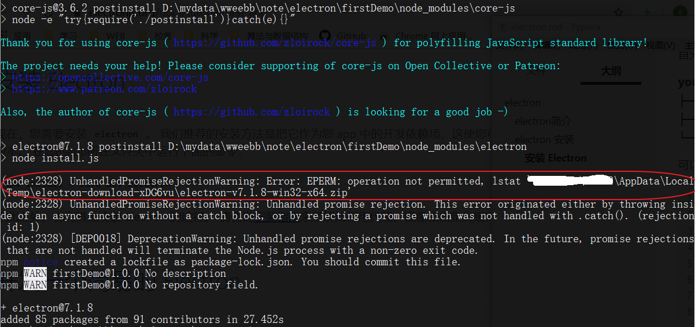

# electron

## electron简介

> 官网：https://electronjs.org/

Electron是由Github开发，用HTML，CSS和JavaScript来构建**跨平台桌面应用程序**的一个开源库。 Electron通过将Chromium和Node.js合并到同一个运行时环境中，并将其打包为Mac，Windows和Linux系统下的应用来实现这一目的。

## electron 安装

我们先自己搭electron的架构，熟悉一下electron的架构

首先最简单的应用起码具备以下目录

**your-app/
├── package.json
├── main.js
└── index.html**

可以通过`npm init`来创建 package.json 目录，以下为 package.json 文件的基本内容

```json
{
  "name": "your-app",
  "version": "0.1.0",
  "main": "main.js",
  "scripts": {
    "start": "electron ."
  }
}
```

### 安装 Electron

```shell
$ npm install --save-dev electron
```

用上面的命令安装后可能会出现以下的错误



如果出现了上述错误，则需要手动下载electron-vx.x.x-xxx.zip文件，不然当编号程序执行`npm start`会报错。下载那个文件也就是多执行下面的语句。

```shell
$ node node_modules\electron\install.js
```

执行上述语句是没有任何命令行反馈的，如果等了很久夯实卡死来了那条指令，可能就是网络问题了，科学上网再执行上述语句。万一还是有问题，则参考下面老哥的方案

> https://blog.csdn.net/u013584271/article/details/102764898

### 编写最基本的main.js

```js
const { app, BrowserWindow } = require('electron')

function createWindow () {   
  // 创建浏览器窗口
  let win = new BrowserWindow({
    width: 800,
    height: 600,
    webPreferences: {
      nodeIntegration: true
    }
  })

  // 加载index.html文件
  win.loadFile('index.html')
}

app.on('ready', createWindow)
```

我们应当在 `main.js` 中创建窗口，并处理程序中可能遇到的所有系统事件。 下面我们将完善上述例子，添加以下功能：打开开发者工具、处理窗口关闭事件、在macOS用户点击dock上图标时重建窗口，添加后，main. js 就像下面这样：

```js
const { app, BrowserWindow } = require('electron')

// 保持对window对象的全局引用，如果不这么做的话，当JavaScript对象被
// 垃圾回收的时候，window对象将会自动的关闭
let win

function createWindow () {
  // 创建浏览器窗口。
  win = new BrowserWindow({
    width: 800,
    height: 600,
    webPreferences: {
      nodeIntegration: true
    }
  })

  // 加载index.html文件
  win.loadFile('index.html')

  // 打开开发者工具
  win.webContents.openDevTools()

  // 当 window 被关闭，这个事件会被触发。
  win.on('closed', () => {
    // 取消引用 window 对象，如果你的应用支持多窗口的话，
    // 通常会把多个 window 对象存放在一个数组里面，
    // 与此同时，你应该删除相应的元素。
    win = null
  })
}

// Electron 会在初始化后并准备
// 创建浏览器窗口时，调用这个函数。
// 部分 API 在 ready 事件触发后才能使用。
app.on('ready', createWindow)

// 当全部窗口关闭时退出。
app.on('window-all-closed', () => {
  // 在 macOS 上，除非用户用 Cmd + Q 确定地退出，
  // 否则绝大部分应用及其菜单栏会保持激活。
  if (process.platform !== 'darwin') {
    app.quit()
  }
})

app.on('activate', () => {
  // 在macOS上，当单击dock图标并且没有其他窗口打开时，
  // 通常在应用程序中重新创建一个窗口。
  if (win === null) {
    createWindow()
  }
})

// 在这个文件中，你可以续写应用剩下主进程代码。
// 也可以拆分成几个文件，然后用 require 导入。
```

### 编写你的index.html

```html
<!DOCTYPE html>
<html>
  <head>
    <meta charset="UTF-8">
    <title>Hello World!</title>
    <!-- https://electronjs.org/docs/tutorial/security#csp-meta-tag -->
    <meta http-equiv="Content-Security-Policy" content="script-src 'self' 'unsafe-inline';" />
  </head>
  <body>
    <h1>Hello World!</h1>
    We are using node <script>document.write(process.versions.node)</script>,
    Chrome <script>document.write(process.versions.chrome)</script>,
    and Electron <script>document.write(process.versions.electron)</script>.
  </body>
</html>
```

安装好 electron、在 package.json 的 script 加上命令、编好 main.js、编好 index.html 后就可以执行了

```shell
$ npm start
```

**注**：要想不出现滚动条，brower的区域要比html插入的区域宽多14高多57；如果出现上下滚动条，则brower的区域要比html的区域宽多31，高随意。不过最方便的还是自适应。

### 快速搭建应用

在想创建应用的目录下 从 GItHub上下载实例代码

```shell
$ git clone https://github.com/electron/electron-quick-start
```

不喜欢目录名乐意改掉目录名，然后在项目里的package.json 把name也改掉。删除项目里 .git 文件

安装项目依赖

```shell
$ npm i
```

启动项目

```shell
$ npm start
```

## Electron 应用架构

在我们深入了解Electron的API之前，我们需要探讨一下在Electron中可能遇到的两种进程类型。 它们是完全不同的，因此理解它们非常重要。

### 主进程和渲染器进程

Electron 运行 `package.json` 的 `main` 脚本的进程被称为**主进程**。 在主进程中运行的脚本通过创建web页面来展示用户界面。 一个 Electron 应用总是有且只有一个主进程。

由于 Electron 使用了 Chromium 来展示 web 页面，所以 Chromium 的多进程架构也被使用到。 每个 Electron 中的 web 页面运行在它自己的**渲染进程**中。

在普通的浏览器中，web页面通常在沙盒环境中运行，并且无法访问操作系统的原生资源。 然而 Electron 的用户在 Node.js 的 API 支持下可以在页面中和操作系统进行一些底层交互。

**主进程和渲染进程支架的区别**

主进程使用 `BrowserWindow` 实例创建页面。 每个 `BrowserWindow` 实例都在自己的渲染进程里运行页面。 当一个 `BrowserWindow` 实例被销毁后，相应的渲染进程也会被终止。

主进程管理所有的web页面和它们对应的渲染进程。 每个渲染进程都是独立的，它只关心它所运行的 web 页面。

在页面中调用与 GUI 相关的原生 API 是不被允许的，因为在 web 页面里操作原生的 GUI 资源是非常危险的，而且容易造成资源泄露。 如果你想在 web 页面里使用 GUI 操作，其对应的渲染进程必须与主进程进行通讯，请求主进程进行相关的 GUI 操作。

> #### 题外话：进程间通讯
>
> Electron为主进程（ main process）和渲染器进程（renderer processes）通信提供了多种实现方式，如可以使用[`ipcRenderer`](https://electronjs.org/docs/api/ipc-renderer) 和 [`ipcMain`](https://electronjs.org/docs/api/ipc-main)模块发送消息，使用 [remote](https://electronjs.org/docs/api/remote)模块进行RPC方式通信。 这里也有一个常见问题解答：[web页面间如何共享数据](https://electronjs.org/docs/faq#how-to-share-data-between-web-pages)。

### 使用 Electron 的 API

Electron在主进程和渲染进程中提供了大量API去帮助开发桌面应用程序， 在主进程和渲染进程中，你可以通过require的方式将其包含在模块中以此，获取Electron的API

```javascript
const electron = require('electron')Copy
```

所有Electron的API都被指派给一种进程类型。 许多API只能被用于主进程或渲染进程中，但其中一些API可以同时在上述两种进程中使用。 每一个API的文档都将声明你可以在哪种进程中使用该API。

Electron中的窗口是使用`BrowserWindow`类型创建的一个实例， 它只能在主进程中使用。

```javascript
// 这样写在主进程会有用，但是在渲染进程中会提示'未定义'
const { BrowserWindow } = require('electron')

const win = new BrowserWindow()Copy
```

因为进程之间的通信是被允许的, 所以渲染进程可以调用主进程来执行任务。 Electron通过`remote`模块暴露一些通常只能在主进程中获取到的API。 为了在渲染进程中创建一个`BrowserWindow`的实例，我们通常使用remote模块为中间件：

```javascript
//这样写在渲染进程中时行得通的，但是在主进程中是'未定义'
const { remote } = require('electron')
const { BrowserWindow } = remote

const win = new BrowserWindow()
```

### 使用 Node.js 的 API

Electron同时对主进程和渲染进程暴露了Node.js 所有的接口。 这里有两个重要的定义：

1)所有在Node.js可以使用的API，在Electron中同样可以使用。 在Electron中调用如下代码是有用的：

```javascript
const fs = require('fs')
 
const root = fs.readdirSync('/')

// 这会打印出磁盘根级别的所有文件
// 同时包含'/'和'C:\'。
console.log(root)Copy
```

正如您可能已经猜到的那样，如果您尝试加载远程内容， 这会带来重要的安全隐患。 您可以在我们的 [安全文档 ](https://electronjs.org/docs/tutorial/security)中找到更多有关加载远程内容的信息和指南。

2)你可以在你的应用程序中使用Node.js的模块。 选择您最喜欢的 npm 模块。 npm 提供了目前世界上最大的开源代码库，那里包含良好的维护、经过测试的代码，提供给服务器应用程序的特色功能也提供给Electron。

例如，在你的应用程序中要使用官方的AWS SDK，你需要首先安装它的依赖：

```sh
npm install --save aws-sdkCopy
```

然后在你的Electron应用中，通过require引入并使用该模块，就像构建Node.js应用程序那样：

```javascript
// 准备好被使用的S3 client模块
const S3 = require('aws-sdk/clients/s3')Copy
```

有一个非常重要的提示: 原生Node.js模块 (即指，需要编译源码过后才能被使用的模块) 需要在编译后才能和Electron一起使用。

绝大多数的Node.js模块都*不*是原生的， 在650000个模块中只有400是原生的。 当然了，如果你的确需要原生模块，可以在这里查询[如何重新为Electron编译原生模块](https://electronjs.org/docs/tutorial/using-native-node-modules)(很简单)。