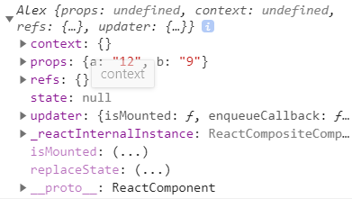

# React

## React 介绍

- React 是一个用于构建用户界面渐进式的 JavaScript 库。
  - 本身只处理 UI
  - 不关心路由
  - 不处理 Ajax
- React 主要用于构建 UI，很多人认为 React 是 MVC 中的 V （视图）。
  - 数据驱动视图
  - 第一个真正意义上把组件化思想带到前端领域

React 起源于 Facebook 的内部项目，用来架设 Instagram 的网站，并于 2013 年 5 月开源。

由于 React的设计思想极其独特，属于革命性创新，性能出众，代码逻辑却非常简单。所以，越来越多的人开始关注和使用，认为它可能是将来 Web 开发的主流工具。

这个项目本身也越滚越大，从最早的UI引擎变成了一整套前后端通吃的 Web App 解决方案。衍生的 React Native 项目，目标更是宏伟，希望用写 Web App 的方式去写 Native App。如果能够实现，整个互联网行业都会被颠覆，因为同一组人只需要写一次 UI ，就能同时运行在服务器、浏览器和手机。

React 拥有较高的性能，代码逻辑非常简单，越来越多的人已开始关注和使用它。

**React 特点**

- **声明式设计** −React 采用声明范式，可以轻松描述应用。
- **高效** −React 通过对 DOM 的模拟，即虚拟 DOM，最大限度地减少与 DOM 的交互。
- **灵活** −React 可以与已知的库或框架很好地配合。
- **JSX** − JSX 是 一种预编译 JavaScript 语言，可以让 JavaScript 和 HTML 混搭。React 开发不一定使用 JSX ，但我们建议使用它。
- **组件化** − 通过 React 构建组件，使得代码更加容易得到复用，能够很好的应用在大项目的开发中。
- **单向响应的数据流** − React 实现了单向响应的数据流，从而减少了重复代码，这也是它为什么比传统数据绑定更简单。原生没有双向数据绑定，可以自己写。

**React 发展史**

- Facebook 内部用来开发 Instagram
- 2013 年开源了 React
- 随后发布了 React Native
- React 开源协议
  - [知乎专栏 -React 的许可协议到底发生了什么问题？](https://zhuanlan.zhihu.com/p/28618630)
  - [知乎 - 如何看待 Facebook 计划将 React 改为 MIT 许可证？](https://www.zhihu.com/question/65728078)
  - [阮一峰 - 开源许可证教程](http://www.ruanyifeng.com/blog/2017/10/open-source-license-tutorial.html)
  - [阮一峰 - 如何选择开源许可证](http://www.ruanyifeng.com/blog/2011/05/how_to_choose_free_software_licenses.html)
  - React  最后架不住社区的压力，最后还是修改了许可协议条款。
- [React - Releases](https://github.com/facebook/react/releases)

**React 和 Vue 对比**

- **技术层面**
  - Vue 生产力更高（更少的代码实现更强劲的功能）
  - React 更底层一点，技术占比比较重
  - 两个框架的效率都采用了虚拟 DOM
    - 性能都差不多
  - 组件化
    - Vue 支持
    - React 支持
  - 数据绑定
    - 都支持数据驱动视图
    - Vue 支持表单控件双向数据绑定
    - React 不支持双向数据绑定
  - 它们的核心库都很小，都是渐进式 JavaScript 库
  - React 采用 JSX 语法来编写组件
  - Vue 采用单文件组件
    - `template`
    - `script`
    - `style`

- **开发团队**
  - React 由 Facebook 前端维护开发

  - Vue

    早期只有尤雨溪一个人由于后来使用者越来越多，后来离职专职开发维护 Vu目前也有一个小团队在开发维护

- **Native APP 开发**
  - React Native
    - 可以写安卓/iOS原生应用
  - Weex
    - 阿里巴巴内部做出来的一个东西，基于 Vue

**相关资源链接**

- [React 官网](https://reactjs.org/)(被墙)
  - [中文官网](https://react.docschina.org/)
- [官方教程](https://react.docschina.org/tutorial/tutorial.html)
  - 井字棋
- [官方文档](https://react.docschina.org/docs/getting-started.html)
  - 基础教程
  - 高级教程
  - API 参考文档
- [React - GitHub](https://github.com/facebook/react)
- [阮一峰 - React 技术栈系列教程](http://www.ruanyifeng.com/blog/2016/09/react-technology-stack.html)
- [阮一峰 - React 入门实例教程](http://www.ruanyifeng.com/blog/2015/03/react.html)
- [awesome react](https://github.com/enaqx/awesome-react)
- [awesome-react-components](https://github.com/brillout/awesome-react-components)

## React 核心概念

- 组件化


- 虚拟 DOM

> 虚拟 DOM 对于使用者来讲完全不用关心

- [知乎 - 如何理解虚拟DOM？](https://www.zhihu.com/question/29504639)
- [深度剖析：如何实现一个 Virtual DOM 算法](https://github.com/livoras/blog/issues/13)
- [理解 Virtual DOM](https://github.com/y8n/blog/issues/5)
- [深入浅出React（四）：虚拟DOM Diff算法解析](http://www.infoq.com/cn/articles/react-dom-diff)
- [全面理解虚拟DOM，实现虚拟DOM](https://foio.github.io/virtual-dom/)
- [50行代码实现Virtual DOM](http://www.jianshu.com/p/cbb7d7094fb9)
- [网上都说操作真实 DOM 慢，但测试结果却比 React 更快，为什么？](https://www.zhihu.com/question/31809713)

- JSX

虚拟 DOM 写起来麻烦，所以提供了 JSX 的方式。

## 起步

### 安装

- 云端编程环境（在线编辑器：codepen、jsfiddle）
  - 只用于 demo 测试
- 脚手架工具：`create-react-app`
  - 目前不推荐使用
  - 类似于 `vue-cli`
  - 集成了 webpack 构建工具等环境
  - 自动刷新浏览器
  - 。。。
- 本地简单开发测试环境（没有模块化支持）
- 自己手动搭建模块化 webpack 开发环境

> https://reactjs.org/docs/hello-world.html

### webpack

除了平常的配置外，还要一些 react 相关的加载器

```shell
# 如果 webpack 时候出现关于 react-hot-loader 的报错，我们可以下一个 1.3.1 的稳定版本
npm i -D react react-dom babel-preset-react react-hot-loader
```

配置：

```js

```


### babel-standalone

> 参考文档：https://github.com/babel/babel/tree/master/packages/babel-standalone

自己手动调用 babel API 编译执行：

```html
<script>
  var input = 'const getMessage = () => "Hello World"; console.log(getMessage())';

  // 调用 Babel 提供的转换 API 完成编译转换，得到结果字符串
  // 编译过程比较耗时，所以只推荐开发测试使用
  // 咱们这里使用它的目的是为了简化 react 的学习过程
  var output = Babel.transform(input, { presets: ['es2015'] }).code;
  
  // eval 函数支持动态解析执行 JavaScript 字符串
  window.eval(output)
</script>
```

babel 自动编译执行：

```html
<!--
当 babel-standalone 发现 type="text/babel" 类型标签的时候：
	1. 将 script 标签中的内容转换为浏览器可以识别的 JavaScript
	2. 使用 eval 执行编译结果代码
-->
<script type="text/babel">
  const getMessage = () => "Hello World";
  console.log(getMessage())
</script>
```


### 初始化及安装依赖

```Shell
$ mkdir react-demos
$ cd react-demos
$ npm init --yes
$ npm install --save react react-dom @babel/standalone
```

### Hello World

```html
<!DOCTYPE html>
<html lang="en">

<head>
  <meta charset="UTF-8">
  <title>demo - Hello World</title>
  <script src="node_modules/@babel/standalone/babel.js"></script>
  <script src="node_modules/react/umd/react.development.js"></script>
  <script src="node_modules/react-dom/umd/react-dom.development.js"></script>
</head>

<body>
  <div id="root"></div>
  <script type="text/babel">
    ReactDOM.render(
      <h1>Hello, react!</h1>, // 这就是 JSX 代码，这个标签不要加引号， JS 和 html 混写
      document.getElementById('root')
    )
  </script>
</body>

</html>
```

## JSX

JSX 全称 `JavaScript XML` ，是一种扩展的 JavaScript 语言，它允许 HTML 语言直接写在 JavaScript 语言中，不加任何引号，这就是 JSX 语法。它允许 HTML 与 JavaScript 的混写。

- [Introducing JSX](https://reactjs.org/docs/introducing-jsx.html)
- [JSX In Depth](https://reactjs.org/docs/jsx-in-depth.html)
- [React Without JSX](https://reactjs.org/docs/react-without-jsx.html)

### 环境配置

- 非模块化环境
  - `babel-standalone`
  - 执行时编译，速度比较慢
  - 只适用于开发测试环境
- 模块化环境
  - 结合 webpack 配置 babel 响应的工具完成预编译
  - 浏览器执行的是预编译结果
- Babel REPL 赋值查看编译结果
  - 使用在线测试

### 基本语法规则

- 必须只能有一个根节点
- 多标签写到包到一个小括号中，防止 JavaScript 自动分号不往后执行的问题。


- 遇到 HTML 标签 （以 `<` 开头） 就用 HTML 规则解析
  
  - 单标签不能省略结束标签。
  
- 遇到代码块（以 `{` 开头），就用 JavaScript 规则解析

  ```jsx
  // 因为 {} 会当成js规则解析，所以如果想在标签内写style属性时要用两层括号，不过定义一个变量里面写样式，要写行内样式时直接赋值就好了
  const h1Style = {
      color: 'hotpink',
      fontSize :'18px'
  }
  <h1 style={{'color':'hotpink','font-size':'18px'}}></h1>
  //推荐
  <h1 style={h1Style}></h1>
  ```

- JSX 允许直接在模板中插入一个 JavaScript 变量
  
  - 如果这个变量是一个数组，则会展开这个数组的所有成员添加到模板中
  
- 单标签必须结束 `/>`

- 标签内的添加事件（onclick,onmouseover等这些）要遵循驼峰命名法


  ```jsx
// onclick -> onClick
// onmouoseover -> onMouseOver
function myconsole() {
    console.log('onMouseOver Event')
}

  ```

基本语法：

```jsx
const element = <h1>Hello, world!</h1>;
```

### 在 JSX 中嵌入 JavaScript 表达式

- 语法
- 如果 JSX 写到了多行中，则建议包装括号避免自动分号的陷阱

```jsx
function formatName(user) {
  return user.firstName + ' ' + user.lastName;
}

const user = {
  firstName: 'Harper',
  lastName: 'Perez'
};

const element = (
  <h1>
    Hello, {formatName(user)}!
  </h1>
);

ReactDOM.render(
  element,
  document.getElementById('root')
);
```

```jsx
const user = {
  name: '张三',
  age: 18,
  gender: 0
}

const element = (
  <div>
    <p>姓名：{user.name}</p>
    <p>年龄：{user.age}</p>
    <p>性别：{user.gender === 0 ? '男' : '女'}</p>
  </div>
)
```

### JSX 中的节点属性

- 动态绑定属性值
- `class` 使用 `className`
- `tabindex` 使用 `tabIndex`
- `for` 使用 `htmlFor`

普通的属性：

```jsx
const element = <div tabIndex="0"></div>;
```

在属性中使用表达式：

```jsx
const element = </img>;
```

- 必须有且只有一个根节点

如果标签是空的，可以使用 `/>` 立即关闭它。

```jsx
const element = ;
```

JSX 子节点可以包含子节点（最好加上小括号，防止自动分号的问题）：

```jsx
const element = (
  <div>
    <h1>Hello!</h1>
    <h2>Good to see you here.</h2>
  </div>
);
```

### JSX 自动阻止注入攻击

原样输出：

```jsx
const element = <div>{'<h1>this is safe</h1>'}</div>
```

输出 html：

```jsx
function createMarkup() {
  return {__html: 'First &middot; Second'};
}

function MyComponent() {
  return <div dangerouslySetInnerHTML={createMarkup()} />;
}
```

### JSX 原理

Babel 会把 JSX 编译为 `React.createElement()` 函数。

下面两种方式是等价的：

```jsx
const element = (
  <h1 className="greeting">
    Hello, world!
  </h1>
);
```

```jsx
const element = React.createElement(
  'h1',
  {className: 'greeting'},
  'Hello, world!'
);
```

```javascript
// Note: this structure is simplified
const element = {
  type: 'h1',
  props: {
    className: 'greeting',
    children: 'Hello, world'
  }
};
```

### DOM Elements

> 参考文档：https://reactjs.org/docs/dom-elements.html

## 组件

React 允许将代码封装成组件（component），然后像插入普通 HTML 标签一样，在网页中插入这个组件。

### 组件规则注意事项

- 组件类的第一个首字母必须大写
- 组件类必须有 `render` 方法
- 组件类必须有且只有一个根节点
- 组件属性可以在组件的 `props` 获取
  - 函数需要声明参数：`props`
  - 类直接通过 `this.props`

### 函数式组件

- 名字不能用小写
  - React 在解析的时候，是以标签的首字母来区分的
  - 如果首字母是小写则当作 HTML 来解析
  - 如果首字母是大小则当作组件来解析
  - 结论：组件首字母必须大写

```jsx
function Welcome(props) {
  return <h1>Hello, {props.name}</h1>;
}

const element = <Welcome name="Sara" />;
ReactDOM.render(
  element,
  document.getElementById('root')
);
```

组件构成：

```jsx
function Welcome(props) {
  return <h1>Hello, {props.name}</h1>;
}

function App() {
  return (
    <div>
      <Welcome name="Sara" />
      <Welcome name="Cahal" />
      <Welcome name="Edite" />
    </div>
  );
}

ReactDOM.render(
  <App />,
  document.getElementById('root')
);
```

**抽取组件**

```jsx
function Comment(props) {
  return (
    <div className="Comment">
      <div className="UserInfo">
        
        <div className="UserInfo-name">
          {props.author.name}
        </div>
      </div>
      <div className="Comment-text">
        {props.text}
      </div>
      <div className="Comment-date">
        {formatDate(props.date)}
      </div>
    </div>
  );
}
```

### 类方式组件

### class 补充

> 本质就是对 EcmaScript 5 中构造函数的一个语法糖
>
> 就是让你写构造函数（类）更方便了

- 基本语法
- `constructor` 构造函数
- 实例成员
  - 实例属性
  - 实例方法
- 类成员
  - 静态方法
  - 静态属性

### class 组件语法

> 在 React 中推荐使用 EcmaScript 6 Class 的方式类定义组件

```jsx
// class 组件类，必须继承自 React.Component 才是一个组件类，否则就是一个普通类
// 在组件类中，必须通过 render 渲染函数返回组件模板
class ShoppingList extends React.Component {
  render() {
    return (
      <div className="shopping-list">
        <h1>Shopping List for {this.props.name}</h1>
        <ul>
          <li>Instagram</li>
          <li>WhatsApp</li>
          <li>Oculus</li>
        </ul>
      </div>
    );
  }
}

// Example usage: <ShoppingList name="Mark" />
```

本质：

```javascript
return React.createElement('div', {className: 'shopping-list'},
  React.createElement('h1', /* ... h1 children ... */),
  React.createElement('ul', /* ... ul children ... */)
);
```

### 组件传值 Props

我们可以看一下继承 React.Comonent 后的类的this



- Props 是只读的，不能修改

EcmaScript 5 构造函数：

```javascript
function Welcome(props) {
  return <h1>Hello, {props.name}</h1>;
}
```

EcmaScript 6 Class：

```jsx
class Welcome extends React.Component {
  render() {
      // 因为实例中有props属性，所以可以这样获取参数
    return <h1>Hello, {this.props.name},I'm {this.props.b} years old</h1>;
  }
}
// 参数在 组件像写属性那样写就行了
ReactDOM.render(<Welcome name='Alexander' b='9'/>, app)
```

**this.props.children**

> 参考文档：https://reactjs.org/docs/react-api.html#reactchildren

`this.props` 对象的属性与组件的属性一一对应，但是有一个例外，就是 `this.props.children` 属性。

它表示组件的所有子节点。

`this.props.children` 的值有三种可能：如果当前组件没有子节点，它就是 `undefined`;如果有一个子节点，数据类型是 `object` ；如果有多个子节点，数据类型就是 `array` 。所以，处理 `this.props.children` 的时候要小心。

React 提供一个工具方法 [`React.Children`](https://facebook.github.io/react/docs/top-level-api.html#react.children) 来处理 `this.props.children` 。我们可以用 `React.Children.map` 来遍历子节点，而不用担心 `this.props.children` 的数据类型是 `undefined` 还是 `object`。

### 组件中的事件处理

> 参考文档：https://reactjs.org/docs/handling-events.html

**示例1**

```jsx
<button onclick="activateLasers()">
  Activate Lasers
</button>
```

```jsx
<button onClick={activateLasers}>
  Activate Lasers
</button>
```

**示例2**

```html
<a href="#" onclick="console.log('The link was clicked.'); return false">
  Click me
</a>
```

```jsx
function ActionLink() {
  function handleClick(e) {
    e.preventDefault();
    console.log('The link was clicked.');
  }

  return (
    <a href="#" onClick={handleClick}>
      Click me
    </a>
  );
}
```

**示例3（this 绑定问题）**

```jsx
class Toggle extends React.Component {
  constructor(props) {
    super(props);
    this.state = {isToggleOn: true};

    // This binding is necessary to make `this` work in the callback
    this.handleClick = this.handleClick.bind(this);
  }

  handleClick() {
    this.setState(prevState => ({
      isToggleOn: !prevState.isToggleOn
    }));
  }

  render() {
    return (
      <button onClick={this.handleClick}>
        {this.state.isToggleOn ? 'ON' : 'OFF'}
      </button>
    );
  }
}

ReactDOM.render(
  <Toggle />,
  document.getElementById('root')
);
```

箭头函数：

```jsx
class LoggingButton extends React.Component {
  // This syntax ensures `this` is bound within handleClick.
  // Warning: this is *experimental* syntax.
  handleClick = () => {
    console.log('this is:', this);
  }

  render() {
    return (
      <button onClick={this.handleClick}>
        Click me
      </button>
    );
  }
}
```

更简单的方式：

```jsx
class LoggingButton extends React.Component {
  handleClick() {
    console.log('this is:', this);
  }

  render() {
    //因为用箭头函数定义函数时 , 函数内部的 this 是指向父级的 this 的，此处写法虽然是 JSX 但是其父级的 this 就是 类的 this。(有种定义时就已经绑定好 this 的感觉)
    return (
      <button onClick={() => this.handleClick()}>
        Click me
      </button>
    );
  }
}
```

**示例4（传递参数）**

```jsx
// 下面的那个 e 是事件对象，DOM元素绑定事件都有事件对象
<button onClick={(e) => this.deleteRow(id, e)}>Delete Row</button>
<button onClick={this.deleteRow.bind(this, id)}>Delete Row</button>
```

**! 事件绑定中的 this 指向问题**

> 多分享，多交流

第一种绑定方式（不做任何处理）：

- `this` 指向 Window
- 默认接收一个参数 `event` 事件源对象
- 不支持额外的参数传递

```jsx
<button onClick={this.handleClick}>点击改变 message</button>
```

第二种方式（bind）：

- `this` 指向组件实例
- 默认接收一个参数 `event`

```jsx
<button onClick={this.handleClick.bind(this)}>点击改变 message</button>
```

第二种方式还可以为方法传递额外参数：

- 手动传递的参数会放到函数最前面，`event` 会作为函数的最后一个参数

```jsx
<button onClick={this.handleClick.bind(this, 123, 456)}>点击改变 message</button>
```

第三种方式（箭头函数）：

- 自动 bind  this （父级的 this）
- 手动传递参数
- 参数顺序自己指定，`event` 也需要自己手动传递

```jsx
<button onClick={(e) => {this.handleClick(e, 123, 456)}}>点击改变 message</button>
```

### 组件状态 State

> 参考文档：https://reactjs.org/docs/state-and-lifecycle.html

通过实验，我们知道 props 属性是只读的，不能改变，但是官方给了我们一个可以读写的属性 `State`

- 用State可以修改组件的数据

  - 通过官方我们知道了 state 属性可以读写，但是，改变了state属性只是改变了数据层面的东西，view 渲染层并没有渲染，所以我们要用到下面的函数进行 view 层的渲染

- SetState 函数
  - 有种拦截器的感觉，设置 state 属性的时候触发渲染事件
  - 类似于 vue 中的 data 传参（数据驱动视图）

```jsx
class MyComponent extends React.Component {
        constructor () {
            super()
            // React 组件需要通过手动为组件类添加 state 成员来初始化：ViewModel
            this.state = {
                msg: 'Hello MyComponent'
            }
        }
        handleClick () {
            // 不能通过 this.state.msg = '' 这样直接重新赋值，这样是改不了的
            this.setState({
                msg: 'msg in state has been changed!'
            })
        }
        render() {
            return (
                <div>
                    <h1>{this.state.msg}</h1>
                    {/* 用bind方法把组件类的 this 传递给 handleClick */}
                    <button onClick={this.handleClick.bind(this)}>改变内容</button>
                    {/* 通过箭头函数调用 */}
                    <button onClick={() => {this.handleClick()}}>改变内容</button>
                </div>
            )
        }
    }
```

### 数据的双向绑定

类似于 vue 的那种输入框一输入，显示框就显示的那种效果

- 一个输入框（当输入框内容一旦改变，就会触发一个函数，改变states ），这就涉及到如何获取DOM的方式了
- 一个输出框 同步显示输入框的内容

**获取真实 DOM 节点**

> 参考文档：https://reactjs.org/docs/refs-and-the-dom.html

如果是获取真实自身DOM元素有三种方式

- 给标签加个id,class 之类的属性，再通过原生的方式查询到DOM
  - document.querySelector()等等的原生方法
- 用事件对象，e.target 就是事件源的DOM（如果获取的不是自身事件的元素，此方法就无效了）
- 官方推荐的 给标签加个 ref 属性

组件并不是真实的 DOM 节点，而是存在于内存之中的一种数据结构，叫做虚拟 DOM （virtual DOM）。只有当它插入文档以后，才会变成真实的 DOM 。根据 React 的设计，所有的 DOM 变动，都先在虚拟 DOM 上发生，然后再将实际发生变动的部分，反映在真实 DOM上，这种算法叫做 [DOM diff](http://calendar.perfplanet.com/2013/diff/) ，它可以极大提高网页的性能表现。

但是，有时需要从组件获取真实 DOM 的节点，这时就要用到 `ref` 属性。

```jsx
class InputChange extends  React.Component {
        constructor() {
            super()
            this.state = {
                msg: ''
            }
        }
        change() {
            //console.log(1)
            this.setState({
                // 下面两种被注释的方式都是可以的第一种是给input加个id再找到这个DOM
                // 第二种是使用事件对象获取 DOM,定义change函数时记得加形参e，用箭头函数调用方法时记得给函数传事件对象，但如果使用bind的方法就直接 onClick=this.change.bind(this)就好了
                // 未被注释的是官方推荐使用的是，加一个ref属性
                //msg: document.querySelector('#target').value
                //msg: e.target.value
                msg: this.refs.target.value
            })
        }
        render() {
            return (
                <div>
                    <!-- <input id='target' type="text" onInput={() => this.change()}/> -->
                    <!-- <input type="text" onInput={(e) => this.change(e)}/> -->
                    <input type="text" onInput={() => this.change()} ref='target'/>
                    <div>{this.state.msg}</div>
                </div>
            )
        }
    }
    ReactDOM.render(
        <InputChange/>,
        document.querySelector('#app')
    )
```


### 组件生命周期

> 参考文档：https://reactjs.org/docs/state-and-lifecycle.html
>
> 完整生命周期 API：https://reactjs.org/docs/react-component.html#the-component-lifecycle

简单来说 react Component 通过定义了几个函数来控制各个阶段的动作，而这些阶段就是组件的生命周期

- componentWillMount 组件挂载前（组件加载前，即DOM元素渲染前）
  - 属性、状态等数据都可以使用，但是组件（render的DOM）找不到

```jsx
<div id="app"></div>
<script type="text/babel">
    class Life extends React.Component {
        constructor() {
            super()
        }
        componentWillMount() {
			console.log(this.porps)// {l: "1"}
            console.log(document.querySelector("#div1"))//  null
            console.log('111')// 1111
        }
        render() {
            return (
                <div id='div1'></div>
            )
        }
    }
    ReactDOM.render(
        <Life l='1'/>,
        app
    )
</script>
```

- componentDidMount 组件挂载后

```jsx
<div id="app"></div>
<script type="text/babel">
    class Life extends React.Component {
        constructor() {
            super()
        }
        componentWillMount() {
			console.log(this.porps)// {l: "1"}
            console.log(document.querySelector("#div1"))//  null
            console.log('组件挂载前')// 组件挂载前
        }
        componentDidMount() {
            console.log('------------------')
			console.log(this.porps)// {l: "1"}
            console.log(document.querySelector("#div1"))// <div data-reactroot id="div1"></div>
            console.log('组件挂载后')// 组件挂载后
        }
        render() {
            return (
                <div id='div1'></div>
            )
        }
    }
    ReactDOM.render(
        <Life l='1'/>,
        app
    )
</script>
```

- componentWillUpdate 组件更新前
- componentDidUpdate  组件更新后

```jsx
class Life extends React.Component {
        constructor() {
            super()
            this.state = {
                msg: '11111111'
            }
        }
        componentWillMount() {
            console.log('组件挂载前')
        }
        componentDidMount() {
            console.log('组件挂载后')
        }
        componentDidUpdate() {
            console.log('组件更新后')
        }
        componentWillUpdate() {
            debugger
            console.log('组件更新前')
        }
        show() {
            this.setState({
                msg: Math.random()
            })
        }
        render() {
            return (

                <div>
                    <button onClick = {this.show.bind(this)}>点击</button>
                    <div id='div1'>{this.state.msg}</div>
                </div>
            )
        }
    }
    ReactDOM.render(
        <Life l='1'/>,
        app
    )
```

- componentWillUnmount 组件卸载
  - 没有DidUnmount，因为组件已经卸载了，没有生命周期了
  - 重新 ReactDOM.render() 即可完成卸载

### 事件冒泡

在 React 中原生的阻止冒泡事件的方法都没有用

- return false
- e.stopPropagation()
- e.cancelBubble = true

其实我们传的事件对象其实不是原生的事件对象，是React封装过的，我们可以用 e.nativeEvent 获取，但是即使获得的原生的事件对象 e.nativeEvent.cancleBubble = true 也不行，要想政治的阻止 React 的是时间冒泡要用 e.nativeEvetn.stopImmediatePropagation()

```jsx
class Life extends React.Component {
        constructor() {
            super()
            this.state = {
                msg: '11111111'
            }
        }
        show(e) {
            this.setState({
                msg: Math.random()
            })
            e.nativeEvent.stopImmediatePropagation()
        }
        render() {
            return (

                <div>
                    <button onClick = {this.show.bind(this)}>点击</button>
                    <div id='div1'>{this.state.msg}</div>
                </div>
            )
        }
    }
    ReactDOM.render(
        <Life l='1'/>,
        app
    )
    document.onclick = function () {
        ReactDOM.render(<h1>asdasd</h1>, app)
    }
```

### 组件的嵌套

```jsx
class Parent extends React.Component {
    render() {
        return (
            <div>
                <div>我是父组件</div>
                <Child textColor={`rgb(${parseInt(Math.random()*256)},${parseInt(Math.random()*256)},${parseInt(Math.random()*256)})`}/>
            </div>
        )
    }
}
class Child extends React.Component {
    render() {
        return (
            <div>
                <div style={{color:this.props.textColor}}>我是子组件</div>
            </div>
        )
    }
}
ReactDOM.render(<Parent/>,app)
```

### 父子组件数据通信

父子组件的数据通信分为两种，就是父传子，子传父

**父传子**

用 props 的方式直接传数据

```jsx
class Child extends React.Component {
        render() {
            return (
                <div>我是子组件 => {this.props.setMsg}</div>
            )
        }
    }
    class Parent extends React.Component {
        constructor() {
            super()
            this.state = {
                msg: '我是父组件的数据'
            }
        }
        show() {
            // 因为 setState 会重新渲染，重新渲染后msg变了，所以自组价的 props 也会改变
            this.setState({
                msg:'我变了'
            })
        }
        render() {
            return (
                <div onClick={this.show.bind(this)}>
                    我是父组件 => {this.state.msg}
                    <Child setMsg={this.state.msg}/>
                </div>
            )
        }
    }
    ReactDOM.render(<Parent/>,app)
```

虽然也是用 props 但是用子组件的 state 间接传输数据

- 间接的方式因为是在数据挂载前加载的，所以父组建的state改变了，即使重新渲染了，子组件也没有重新给state赋值，因此子组件数据没有改变，所以不推荐这种写法，推荐用 props 直接传数据，除非像父组件改变子组件不改变就用这种洗发

```jsx
class Child extends React.Component {
        constructor() {
            super()
            this.state = {
                cMsg: ''
            }
        }
    // 数据挂载前改变 state 这样渲染后的 state 就有数据了
        componentWillMount() {
            this.setState({
                cMsg: this.props.setMsg
            })
        }
        render() {
            return (
                <div>我是子组件 => 直接 {this.props.setMsg} => 间接 {this.state.cMsg}</div>
            )
        }
    }
    class Parent extends React.Component {
        constructor() {
            super()
            this.state = {
                msg: '我是父组件的数据'
            }
        }
        show() {
            this.setState({
                msg:'我变了'
            })
        }
        render() {
            return (
                <div onClick={this.show.bind(this)}>
                    我是父组件 => {this.state.msg}
                    <Child setMsg={this.state.msg}/>
                </div>
            )
        }
    }
    ReactDOM.render(<Parent/>,app)
```

**子传父**

有一点点 jsonp 的感觉，父定义一个函数传给子去调用，函数的this绑定为父组件的 this 用于父组件的 setState

```jsx
class Child extends React.Component {
    constructor() {
        super()
        this.state = {
            cMsg: '我是子组件的数据'
        }
    }
    componentWillMount() {
        this.props.getMsg(this.state.cMsg)
    }
    render() {
        return (
            <div>我是子组件 => {this.state.cMsg}</div>
        )
    }
}
class Parent extends React.Component {
    constructor() {
        super()
        this.state = {
            pMsg: ''
        }
    }
    // 有点像 jsonp 跨域的感觉
    getMsg(msg) {
        this.setState({
            pMsg: msg
        })
    }
    render() {
        return (
            <div>
                我是父组件 => {this.state.pMsg}
                <Child getMsg={this.getMsg.bind(this)}/>
            </div>
        )
    }
}
ReactDOM.render(<Parent/>,app)
```

### PropTypes 类型校验

> 参考文档：https://reactjs.org/docs/typechecking-with-proptypes.html

组件的属性可以接受任意值，字符串、对象、函数等等都可以。有时，我们需要一种机制，验证别人使用组件时，提供的参数是否符合要求。

示例：

```jsx
import PropTypes from 'prop-types';

class Greeting extends React.Component {
  render() {
    return (
      <h1>Hello, {this.props.name}</h1>
    );
  }
}

Greeting.propTypes = {
  name: PropTypes.string
};
```

**Default Prop Values** 

> 参考文档：https://reactjs.org/docs/typechecking-with-proptypes.html#default-prop-values

示例：

```jsx
class Greeting extends React.Component {
  render() {
    return (
      <h1>Hello, {this.props.name}</h1>
    );
  }
}

// Specifies the default values for props:
Greeting.defaultProps = {
  name: 'Stranger'
};

// Renders "Hello, Stranger":
ReactDOM.render(
  <Greeting />,
  document.getElementById('example')
);
```

或者：

```jsx
class Greeting extends React.Component {
  static defaultProps = {
    name: 'stranger'
  }

  render() {
    return (
      <div>Hello, {this.props.name}</div>
    )
  }
}
```

## 渲染方式

### 列表渲染

> 参考文档：https://reactjs.org/docs/lists-and-keys.html

JSX 允许直接在模板插入 JavaScript 变量。如果这个变量是一个数组，则会展开这个数组的所有成员。

```jsx
var arr = [
  <h1>Hello world!</h1>,
  <h2>React is awesome</h2>,
];

ReactDOM.render(
  <div>{arr}</div>,
  document.getElementById('example')
);
```

综上所述，我们可以这样：

```jsx
var names = ['Alice', 'Emily', 'Kate'];
// 这样的代码看起来很乱，不推荐使用
ReactDOM.render(
  <div>
  {
    names.map(function (name) {
      return <div>Hello, {name}!</div>
    })
  }
  </div>,
  document.getElementById('example')
);
```

### 条件渲染

> 参考文档：https://reactjs.org/docs/conditional-rendering.html

**示例1：**

```jsx
function UserGreeting(props) {
  return <h1>Welcome back!</h1>;
}

function GuestGreeting(props) {
  return <h1>Please sign up.</h1>;
}

function Greeting(props) {
  const isLoggedIn = props.isLoggedIn;
  if (isLoggedIn) {
    return <UserGreeting />;
  }
  return <GuestGreeting />;
}

ReactDOM.render(
  // Try changing to isLoggedIn={true}:
  <Greeting isLoggedIn={false} />,
  document.getElementById('root')
);
```

**示例2：**

```jsx
function LoginButton(props) {
  return (
    <button onClick={props.onClick}>
      Login
    </button>
  );
}

function LogoutButton(props) {
  return (
    <button onClick={props.onClick}>
      Logout
    </button>
  );
}

class LoginControl extends React.Component {
  constructor(props) {
    super(props);
    this.handleLoginClick = this.handleLoginClick.bind(this);
    this.handleLogoutClick = this.handleLogoutClick.bind(this);
    this.state = {isLoggedIn: false};
  }

  handleLoginClick() {
    this.setState({isLoggedIn: true});
  }

  handleLogoutClick() {
    this.setState({isLoggedIn: false});
  }

  render() {
    const isLoggedIn = this.state.isLoggedIn;

    let button = null;
    if (isLoggedIn) {
      button = <LogoutButton onClick={this.handleLogoutClick} />;
    } else {
      button = <LoginButton onClick={this.handleLoginClick} />;
    }

    return (
      <div>
        <Greeting isLoggedIn={isLoggedIn} />
        {button}
      </div>
    );
  }
}

ReactDOM.render(
  <LoginControl />,
  document.getElementById('root')
);
```

**示例3（行内判断）：**

```jsx
function Mailbox(props) {
  const unreadMessages = props.unreadMessages;
  return (
    <div>
      <h1>Hello!</h1>
      {unreadMessages.length > 0 &&
        <h2>
          You have {unreadMessages.length} unread messages.
        </h2>
      }
    </div>
  );
}

const messages = ['React', 'Re: React', 'Re:Re: React'];
ReactDOM.render(
  <Mailbox unreadMessages={messages} />,
  document.getElementById('root')
);
```

**示例4（if-else）：**

```jsx
render() {
  const isLoggedIn = this.state.isLoggedIn;
  return (
    <div>
      The user is <b>{isLoggedIn ? 'currently' : 'not'}</b> logged in.
    </div>
  );
}
```

```jsx
render() {
  const isLoggedIn = this.state.isLoggedIn;
  return (
    <div>
      {isLoggedIn ? (
        <LogoutButton onClick={this.handleLogoutClick} />
      ) : (
        <LoginButton onClick={this.handleLoginClick} />
      )}
    </div>
  );
}
```

**示例5（阻止组件渲染）：**

```jsx
function WarningBanner(props) {
  if (!props.warn) {
    return null;
  }

  return (
    <div className="warning">
      Warning!
    </div>
  );
}

class Page extends React.Component {
  constructor(props) {
    super(props);
    this.state = {showWarning: true}
    this.handleToggleClick = this.handleToggleClick.bind(this);
  }

  handleToggleClick() {
    this.setState(prevState => ({
      showWarning: !prevState.showWarning
    }));
  }

  render() {
    return (
      <div>
        <WarningBanner warn={this.state.showWarning} />
        <button onClick={this.handleToggleClick}>
          {this.state.showWarning ? 'Hide' : 'Show'}
        </button>
      </div>
    );
  }
}

ReactDOM.render(
  <Page />,
  document.getElementById('root')
);
```

### React中的表单处理

> 参考文档：https://reactjs.org/docs/forms.html

表单：放在 form 标签中的就是表单，表单并没什么区别，重点是 input 会和原生的有点不一样。在 React 中分为受控表单和非受控表单，这个现象通常在input中实现。

- 受控表单就把内容锁死了，不能直接通过键盘或鼠标输入直接输入内容。出现一些属性就表面此 input 是受控组件
  - value `<input type='text' value='aaa'/>`
  - checked `<input type='checkbox' checked/>`  
- 但是在实际应用中，可能会有自动填充表单框的需求，这就需要另一些属性
  - defaultValue  `<input type='text' defaultValue='aaa'/>`
  - defaultChecked `<input type='checkbox' defaultChecked/>`

## 和服务端交互

React 本身完全不限制你如何去交互（），如果是angular则必须用 $http，如果是 vue 虽然也不限制但官方推荐使用 vue-resource

组件的数据来源，通常是通过 Ajax 请求从服务器获取，可以使用 `componentDidMount` 方法设置 Ajax 请求，等到请求成功，再用 `this.setState` 方法重新渲染 UI 。

**原生写法**

```jsx
class Alex extends React.Component {
        constructor() {
            super()
            this.state = {
                arr: []
            }
        }
        componentWillMount() {
            this.ajaxToData()
        }
        ajaxToData() {
            let URL = 'http://127.0.0.1:3001/get'
            let XMLHttp = new XMLHttpRequest()
            XMLHttp.open('GET', URL)
            XMLHttp.send()
            XMLHttp.onload = () => {
                if (XMLHttp.readyState === 4 && XMLHttp.status === 200) {
                    //let json = eval(XMLHttp.responseText)
                    let json = JSON.parse(XMLHttp.responseText)
                    //console.log(json)
                    this.setState({
                        arr: json
                    })
                }
            }
        }
        render() {
            let arrLi = this.state.arr.map((item,index) => {
                return <li key={index}>{item}</li>
            })
            return (
                <div>
                    {
                        // 三目运算符
                        this.state.arr.length === 0 ?
                            <div>请求中...</div> :
                            <ul>
                                {arrLi}
                            </ul>
                    }
                </div>
            )
        }
    }
    ReactDOM.render(<Alex/>,document.querySelector('#app'))
```

**jquery写法**

```jsx
ajaxToData() {
    // 记得引包
            var _this = this
            let URL = 'http://127.0.0.1:3001/get'
            // $.ajax({
            //     url: URL,
            //     dataType: 'json',
            //     // success(data) {
            //     //     _this.setState({
            //     //         arr: data
            //     //     })
            //     // }
            //     ES5 的写法加 bind 也可以解决 this 问题
            //     success: function (data) {
            //         this.setState({
            //             arr: data
            //         })
            //     }.bind(this)
            // })
            
            // promise 写法也可以解决$.ajax的 this 指向问题
            $.ajax({
                url:URL
            }).then((res)=>{
                this.setState({
                    arr:res
                })
            })
        }
```

**axios写法**

```jsx
ajaxToData() {
    // 记得引包
            let URL = 'http://127.0.0.1:3001/get'
            axios.get(URL).then(res => {
                // console.log(res)
                this.setState({
                    arr: res.data
                })
            })
        }
```

#### fetch

> MDN https://developer.mozilla.org/zh-CN/docs/Web/API/Fetch_API
>
> https://www.cnblogs.com/ddfe/p/5609697.html

Fetch 是一个现代的概念, 等同于 XMLHttpRequest。它提供了许多与XMLHttpRequest相同的功能，但被设计成更具可扩展性和高效性。

Fetch 的核心在于对 HTTP 接口的抽象，包括 `Request`，`Response`，`Headers`，`Body`，以及用于初始化异步请求的 `global fetch`。得益于 JavaScript 实现的这些抽象好的 HTTP 模块，其他接口能够很方便的使用这些功能。

fetch 交互用的和 ajax 的效果差不多，注意 ie 本身不支持 fetch，基本语法如下

```js
// GET
fetch(`http://127.0.0.1:3001/login?user=${user.value}&pass=${pass.value}`,{
    method: 'GET'
}).then((res) => {
    res.json().then(res => {
        console.log(res)
    }).catch(()=>{
        console.log('服务器异常')
    })
})
// 上面的写法还是有点丑陋, 下面用优雅的promise写法写
fetch(`http://127.0.0.1:3001/login?user=${user.value}&pass=${pass.value}`,{
    method: 'GET'
}).then((res) => {
    // return res.text() 此方法接收的数据是String类型
    return res.json()// 此方法接收的数据是json 如果不是json则会报错（调用promise 的 reject）
}).then(res => {
    console.log(res)
}).catch(()=>{
    console.log('服务器异常')
})
// POST
fetch(`http://127.0.0.1:3001/loginPost`,{
    method: 'POST',
    headers: {
        'Content-Type':'application/x-www-form-urlencoded'
    },
    body: `user=${user.value}&pass=${pass.value}`
}).then((res) => {
    return res.json()
}).then(res => {
    console.log(res)
}).catch(()=>{
    console.log('服务器异常')
})
// 上传图片
// fl 头像 <input type="file" name="" id="fl"><br>
document.querySelector('.login').onclick = () => {
        var fd = new FormData()
        fd.append('pic', fl.files[0])
        fetch(`http://127.0.0.1:3001/addPic`,{
            method: 'POST',
            body: fd
        }).then((res) => {
            return res.json()
        }).then(res => {
            //console.log(res)
            imgNode.src = res.dataUrl
        }).catch(()=>{
            console.log('服务器异常')
        })
    }
```

- node搭建服务器部分代码

```js
const express = require('express')
const bodyParser = require('body-parser')// 用于解析post urlencoded的
const multer = require('multer')// 用于解析请求文件的
const path = require('path')
const fs = require('fs')

const server = express()

// 把本地的所有资源都变成可访问的静态资源，懒得用 art-template 渲染和一个个去公开HTML了
server.use('/', express.static('./'))
server.use(bodyParser.urlencoded({{extended: true}}))// 引入中间件
server.use(multer({dest:'./img'}).any())// 解析文件的中间件，并把文件放入 img 文件夹

var user = {
    leo: '111'
}
server.get('/login', (req,res) => {
    if (!user[req.query.user]) {
        return res.send({ok:0,msg:'用户不存在'})
    }
    if (user[req.query.user] !== req.query.pass) {
        return res.send({ok:0,msg:'密码错误'})
    }
    return res.send({ok:1,msg:'登录成功'})
})

server.post('/loginPost', (req, res) => {
    if (!user[req.body.user]) {
        return res.send({ok:0,msg:'用户不存在'})
    }
    if (user[req.body.user] !== req.body.pass) {
        return res.send({ok:0,msg:'密码错误'})
    }
    return res.send({ok:1,msg:'登录成功'})
})

server.use('/addPic', (req,res) => {
    // console.log(req.files[0])
    // 把文件
    var newPath = req.files[0].path + path.parse(req.files[0].originalname).ext
    fs.rename(req.files[0].path, newPath, (err)=>{
        if(err){
            return res.send({ok:0,msg:'写入失败'})
        }else{
            return res.send({ok:1,msg:'头像保存成功',dataUrl: newPath})
        }
    })
})

server.listen(3001, function () {
    console.log('running')
})

```

因此 fetch 与服务端交互的写法如下

```jsx
ajaxToData() {
    // 不用引包 fetch 也是原生的
    let URL = 'http://127.0.0.1:3001/get'
    fetch(URL,{
        method: 'GET'
    }).then(res => {
        //console.log(res)
        res.json(res => {
            //console.log(res)
        }).then(res => {
            //console.log(res)
            this.setState({
                arr: res
            })
        })
    })
}
// 标准 promise 写法
ajaxToData() {
    // 不用引包 fetch 也是原生的
    let URL = 'http://127.0.0.1:3001/get'
    fetch(URL,{
        method: 'GET'
    }).then(res => {
        //console.log(res)
        return res.json()
    }).then(res => {
        // console.log(res)
        this.setState({
            arr: res
        })
    })
}
```

## 跨域(JSONP使用)

**例子一** 原生 jsonp 写法(本地服务器跨域到百度)

```jsx
<script>
    function leo (json) {
        //console.log(json) 经过分析后 json.g.q 就是内容
        ul.innerHTML = ''
        json.g.map((value) => {
            var oLi = document.createElement('li')
            oLi.innerText = value.q
            ul.appendChild(oLi)
        })
    }
</script>
<script type="text/babel">
    // 跨域后的不能把回调函数的定义写在这个标签里，因为这个 script 标签 type="text/babel" 不是原生的 script
    class Search extends React.Component {
        constructor() {
            super()
        }
        change(e) {
            //console.log(e.target.value)
            let oS = document.createElement('script')
            oS.src = `https://www.baidu.com/sugrec?pre=1&p=3&ie=utf-8&json=1&prod=pc&from=pc_web&sugsid=1450,21118,30211,18560&wd=${e.target.value}&req=2&csor=1&pwd=2&cb=leo&_=1575295812602`
            oS.id = 'oS'
            document.head.appendChild(oS)
            oS.remove()
        }
        render() {

            return (
                <div>
                    <input type="text" onChange={this.change.bind(this)}/>
                    <ul id="ul">
                    </ul>
                </div>
            )
        }
    }
    ReactDOM.render(<Search/>,app)
</script>
```

**例子二** jquery jsonp写法（也是跨域百度，点击 li 可以进入百度搜索内容）

```jsx
class Search extends React.Component {
    constructor() {
        super()
        this.state = {
            search: []
        }
    }
    change(e) {
        $.ajax({
            url: `https://www.baidu.com/sugrec?pre=1&p=3&ie=utf-8&json=1&prod=pc&from=pc_web&sugsid=1450,21118,30211,18560&wd=${e.target.value}&req=2&csor=1&pwd=2&_=1575295812602`,
            type: 'GET',
            jsonp: 'cb',
            dataType: 'jsonp',
            success: function (data) {
                // console.log(data)
                // 有结果才添加，没结果就清空
                if ('g' in data) {
                    let aLi = []
                    data.g.map((value, index) => {
                        aLi.push(<li key={index}><a href={`https://www.baidu.com/s?wd=${value.q}&rsv_spt=1&rsv_iqid=0x972233f600001fa2&issp=1&f=3&rsv_bp=1&rsv_idx=2&ie=utf-8&tn=baiduhome_pg&rsv_enter=1&rsv_dl=ts_0&rsv_sug3=2&rsv_sug1=2&rsv_sug7=101&rsv_sug2=1&prefixsug=1&rsp=0&inputT=1396&rsv_sug4=1476`}>{value.q}</a></li>)
                    })
                    this.setState({
                        search: aLi
                    })
                } else {
                    this.setState({
                        search: []
                    })
                }
            }.bind(this)
        })
    }
    render() {

        return (
            <div>
                <input type="text" onChange={this.change.bind(this)}/>
                <ul id="ul">
                    {this.state.search}
                </ul>
            </div>
        )
    }
}
ReactDOM.render(<Search/>,app)
```

## TodoMVC

TodoMVC是一个类似于备忘录的小示例，是一个开源项目，可以用于各种框架的练手。

下载模板：

```shell
git clone https://github.com/tastejs/todomvc-app-template.git --depth=1 todomvc-react
```

安装依赖：

```shell
cd todomvc-react
npm install
```

安装 `react` 开发环境依赖：

```shell
npm install --save babel-standalone react react-dom
```

## 问题

关于 render() 的container 问题，为什么下面这段代码不用document.querySeleter("#app")也可以找到根元素，但是一把根元素的标签改成 class 就找不到根元素了，经过尝试只要标签有id 就可以直接向下面那样container的参数直接用根元素id 就可以了，暂时没找到答案

```html
<div id="app"></div>
<script type="text/babel">
    class Life extends React.Component {
        constructor() {
            super()
        }
        render() {
            return (
                <div style={{color: 'red'}}>
                    1112
                </div>
            )
        }
    }
    ReactDOM.render(
        <Life/>,
        app
    )
</script>
```

- 解惑
  - *原因大概是*：**如果dom元素的id名称不和js内置属性或全局变量重名的话，该名称自动成为window对象的属性**，所以可以直接用来操作dom。看网上的说法是，这个是**IE首先支持**，火狐谷歌后面才支持的。不过现在还未形成标准，为了保险，还是不用的好。


