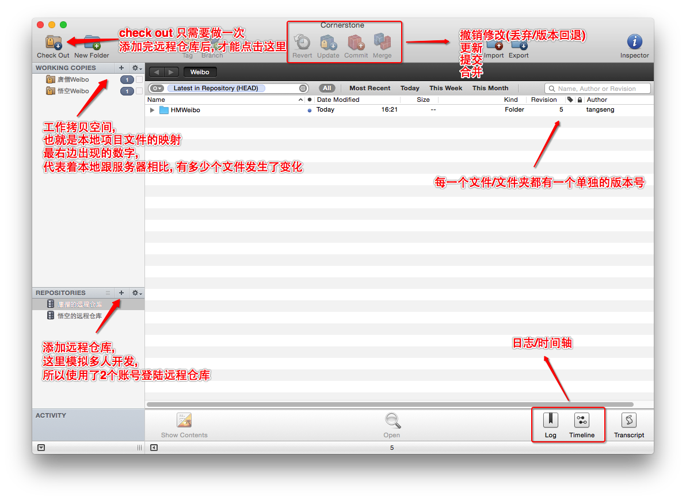

# SVN

与git相同都是代码管理工具，但是操作比git简单，在现阶段还是有很多公司用的是svn，所以学习svn还是有必要的。

## 安装svn服务器端

> https://www.visualsvn.com/ 去官网下载，注意服务器端搭建，先下visualSVN_server

安装时候就安装目录可以改一下，别的看不懂就不看了，一路按默认选项next

安装完后，打开VisualSVN manager 创建一个repositories 创建的时候，可以选择默认的fsfs。用户权限先随便设置，不要是任何人都能读写就行了，后面可以改的。

创建一个库后可以在右边大区域点右键创建一些文件夹什么的。如果想改读写权限，在左边目录栏的repositories下你刚创建的那个名字那里右键（或者就在创建文件夹的地方点击右键也行），点击properties，里面可以改用户和权限。

可以在users目录创建一些用户，这些用户会的账号密码都会给公司的开发人员，由运维人员给用户权限

## 连接服务器

第一次连接的话先 根据拥有 repository 权限的用户名密码把服务器上的代码拉下来。比 git 简单，git 客户端又要生成秘钥。再把秘钥复制给git 服务器端，让服务器添加秘钥，比那样简单

```shell
# 服务器地址：http://域名/svn/仓库名 如果不是80端口的还有把端口加上(安装服务器的时候设置的)
# 如 http://127.0.0.1/svn/Jamsdfn
$ svn checkout 服务器地址 --username=xxx --password=***
```

## 基本命令

- svn checkout // 检出 下载

- svn status // 查看状态
  - /? : 文件在SVN管理的目录下, 但是没有被SVN所管理. 看见? , 记得add
  -  A : 文件在SVN管理的目录下, 并且, 已经被本地SVN版本库管理, 看见A, 记得commit
  -  D : 文件在本地删除, 还需要提交
  - M : 文件在本地被修改过, 需要提交
  - G : 文件曾经发生过冲突, 然后被解决了
  - U : 文件被更新
  - C : 文件发生了冲突

- svn add // 添加某个文件进行管理
  -  svn add a.h

- svn commit // 提交代码
  - svn commit -m "这里写message"

- svn update // 更新代码

- svn help // 帮助

- svn log // 查看之间的记录

- svn resolved // 告诉系统已经解决好了冲突

**提交代码**

```shell
# 比git少一个push操作
$ svn add 文件名
$ svn commit -m '信息'
```

**更新代码**

```shell
# 类似于 git pull
$ svn update
```

**删除文件**

本地删除文件后提交一下就好了

## 解决冲突

和所有代码管理系统一样，解决冲突是最重要的问题，我们在提交代码前通常是先 svn update > svn commit。如果你要commit的代码已经有人先修改了并且commit了，这时候commit这个文件就会报冲突，这时候就要看是谁修改了这个代码，然后和那个人沟通在决定用谁的

1. 代码冲突: 同一个文件, 同一行, 两个不同的人修改并提交. 就会发生冲突

2. 更新时, 如果发生冲突时会报以下错误

- `Conflict discovered in '/Users/apple/Desktop/SVN/八戒/Weixin/Car.h'` 出现这个冲突后会保错并且然后给一些提示，最后让你输入你要处理的方式
  - 解决方式
  - 常用
    - (p) postpone : 延迟处理(svn工具不会帮你做解决冲突的事情, 自己手动解决) (版本会发生改变, 所以解决完冲突需要提交)
    - (mf) mine-conflict : 使用我的代码, 覆盖服务器的代码 . 还需要提交一次 (版本会发生改变, 所以需要提交)
    - (tf) theirs-conflict : 使用服务器的代码(他们的), 丢弃我的代码 (版本不会发生改变)
  - 不常用
    - (s) show all options : 展示所有的选项
    - (df) diff-full : 展示所有不同
    -  (e) edit : 编辑, 在命令行中编辑

3. 发生冲突的文件会发生改变

- <<<<<<< .mine ~ ======= 我的代码

- ======= ~ >>>>>>> .r24 服务器的代码
- 文件夹下会多两个文件，一个是你修改文件前的文件（原始版本文件），一个是服务器的文件，根据服务器的文件和自己的文件作对比后修改，改好后冲突文件后就可以` svn resolved Car.h`解决冲突，重新update、commit

4. 解决冲突的方案:

   1. (建议)选p, 延迟解决

   2. 删除不认识的代码(<< == >> ), 然后自己合并代码

   3. 告诉本地版本库, 自己已经解决了冲突:` svn resolved Car.h`

   4. 需要提交代码 (其它人更新即可)

## 添加忽略

类似git 的.gitignore

## 图形化界面SVN

比如conerstone。注意xcode建的项目data结尾的文件夹都不要提交，那是记录xcode状态的文件而已。



## 常见问题

1. is not a working copy : 说明没有进入到SVN管理的目录. 就进行了SVN的命令. 应该进入到正确目录

2. xcrun: error: active developer path ("/Applications/Xcode 2.app/Contents/Developer") does not exist, use `xcode-select --switch path/to/Xcode.app` to specify the Xcode that you wish to use for command line developer tools (or see `man xcode-select`)

- 解决方案: 当多个Xcode版本同时存在, 可能工具就混乱了. 需要选择一下. 找Xcode --> 偏好设置 --> Locations --> command line 选择一下即可


3. is out of date : 文件过期 . 如果发生了冲突, 那么直接提交时, 会报此错误. 应该update.


4. Could not use external editor to fetch log message; consider setting the $SVN_EDITOR environment variable or using the --message (-m) or --file (-F) options

- 需要添加一个 message


5. Authentication realm: \<http://127.0.0.1:80\> VisualSVN Server

- 权限 可能用户名或密码错误