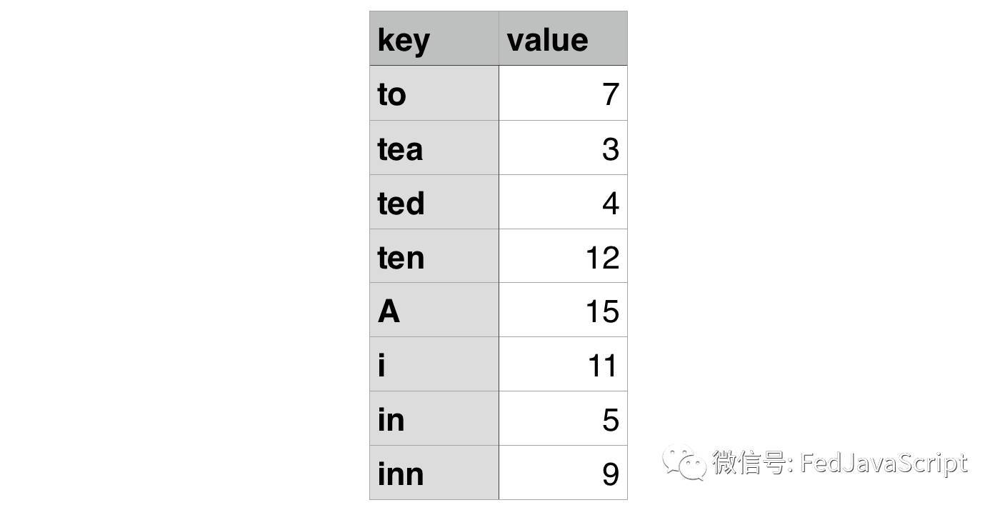
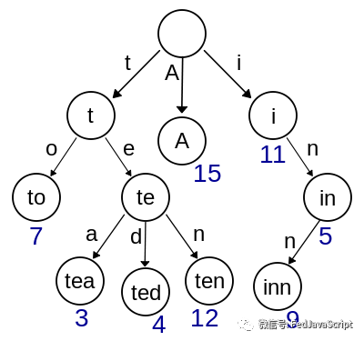
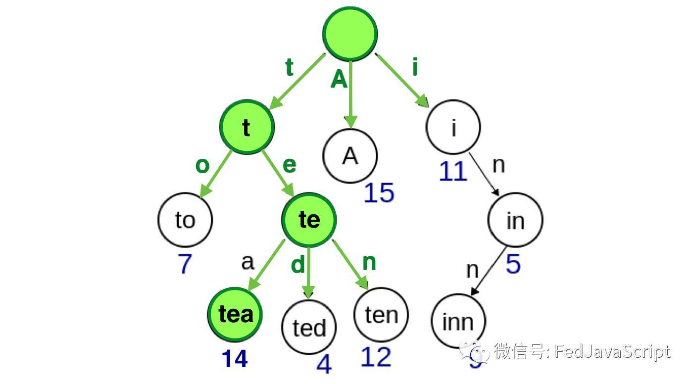
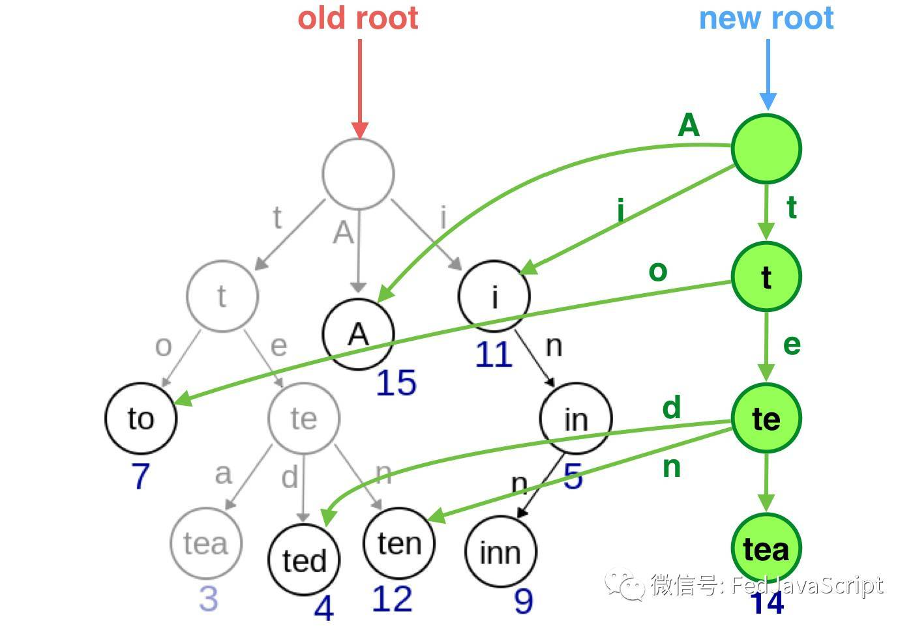
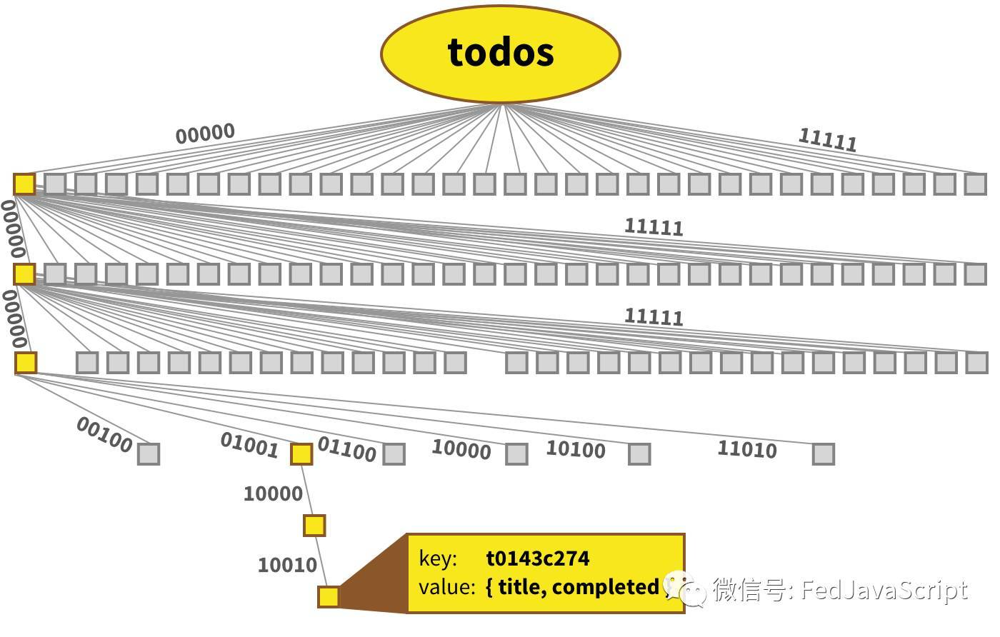
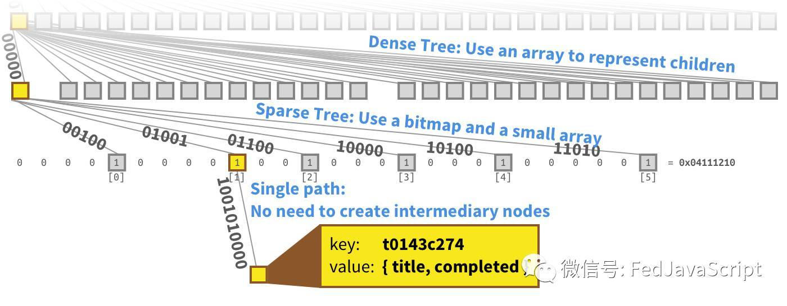

# 可持久化数据结构

## 为什么要提出这个概念

因为如果我们要改变一个对象，首先我们不应该直接把对象改变，因为这样可能会引起一系列的bug，因为你不知道后面的程序什么时候回用到这个对象，因此我们的通常的做法是重新建立一个对象，但是重新建立一个对象就要复制原对象，如果原对象本事数据量就很大，并且我的改动很微小，这时候我们为了节省存储空间和减少程序运行的时间，我们又不希望直接改变原对象，即我们要尽可能的复用原对象但又不能直接改变原对象，这时候就提出了可持久化的数据结构的概念。

## 什么是可持久化数据结构

可持久化的数据结构强制约束所有的操作将返回新版本数据结构并且保持原有的数据结构不变，而不是直接修改原来的数据结构。

这意味着所有的可持久化数据结构是不可变的。

为了直观的观察，让我们尝试一个小小例子。

键值对映射数据：

我们可以用一个普通的Java对象来保存：

constdata ={

to:7,

tea:3,

ted:4,

ten:12,

A:15,

i:11,

in:5,

inn:9

}

转换成一棵数据树，像这样：

图片来源:维基百科

通常来讲，你可以从根节点沿着上图的路径来获取你想要的值。

如果你想获取data.in，从根节点开始，沿着i，n，就可以到达值为5的节点。

如何去修改呢？

比如我们想把键为tea的值3改成14。

我要建造一个新的树，并且尽可能重用已经存在的节点

绿色表示新建的节点。

灰色的节点失去的索引，将会被回收

正如你所看到的，我们只是重新创建了4个新的节点来更新这个树。其他节点都被重用了。

这叫 结构共享

Immutable.js就是通过这种方式实现Immutable.Map。创建一个树，每个节点最多有32个分支。

这张图展示了一个真实的Immutable.Map

当我们更新一个节点，只有几个节点需要被重新创建。

Immutable.js通过创建多种类型的节点来保持树结构的紧凑和性能：

万物皆有两面性…

请不要认为这篇文章的意思是“你应该经常使用Immutable.js”，准确的讲，我只是告诉你用它的所有好处，以及为什么要使用它。

当我在写代码的时候，我首先会用普通的Java对象和数组，当我使用Immutable.js时，我需要非常确定，比如一个对象包含10,000个属性。我几乎从不使用Immutable.js，因为大多数时候的对象都很小。

## 推荐js库

mori.js

Immutable.js