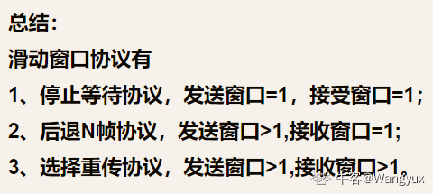
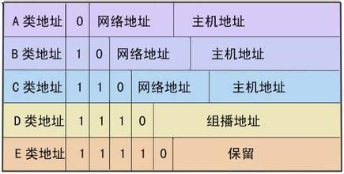
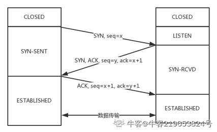

## 网络基础

从计算机网络系统看，计算机网络是由计算机网络的硬件系统和网络软件系统组成的；

从拓补结构看，计算机网络是由网络节点和通信链路组成的；

从逻辑功能看，计算机网络是由用户资源子网和通信子网组成的。

**计算机网络：**

计算机网络是用通信线路将分布在不同地点并具有独立功能的多台计算机系统互相连接，按照网络协议进行数据通信实现资源共享的信息系统。

**计算机的三个主要组成部分**


①若干主机(host)，它可以是各种类型的计算机，用来向用户提供服务；②一个通信子网，它由一些通信电路和结点交换机组成，用于进行数据通信；③一组通信协议，这些协议是为主机与主机、主机与通信子网或通信子网中各结点之间通信用的，协议是通信双方事先约定好的和必须遵守的规则

**计算机网络的类型：**

1. 按照**网络交换方式**的不同进行分类

- 电路交换网络

- 报文交换网络

- 分组交换网络

- 混合交换网络（同时采用电路交换和分组交换）

2. 按照**网络通信媒体**的不同进行分类

- 有线网络

- 无线网络

- 混合网络（同时采用有线和无线）

3. 按照**网络使用范围**的不同进行分类

- 公用网路，如Internet。它是为公众提供各种信息服务的网络系统，只要用户能够遵守网络服务商的使用和管理规则都可以申请使用。

- 专用网络，如校园网。它是由特定组织或者部门自己投资建立的网络系统，只有网络拥有者才可以使用。

- 接入网，它是一种比较特殊的计算机网络，通常是指骨干网络到用户终端之间的所有设备，起到一个桥梁的作用。

4. 按照**网络连接范围**的不同进行分类

- 局域网络（LAN），覆盖范围是几百米到几千米

- 城域网络（MAN），大型的局域网

- 广域网络（WAN），多个局域网互联后的覆盖范围更广的网络

- 个人区域网络（PAN），将个人使用的设备用无线技术连接起来的网络，覆盖范围是10米左右。

**现代互联网结构：**在internet中，用户计算机需要通过校园网，企业网或者ISP连入地区主干网；地区主干网通过国家主干网联入国家间的高速主干网，这样就形成了一种由路由器连接的大型、具有层次结构的互联网络。

**应用层**

网络服务与最终用户的一个接口。

协议有：**HTTP FTP TFTP SMTP SNMP DNS TELNET HTTPS POP3 DHCP**

**表示层**

数据的表示、安全、压缩。（在五层模型里面已经合并到了应用层）

格式有，**JPEG、ASCll、EBCDIC、加密格式等 [2]** 

**会话层**

建立、管理、终止会话。（在五层模型里面已经合并到了应用层）

**对应主机进程，指本地主机与远程主机正在进行的会话**

**传输层**

定义传输数据的协议端口号，以及流控和差错校验。

协议有：**TCP UDP，数据包一旦离开网卡即进入网络传输层**

**网络层**

进行逻辑地址寻址，实现不同网络之间的路径选择。

协议有：**ICMP IGMP IP（IPV4 IPV6）**

**数据链路层**

建立逻辑连接、进行硬件地址寻址、差错校验 [3] 等功能。（由底层网络定义协议）

将比特组合成字节进而组合成帧，用MAC地址访问介质，错误发现但不能纠正。

**物理层**

建立、维护、断开物理连接。（由底层网络定义协议）

**各个层级的硬件设备**

一层（物理层）：网卡、集线器、中继器
二层（数据链路层）：网桥、交换机
三层（网络层）：路由器
传输层、应用层：网关。

OSI层与层之间交换数据的单位是SDU（服务数据单元 Protocol Data Unit）

对等层即同一层之间传输的才叫PDU（协议数据单元 Service Data Unit）

## 线缆

直通线：两头都是A类或B类
交叉线：一头A类一头B类
反转线：一头A类另一头把A类线的线序反过来

同类交叉，异类直通，即如果一头是交换机一头是PC机就用直通线，反之用交叉线。反转线用于连接路由器

**双绞线/同轴电缆**

双绞线可以用来传输模拟信号，数字信号。 同轴电缆，只能传输数字信号。双绞线其实就是一条粗一点的电线

**光纤**

单模传输距离远，不会发生色散，质量可靠，通常使用激光作为光源，贵；多模传输带宽大，使用便宜的led，近距离传输。

多模光纤允许多个模式传输，单模光纤仅支持一个模式传输


## 应用层、表示层、会话层

应用层：各种协议 HTTP FTP TFTP SMTP SNMP DNS TELNET HTTPS POP3 DHCP

表示层：数据的表示、安全、压缩。

会话层：建立、管理、终止会话。

如果是五层模型，这三层是合并到一起的

### HTTP

**报文**

协议数据单元(Protocol Data Unit )物理层的 PDU是数据位（bit），数据链路层的 PDU是数据帧（frame），网络层的PDU是数据包（packet），传输层的 PDU是数据段（segment），其他更高层次的PDU是报文（message）。

### FTP

FTP协议使用控制连接和数据连接，控制连接存在于整个FTP会话过程中，数据连接在每次文件传输时才建立，传输结束就关闭。

当客户端向服务器发出连接请求时，客户端与**服务器的21端口建立控制连**接，并告诉服务器自己的另一个端口号码，用于建立数据连接。接着**服务器就用自己的20端口**与客户端所提供的端口号进行数据连接，由于FTP使用了两个不同的端口号，所以数据连接和控制连接不会混乱（注意20和21都是服务器端的端口）

### Telnet

Telnet协议是TCP/IP协议族中的一员，是Internet远程登陆服务的标准协议和主要方式。

它为用户提供了在本地计算机上完成远程主机工作的能力。在终端使用者的电脑上使用Telnet程序，用它连接到服务器。

终端使用者可以在Telnet程序中输入命令，这些命令会在服务器上运行，就像直接在服务器的控制台上输入一样，可以在本地就能控制服务器。要开始一个Telnet会话，必须输入用户名和密码来登录服务器。

Telnet是常用的远程控制Web服务器的方法。

Telnet协议是一种应用层协议，使用于互联网及局域网中，使用虚拟终端机的形式，提供双向、以文字字符串为主的交互功能。是Internet远程登录服务的标准协议和主要方式，常用于网页服务器的远程控制，可供用户在本地主机运行远程主机上的工作。

用户首先在电脑运行Telnet程序，连接至目的地服务器，然后输入账号和密码以验证身份。用户可以在本地主机输入命令，然后让已连接的远程主机运行，就像直接在对方的控制台上输入一样。
传统Telnet会话所传输的数据并未加密，账号和密码等敏感数据容易会被窃听，因此很多服务器都会封锁Telnet服务，改用更安全的SSH。

### DHCP

采用 DHCP 动态获取 IP 地址的客户机从启动到绑定 IP，其间要经过那些状态？

1. DHCP Client以广播的方式发出DHCP Discover报文。
2. 所有的DHCP Server都能够接收到DHCP Client发送的DHCP Discover报文，所有的DHCP Server都会给出响应，向DHCP Client发送一个DHCP Offer报文。（**初始状态**）
3. DHCP Client收到来自很多DHCP Server的DHCP Offer报文，但只处理最早来到的DHCP Offer报文。（**选择状态**）
4. 然后DHCP Client会发出一个广播的DHCP Request报文，在选项字段中会加入选中的DHCP Server的IP地址和需要的IP地址。DHCP Server收到DHCP Request报文后，判断选项字段中的IP地址是否与自己的地址相同。如果不相同，DHCP Server不做任何处理只清除相应IP地址分配记录；如果相同，DHCP Server就会向DHCP Client响应一个DHCP ACK报文，并在选项字段中增加IP地址的使用租期信息。（**请求状态**）
5. DHCP Client接收到DHCP ACK报文后，检查DHCP Server分配的IP地址是否能够使用。如果可以使用，则DHCP Client成功获得IP地址并根据IP地址使用租期自动启动续延过程。（**绑定状态**）

## 传输层

主要是TCP/UDP协议。传输层提供应用进程间的逻辑通信（通过端口号），即端到端的通信。而数据链路层负责相邻结点之间的通信，这个结点包括了交换机和路由器等数据通信设备，这些设备不能称为端系统。网络层负责主机到主机的逻辑通信。

### TCP

TCP的拥塞控制由4个核心算法组成：“慢启动”（Slow Start）、“拥塞避免”（Congestion voidance）、“快速重传 ”（Fast Retransmit）、“快速恢复”（Fast Recovery）

**TCP建立连接和断开连接过程**

假设Client端发起中断连接请求，也就是发送FIN报文。Server端接到FIN报文后，意思是说"我Client端没有数据要发给你了"，但是如果你还有数据没有发送完成，则不必急着关闭Socket，可以继续发送数据。所以你先发送ACK，"告诉Client端，你的请求我收到了，但是我还没准备好，请继续你等我的消息"。这个时候Client端就进入FIN_WAIT状态，继续等待Server端的FIN报文。当Server端确定数据已发送完成，则向Client端发送FIN报文，"告诉Client端，好了，我这边数据发完了，准备好关闭连接了"。Client端收到FIN报文后，"就知道可以关闭连接了，但是他还是不相信网络，怕Server端不知道要关闭，所以发送ACK后进入TIME_WAIT状态，如果Server端没有收到ACK则可以重传。“，Server端收到ACK后，"就知道可以断开连接了"。Client端等待了2MSL后依然没有收到回复，则证明Server端已正常关闭，那好，我Client端也可以关闭连接了。Ok，TCP连接就这样关闭了！

TCP协议里窗口机制：**滑动的窗口**

滑动窗口协议，是TCP使用的一种流量控制方法。该协议允许发送方在停止并等待确认前可以连续发送多个分组。由于发送方不必每发一个分组就停下来等待确认，因此该协议可以加速数据的传输。

只有在**接收窗口向前滑动时（与此同时也发送了确认），发送窗口才有可能向前滑动**。
收发两端的窗口按照以上规律不断地向前滑动，**当发送窗口和接收窗口的大小都等于1时，就是停止等待协议**



### UDP

1. TCP是面向连接的，UDP是面向无连接的

2. TCP提供可靠交付，UPD不保证可靠交付

3. TCP是面向字节流的，UDP是面向报文的

4. TCP有拥塞控制，UDP没有拥塞控制

5. TCP固定头部有20个字节，UDP固定头部有8个字节

6. TCP是全双工通信，UDP支持一对一，一对多，多对一和多对多交互通信

## 网络层

进行逻辑地址寻址，实现不同网络之间的路径选择。

IP是网络层的重点。与IP协议配套使用实现其功能的还有**地址解析协议ARP**、**逆地址解析协议RARP**、**因特网报文协议ICMP**、**因特网组管理协议IGMP**。

### IP

**ABCD类网络的格式**

- A: 前两位0以上（二进制表示为：00000001 00000000 00000000 00000001 - 01111111 11111111 11111111 11111110）
  - A类IP地址中网络的标识长度为8位，主机标识的长度为24位，A类网络地址数量较少，有126个网络，每个网络可以容纳主机数达1600多万台。24位主机标识位全1则为广播地址
  - A类IP地址的地址范围是1.0.0.0到127.255.255.255
  - 子网掩码：255.0.0.0
  - 私有地址：10.0.0.0--10.255.255.255
  - 由1字节的网络地址和3字节主机地址组成
- B: 前三位10以下0以上（二进制表示为：10000000 00000000 00000000 00000001-10111111 11111111 11111111 11111110）
  - B类IP地址中网络的标识长度为16位，主机标识的长度为16位，B类网络地址适用于中等规模的网络，有16384个网络，每个网络所能容纳的计算机数为6万多台。16位主机标识位全1则为广播地址
  - B类IP地址地址范围128.0.0.0-191.255.255.255
  - 子网掩码：255.255.0.0
  - 私有地址：172.16.0.0--172.31.255.255
  - 由2字节的网络地址和2字节主机地址组成
- C: 前四位110以下10以上（二进制表示为: 11000000 00000000 00000000 00000001 - 11011111 11111111 11111111 11111110）
  - C类中网络的标识长度为24位，主机标识的长度为8位，C类网络地址数量较多，有209万余个网络。适用于小规模的局域网络，每个网络最多只能包含254台计算机。8位主机标识位全1则为广播地址
  - C类IP地址类范围192.0.0.0-223.255.255.255。
  - C类的子网掩码为255.255.255.0，每个网络支持的最大主机数为256-2=254台
  - 子网掩码：255.255.255.0
  - 私有地址：192.168.0.0--192.168.255.255
  - 由3字节的网络地址和1字节主机地址组成
- D: 前五位1110以下110以上
  - D类IP地址在历史上被叫做多播地址(multicast address)，即组播地址。在以太网中，多播地址命名了一组应该在这个网络中应用接收到一个分组的站点。
  - 多播地址的最高位必须是“1110”，范围从224.0.0.0到239.255.255.255。
  - 无子网掩码
- E：11110以下1110以上 保留



**特殊的IP地址** 

1. 每一个字节都为0的地址（“0.0.0.0”）对应于当前主机；
2. IP地址中的每一个字节都为1的IP地址（“255．255．255．255”）是当前子网的广播地址；
3. IP地址中凡是以“11110”开头的E类IP地址都保留用于将来和实验使用。
4. IP地址中不能以十进制“127”作为开头，该类地址中数字127．0．0．1到127．255．255．255用于回路测试，如：127.0.0.1可以代表本机IP地址，用“http://127.0.0.1”就可以测试本机中配置的Web服务器。
5. 网络ID的第一个8位组也不能全置为“0”，全“0”表示本地网络。

例题：

```
10.1.0.1/17 的广播地址是 10.1.127.255
因为这里/17表示网络号是17位，如果是普通的A类情况下应该是后24位全1的，但是这里设置了网络号，一次除了网络号外其余15位全1就是这个ip的广播地址
```

### 判断IP是否属于同一网段

1. 根据IP判断出是ABC那一类地址，除非给出网络号
2. 根据地址写出子网掩码，然后与IP做与运算，运算的结果就是网段
3. 多个IP和同一个子网掩码做与运算，结果一致，则为同一网段

### ICMP

ICMP与IP位于同一层，它被用来传送IP的控制信息。它主要是用来提供有关通向目的地址的路径信息。ICMP的‘Redirect’信息通知主机通向其他系统的更准确的路径，而‘Unreachable’信息则指出路径有问题。另外，如果路径不可用了，ICMP可以使TCP连接‘体面地’终止。PING是最常用的基于ICMP的服务。

### IP报文


**注意：把HTTP会话请求分成报文段，添加源和目的端口**，这件事是在**传输层**完成的

## 数据链路层

负责网络寻址、错误侦测和改错。

网桥工作在数据链路层，将两个LAN连起来，根据MAC地址来转发帧，可以看作一个“低层的[路由器](https://baike.baidu.com/item/路由器)”（路由器工作在网络层，根据网络地址如IP地址进行转发）。

数据链路层即OSI第二层，在此层将数据分帧，并处理流控制。屏蔽物理层，为网络层提供一个数据链路的连接，在一条有可能出差错的物理连接上，进行几乎无差错的数据传输（差错控制）。本层指定[拓扑结构](https://baike.baidu.com/item/拓扑结构)并提供硬件寻址。常用设备有网桥、交换机；

数据链路层互联的设备是网桥(bridge)，在网络互联中它起到数据接收、地址过滤与数据转发的作用，用来实现多个网络系统之间的数据交换。

网桥的基本特征

1. 网桥在数据链路层上实现局域网互连；

2. 网桥能够互连两个采用不同数据链路层协议、不同传输介质与不同传输速率的网络

3. 网桥以接收、存储、地址过滤与转发的方式实现互连的网络之间的通信；

4. 网桥需要互连的网络在数据链路层以上采用相同的协议

5. 网桥可以分隔两个网络之间的通信量，有利于改善互连网络的性能与安全性。

6. 网桥只适合于用户数不太多（不超过几百个）和信息量不太大的局域网，否则有时会产生较大的广播风暴

7. 由于网桥对接收的帧要先存储和查找站表，然后转发，这就增加了时延

## 物理层

## 流量劫持

http://www.2cto.com/article/201404/294482.html

上古时代：

- Hub 嗅探
- MAC 欺骗
- MAC 冲刷
- ARP 攻击
- DHCP 钓鱼
- DNS 劫持
- CDN 入侵

中世纪：

- 路由器弱口令
- 路由器 CSRF
- PPPoE 钓鱼
- 蜜罐代理

工业时代：

- WiFi 弱口令
- WiFi 伪热点
- WiFi 强制断线
- WLAN 基站钓鱼

## VLAN

对虚拟网络成员的定义方法，有以下4种：①用交换机端口号定义虚拟局域网(最通用的办法)。②用MAC地址。③用网络层地址(例如用 IP地址来定义)。④IP广播组。

## TCP三次握手



URG:URG=1时，表明紧急指针字段有效，告诉系统有紧急字段需要立即传送。

ACK:ACK=1时确认好才有效，ACK=0时，确认号无效。**TCP规定在连接建立之后所有传送的报文都必须吧ACK置1**，ACK是应答信号，SYN和FIN信号都会受到应答，所以跟打开和关闭连接都有关

RST：RST=1时表示TCP连接出现严重差错，必须释放连接再重新建立连接。

**FIN：FIN=1表示要求释放连接**。

- **第一次握手**：主机A发送位码为syn＝1，随机产生seq number=1234567的数据包到服务器，主机B由SYN=1知道，A要求建立联机；

- **第二次握手**：主机B收到请求后要确认联机信息，向A发送ack number=(主机A的seq+1)，syn=1，ACK=1，随机产生seq=7654321的包；

- **第三次握手**：主机A收到后检查ack number是否正确，即第一次发送的seq number+1，以及位码ack是否为1，若正确，主机A会再发送ack number=(主机B的seq+1)，ACK=1，主机B收到后确认seq值与ACK=1则连接建立成功。

## TCP/IP

[TCP/IP协议](http://baike.baidu.com/view/7649.htm)，或称为TCP/IP协议栈，或互联网协议系列。支持异种计算机网络互联的通信协议

TCP/IP协议栈（按[TCP/IP参考模型](http://baike.baidu.com/view/1792敏感词.htm)划分），TCP/IP分为4层，不同于OSI，他将OSI中的会话层、表示层规划到应用层。

- [应用层](http://baike.baidu.com/view/239619.htm)FTP SMTP HTTP ...
- [传输层](http://baike.baidu.com/view/239605.htm)TCP UDP
- IP网络层IP ICMP IGMP
- [网络接口层](http://baike.baidu.com/view/4022168.htm)ARP RARP[以太网](http://baike.baidu.com/view/848.htm)[令牌环](http://baike.baidu.com/view/54261.htm)FDDI ...

包含了一系列构成互联网基础的[网络协议](http://baike.baidu.com/view/16603.htm)。

## 常见端口号

端口号的范围是从1～65535。其中1～1024是被RFC 3232规定好了的，被称作“众所周知的端口”(Well Known Ports)；从1025～65535的端口被称为动态端口（Dynamic Ports），可用来建立与其它主机的会话，也可由用户自定义用途。

一些常见的端口号及其用途如下：

TCP 21端口：FTP 文件传输服务

TCP 23端口：TELNET 终端仿真服务

TCP 25端口：SMTP 简单邮件传输服务

UDP 53端口：DNS 域名解析服务

TCP 80端口：HTTP 超文本传输服务

TCP 110端口：POP3 “邮局协议版本3”使用的端口

TCP 443端口：HTTPS 加密的超文本传输服务

TCP 1521端口：Oracle数据库服务

TCP 1863端口：MSN Messenger的文件传输功能所使用的端口

TCP 3389端口：Microsoft RDP 微软远程桌面使用的端口

TCP 5631端口：Symantec pcAnywhere 远程控制数据传输时使用的端口

UDP 5632端口：Symantec pcAnywhere 主控端扫描被控端时使用的端口

TCP 5000端口：MS SQL Server使用的端口

UDP 8000端口：腾讯QQ

TCP 25端口：SMTP 25仔

TCP 110端口：POP3 报警110 police

## IEEE802

IEEE 802又称为LMSC（LAN /MAN Standards Committee， 局域网/城域网标准会），致力于研究局域网和城域网的物理层和MAC层中定义的服务和协议，对应OSI网络参考模型的最低两层（即物理层和数据链路层）。

IEEE 802.1 ：局域网体系结构、寻址、网络互联和网络。

IEEE 802.1A：概述和系统结构。

IEEE 802.1B：网络管理和网络互连。

IEEE 802.2 ：逻辑链路控制子层（LLC）的定义。

IEEE 802.3 ：以太网介质访问控制协议 （CSMA/CD）及物理层技术规范。

IEEE 802.4 ：令牌总线网（Token-Bus）的介质访问控制协议及物理层技术规范。

IEEE 802.5 ：令牌环网（Token-Ring)的介质访问控制协议及物理层技术规范。

IEEE 802.6 ：城域网介质访问控制协议DQDB （Distributed Queue Dual Bus 分布式队列双总线）及物理层技术规范。

IEEE 802.7 ：宽带技术咨询组，提供有关宽带联网的技术咨询。

IEEE 802.8 ：光纤技术咨询组，提供有关光纤联网的技术咨询。

IEEE 802.9 ：综合声音数据的局域网（IVD LAN）介质访问控制协议及物理层技术规范。

IEEE 802.10：网络安全技术咨询组，定义了网络互操作的认证和加密方法。

IEEE 802.11：无线局域网（WLAN）的介质访问控制协议及物理层技术规范。

## 关于ping命令

**-t** **:**  不停的ping对方主机，直到你按下Control-C；

**-a：**解析计算机NetBios名；

**-n：**发送count指定的Echo数据包数；

**-l** **：**定义echo数据包大小。

